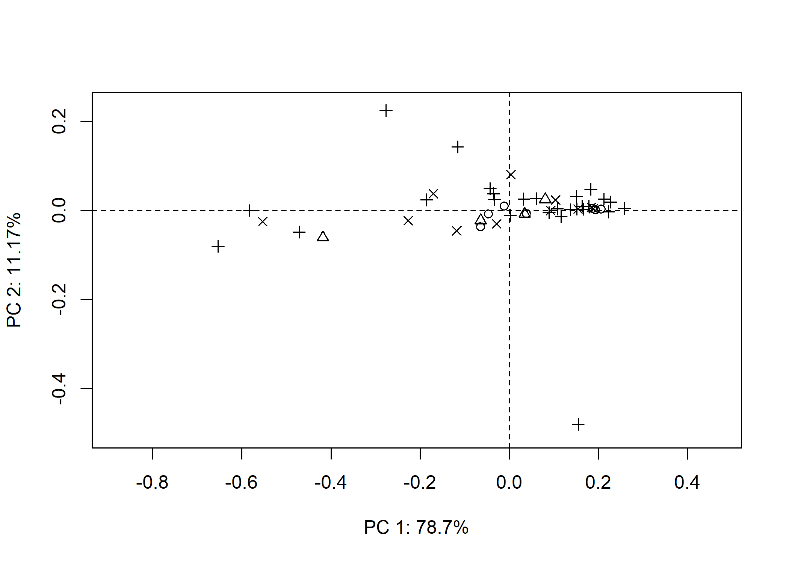

Supplementary materials for paper: Does similar ceramic incision
morphology provide inference to a common toolkit?
================
Robert Z. Selden, Jr.
19 May 2020

## Incision morphology

``` r
# location of landmarks
knitr::include_graphics('images/FigLM.jpg')
```


``` r
fig.cap="Location of landmarks (blue) and equidistant semilandmarks (white)."
```

``` r
# library(devtools)
# devtools::install_github("geomorphR/geomorph", ref = "Stable", build_vignettes = TRUE)
library(geomorph)
```

    ## Loading required package: RRPP

    ## Loading required package: rgl

``` r
setwd(getwd())
source('readmulti.csv.r')

# Read .csv files
setwd("./data2")
filelist <- list.files(pattern = ".csv")
coords<-readmulti.csv(filelist)
setwd("../")

# read qualitative data
qdata<-read.csv("qdata.csv",header=TRUE,row.names=1)
qdata<-qdata[match(dimnames(coords)[[3]],rownames(qdata)),]


#delete this section
Y.gpa<-gpagen(coords, PrinAxes = TRUE, print.progress = FALSE)
plot(Y.gpa)
```

### Generalised Procrustes Analysis

``` r
Y.gpa<-gpagen(coords, PrinAxes = TRUE, print.progress = FALSE)
plot(Y.gpa)
# 3D GPA plot
knitr::include_graphics('images/gpa3d.png')
```


``` r
fig.cap="Results of generalized Procrustes analysis."

# geomorph data frame
gdf<-geomorph.data.frame(shape=Y.gpa$coords, size=Y.gpa$Csize, site=qdata$site, unit=qdata$unit, county=qdata$county) 
csz<-Y.gpa$Csize # attribute for boxplot
unt<-qdata$unit # attribute for boxplot
# boxplot of incision (centroid) size by nfgt unit
boxplot(csz~unt, 
        main = "Centroid size of Caddo incisions by NFGT Unit",
        names = c("AngelinaNF", "DavyCrockettNF", "SabineNF"),
        xlab = "Unit",
        ylab = "Centroid Size",
        col = c("dodgerblue4","indianred4","tan3")
        )
```


### Principal Components Analysis

``` r
# principal components analysis
pca<-gm.prcomp(Y.gpa$coords)
summary(pca)
```

    ## Importance of components: 
    ##                               PC1         PC2        PC3          PC4
    ## Tips variance          0.04003992 0.006476805 0.00152295 0.0004389225
    ## Proportion of variance 0.81030314 0.131073573 0.03082051 0.0088826429
    ## Cumulative Proportion  0.81030314 0.941376710 0.97219722 0.9810798675
    ##                                 PC5          PC6          PC7          PC8
    ## Tips variance          0.0002927559 0.0001960831 0.0001151256 7.075705e-05
    ## Proportion of variance 0.0059246125 0.0039682086 0.0023298400 1.431937e-03
    ## Cumulative Proportion  0.9870044800 0.9909726886 0.9933025286 9.947345e-01
    ##                                 PC9         PC10         PC11         PC12
    ## Tips variance          6.105661e-05 4.797942e-05 3.748915e-05 2.238032e-05
    ## Proportion of variance 1.235626e-03 9.709778e-04 7.586823e-04 4.529190e-04
    ## Cumulative Proportion  9.959701e-01 9.969411e-01 9.976998e-01 9.981527e-01
    ##                                PC13         PC14         PC15         PC16
    ## Tips variance          2.077958e-05 1.422581e-05 1.200411e-05 7.533318e-06
    ## Proportion of variance 4.205242e-04 2.878932e-04 2.429317e-04 1.524546e-04
    ## Cumulative Proportion  9.985732e-01 9.988611e-01 9.991040e-01 9.992565e-01
    ##                                PC17         PC18         PC19         PC20
    ## Tips variance          6.455566e-06 5.125466e-06 4.560384e-06 3.674660e-06
    ## Proportion of variance 1.306437e-04 1.037260e-04 9.229023e-05 7.436549e-05
    ## Cumulative Proportion  9.993871e-01 9.994908e-01 9.995831e-01 9.996575e-01
    ##                                PC21         PC22         PC23         PC24
    ## Tips variance          2.924124e-06 2.881045e-06 1.930763e-06 1.763187e-06
    ## Proportion of variance 5.917661e-05 5.830480e-05 3.907358e-05 3.568228e-05
    ## Cumulative Proportion  9.997167e-01 9.997750e-01 9.998141e-01 9.998497e-01
    ##                                PC25         PC26         PC27         PC28
    ## Tips variance          1.580448e-06 1.416086e-06 9.805964e-07 8.080736e-07
    ## Proportion of variance 3.198412e-05 2.865787e-05 1.984470e-05 1.635329e-05
    ## Cumulative Proportion  9.998817e-01 9.999104e-01 9.999302e-01 9.999466e-01
    ##                                PC29         PC30         PC31         PC32
    ## Tips variance          7.767897e-07 4.689635e-07 3.302867e-07 2.818528e-07
    ## Proportion of variance 1.572019e-05 9.490594e-06 6.684139e-06 5.703963e-06
    ## Cumulative Proportion  9.999623e-01 9.999718e-01 9.999785e-01 9.999842e-01
    ##                                PC33         PC34         PC35         PC36
    ## Tips variance          2.400412e-07 2.126402e-07 1.317707e-07 9.755202e-08
    ## Proportion of variance 4.857804e-06 4.303280e-06 2.666695e-06 1.974198e-06
    ## Cumulative Proportion  9.999890e-01 9.999933e-01 9.999960e-01 9.999980e-01
    ##                                PC37         PC38
    ## Tips variance          7.125228e-08 2.864228e-08
    ## Proportion of variance 1.441960e-06 5.796447e-07
    ## Cumulative Proportion  9.999994e-01 1.000000e+00

``` r
# set plot parameters
# for site
site <- qdata$site
pch.gps.site <- c(1:14)[as.factor(site)]
# for unit
unit <- qdata$unit
pch.gps <- c(15,17,19)[as.factor(unit)]
col.gps <- c("dodgerblue4","indianred4","tan3")[as.factor(unit)]
# for county
county <- qdata$county
pch.gps.cty <- c(1:5)[as.factor(county)]

# plotPCAbySite
pca.plot1<-plot(pca,
                pch = pch.gps.site)
```


``` r
# plotPCAbyUnit
pca.plot2<-plot(pca,
               pch = pch.gps,
               col = col.gps)
```


``` r
# plotPCAbyCounty
pca.plot1<-plot(pca,
                pch = pch.gps.cty)
```



### Define models

``` r
fit.size<-procD.lm(shape ~ size, data = gdf, print.progress = FALSE, iter = 9999)
fit.sizesite<-procD.lm(size ~ site, data = gdf, print.progress = FALSE, iter = 9999)
fit.sizeunit<-procD.lm(size ~ unit, data = gdf, print.progress = FALSE, iter = 9999)
fit.sizecounty<-procD.lm(size ~ county, data = gdf, print.progress = FALSE, iter = 9999)
fit.shapesite<-procD.lm(shape ~ site, data = gdf, print.progress = FALSE, iter = 9999)
fit.shapeunit<-procD.lm(shape ~ unit, data = gdf, print.progress = FALSE, iter = 9999)
fit.shapecounty<-procD.lm(shape ~ county, data = gdf, print.progress = FALSE, iter = 9999)
```

### Size/Shape \~ Site/Unit/County?

``` r
# ANOVA: do incision sizes differ by site?
anova(fit.sizesite)
```

    ## 
    ## Analysis of Variance, using Residual Randomization
    ## Permutation procedure: Randomization of null model residuals 
    ## Number of permutations: 10000 
    ## Estimation method: Ordinary Least Squares 
    ## Sums of Squares and Cross-products: Type I 
    ## Effect sizes (Z) based on F distributions
    ## 
    ##           Df     SS     MS     Rsq      F      Z Pr(>F)
    ## site      13 38.739 2.9799 0.40047 1.2845 0.4913 0.2967
    ## Residuals 25 57.996 2.3198 0.59953                     
    ## Total     38 96.734                                    
    ## 
    ## Call: procD.lm(f1 = size ~ site, iter = 9999, data = gdf, print.progress = FALSE)

``` r
# ANOVA: do incision shapes differ by site?
anova(fit.shapesite)
```

    ## 
    ## Analysis of Variance, using Residual Randomization
    ## Permutation procedure: Randomization of null model residuals 
    ## Number of permutations: 10000 
    ## Estimation method: Ordinary Least Squares 
    ## Sums of Squares and Cross-products: Type I 
    ## Effect sizes (Z) based on F distributions
    ## 
    ##           Df      SS       MS     Rsq      F       Z Pr(>F)
    ## site      13 0.36506 0.028081 0.19442 0.4641 -1.3985 0.9232
    ## Residuals 25 1.51265 0.060506 0.80558                      
    ## Total     38 1.87771                                       
    ## 
    ## Call: procD.lm(f1 = shape ~ site, iter = 9999, data = gdf, print.progress = FALSE)

``` r
# ANOVA: do incision sizes differ by unit?
anova(fit.sizeunit)
```

    ## 
    ## Analysis of Variance, using Residual Randomization
    ## Permutation procedure: Randomization of null model residuals 
    ## Number of permutations: 10000 
    ## Estimation method: Ordinary Least Squares 
    ## Sums of Squares and Cross-products: Type I 
    ## Effect sizes (Z) based on F distributions
    ## 
    ##           Df     SS     MS     Rsq      F       Z Pr(>F)
    ## unit       2  8.127 4.0633 0.08401 1.6509 0.81748 0.1985
    ## Residuals 36 88.608 2.4613 0.91599                      
    ## Total     38 96.734                                     
    ## 
    ## Call: procD.lm(f1 = size ~ unit, iter = 9999, data = gdf, print.progress = FALSE)

``` r
# ANOVA: do incision shapes differ by unit?
anova(fit.shapeunit)
```

    ## 
    ## Analysis of Variance, using Residual Randomization
    ## Permutation procedure: Randomization of null model residuals 
    ## Number of permutations: 10000 
    ## Estimation method: Ordinary Least Squares 
    ## Sums of Squares and Cross-products: Type I 
    ## Effect sizes (Z) based on F distributions
    ## 
    ##           Df      SS       MS     Rsq      F      Z Pr(>F)
    ## unit       2 0.06917 0.034584 0.03684 0.6884 -0.123 0.5611
    ## Residuals 36 1.80854 0.050237 0.96316                     
    ## Total     38 1.87771                                      
    ## 
    ## Call: procD.lm(f1 = shape ~ unit, iter = 9999, data = gdf, print.progress = FALSE)

``` r
# ANOVA: do incision sizes differ by county?
anova(fit.sizecounty)
```

    ## 
    ## Analysis of Variance, using Residual Randomization
    ## Permutation procedure: Randomization of null model residuals 
    ## Number of permutations: 10000 
    ## Estimation method: Ordinary Least Squares 
    ## Sums of Squares and Cross-products: Type I 
    ## Effect sizes (Z) based on F distributions
    ## 
    ##           Df     SS    MS     Rsq      F        Z Pr(>F)
    ## county     4  8.200 2.050 0.08477 0.7873 0.010468 0.5137
    ## Residuals 34 88.534 2.604 0.91523                       
    ## Total     38 96.734                                     
    ## 
    ## Call: procD.lm(f1 = size ~ county, iter = 9999, data = gdf, print.progress = FALSE)

``` r
# ANOVA: do incision shapes differ by county?
anova(fit.shapecounty)
```

    ## 
    ## Analysis of Variance, using Residual Randomization
    ## Permutation procedure: Randomization of null model residuals 
    ## Number of permutations: 10000 
    ## Estimation method: Ordinary Least Squares 
    ## Sums of Squares and Cross-products: Type I 
    ## Effect sizes (Z) based on F distributions
    ## 
    ##           Df      SS       MS     Rsq      F        Z Pr(>F)
    ## county     4 0.17104 0.042760 0.09109 0.8519 0.027212 0.4805
    ## Residuals 34 1.70667 0.050196 0.90891                       
    ## Total     38 1.87771                                        
    ## 
    ## Call: procD.lm(f1 = shape ~ county, iter = 9999, data = gdf, print.progress = FALSE)

### Morphological disparity

``` r
# morphological disparity: does incision morphology display greater shape variation among individuals relative to site, unit, or county?
# unit
morphol.disparity(fit.shapeunit, groups = qdata$unit, data = gdf, print.progress = FALSE, iter = 9999)
```

    ## 
    ## Call:
    ## morphol.disparity(f1 = fit.shapeunit, groups = qdata$unit, iter = 9999,  
    ##     data = gdf, print.progress = FALSE) 
    ## 
    ## 
    ## 
    ## Randomized Residual Permutation Procedure Used
    ## 10000 Permutations
    ## 
    ## Procrustes variances for defined groups
    ## angelinaNF    davycNF   sabineNF 
    ## 0.03246203 0.05228116 0.04791513 
    ## 
    ## 
    ## Pairwise absolute differences between variances
    ##            angelinaNF     davycNF    sabineNF
    ## angelinaNF 0.00000000 0.019819130 0.015453102
    ## davycNF    0.01981913 0.000000000 0.004366028
    ## sabineNF   0.01545310 0.004366028 0.000000000
    ## 
    ## 
    ## P-Values
    ##            angelinaNF davycNF sabineNF
    ## angelinaNF     1.0000  0.6606   0.7347
    ## davycNF        0.6606  1.0000   0.9207
    ## sabineNF       0.7347  0.9207   1.0000

``` r
# county
morphol.disparity(fit.shapecounty, groups = qdata$county, data = gdf, print.progress = FALSE, iter = 9999)
```

    ## 
    ## Call:
    ## morphol.disparity(f1 = fit.shapecounty, groups = qdata$county,  
    ##     iter = 9999, data = gdf, print.progress = FALSE) 
    ## 
    ## 
    ## 
    ## Randomized Residual Permutation Procedure Used
    ## 10000 Permutations
    ## 
    ## Procrustes variances for defined groups
    ##   nacogdoches        sabine san-augustine        shelby       trinity 
    ##  2.799362e-32  1.468981e-02  3.233917e-02  7.759563e-02  5.228116e-02 
    ## 
    ## 
    ## Pairwise absolute differences between variances
    ##               nacogdoches     sabine san-augustine     shelby    trinity
    ## nacogdoches    0.00000000 0.01468981    0.03233917 0.07759563 0.05228116
    ## sabine         0.01468981 0.00000000    0.01764936 0.06290582 0.03759135
    ## san-augustine  0.03233917 0.01764936    0.00000000 0.04525646 0.01994199
    ## shelby         0.07759563 0.06290582    0.04525646 0.00000000 0.02531447
    ## trinity        0.05228116 0.03759135    0.01994199 0.02531447 0.00000000
    ## 
    ## 
    ## P-Values
    ##               nacogdoches sabine san-augustine shelby trinity
    ## nacogdoches        1.0000 0.7181        0.4033 0.1084  0.2216
    ## sabine             0.7181 1.0000        0.6535 0.0562  0.2762
    ## san-augustine      0.4033 0.6535        1.0000 0.2709  0.6270
    ## shelby             0.1084 0.0562        0.2709 1.0000  0.4793
    ## trinity            0.2216 0.2762        0.6270 0.4793  1.0000

``` r
# morphological disparity: does incision morphology display greater size variation among individuals relative to site, unit, or county?
# unit
morphol.disparity(fit.sizeunit, groups = qdata$unit, data = gdf, print.progress = FALSE, iter = 9999)
```

    ## 
    ## Call:
    ## morphol.disparity(f1 = fit.sizeunit, groups = qdata$unit, iter = 9999,  
    ##     data = gdf, print.progress = FALSE) 
    ## 
    ## 
    ## 
    ## Randomized Residual Permutation Procedure Used
    ## 10000 Permutations
    ## 
    ## Procrustes variances for defined groups
    ## angelinaNF    davycNF   sabineNF 
    ##   1.081951   1.994539   2.814012 
    ## 
    ## 
    ## Pairwise absolute differences between variances
    ##            angelinaNF  davycNF sabineNF
    ## angelinaNF   0.000000 0.912588 1.732061
    ## davycNF      0.912588 0.000000 0.819473
    ## sabineNF     1.732061 0.819473 0.000000
    ## 
    ## 
    ## P-Values
    ##            angelinaNF davycNF sabineNF
    ## angelinaNF     1.0000  0.6068    0.345
    ## davycNF        0.6068  1.0000    0.718
    ## sabineNF       0.3450  0.7180    1.000

``` r
# county
morphol.disparity(fit.sizeunit, groups = qdata$unit, data = gdf, print.progress = FALSE, iter = 9999)
```

    ## 
    ## Call:
    ## morphol.disparity(f1 = fit.sizeunit, groups = qdata$unit, iter = 9999,  
    ##     data = gdf, print.progress = FALSE) 
    ## 
    ## 
    ## 
    ## Randomized Residual Permutation Procedure Used
    ## 10000 Permutations
    ## 
    ## Procrustes variances for defined groups
    ## angelinaNF    davycNF   sabineNF 
    ##   1.081951   1.994539   2.814012 
    ## 
    ## 
    ## Pairwise absolute differences between variances
    ##            angelinaNF  davycNF sabineNF
    ## angelinaNF   0.000000 0.912588 1.732061
    ## davycNF      0.912588 0.000000 0.819473
    ## sabineNF     1.732061 0.819473 0.000000
    ## 
    ## 
    ## P-Values
    ##            angelinaNF davycNF sabineNF
    ## angelinaNF     1.0000  0.6068    0.345
    ## davycNF        0.6068  1.0000    0.718
    ## sabineNF       0.3450  0.7180    1.000

### Mean shapes

``` r
# subset landmark coordinates to produce mean shapes by site
new.coords<-coords.subset(A = Y.gpa$coords, group = qdata$site)
names(new.coords)
```

    ##  [1] "na132" "sa255" "sa65"  "sa66"  "sb125" "sb164" "sb189" "sb291" "sb308"
    ## [10] "sy253" "sy255" "sy258" "sy43"  "tn91"

``` r
# group shape means
mean<-lapply(new.coords, mshape)
# plot(mean$tn91)
knitr::include_graphics('images/site-meanshape.png')
```


``` r
fig.cap="Mean shapes for Caddo incisions from sites on the National Forests and Grasslands in Texas."
# end of code
```

### Acknowledgments

I extend my gratitude to the Caddo Tribe of Oklahoma and the National
Forests and Grasslands in Texas for the requisite permissions and access
needed to generate the scans of the Caddo incisions, and to the National
Center for Preservation Technology and Training for access to the
optical profilometer.

### Funding

Components of this analytical work flow were developed and funded by a
Preservation Technology and Training grant (P14AP00138) to the author
from the National Center for Preservation Technology and Training, and
funding for this project was provided by a grant to the author from the
Caddo Tribe of Oklahoma.

### References cited
