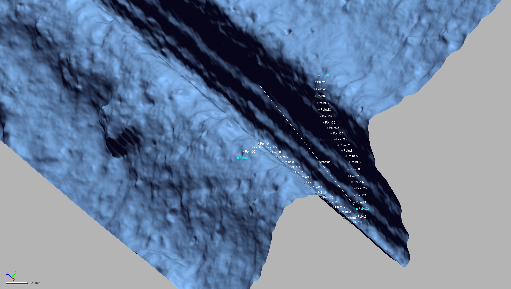
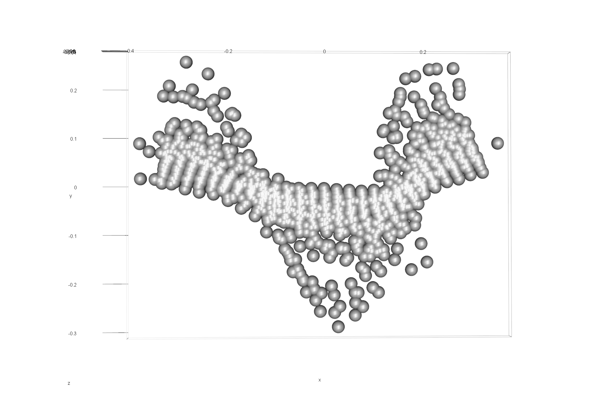
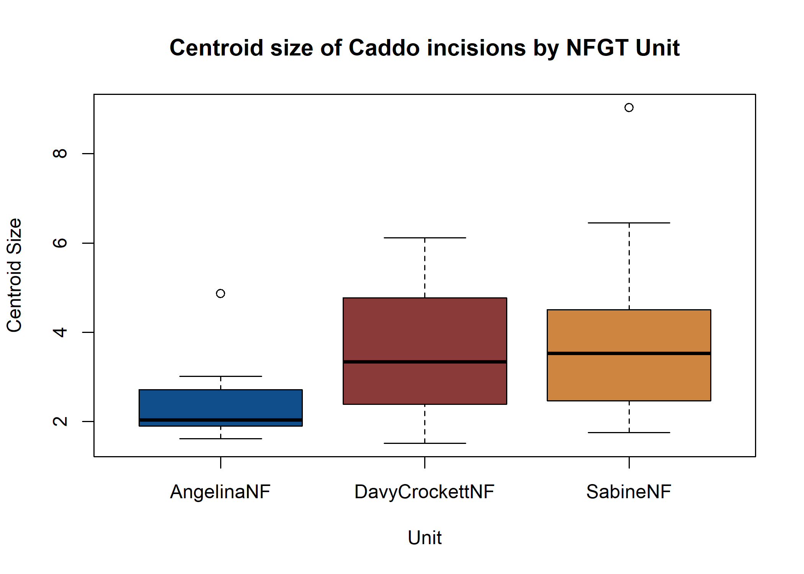
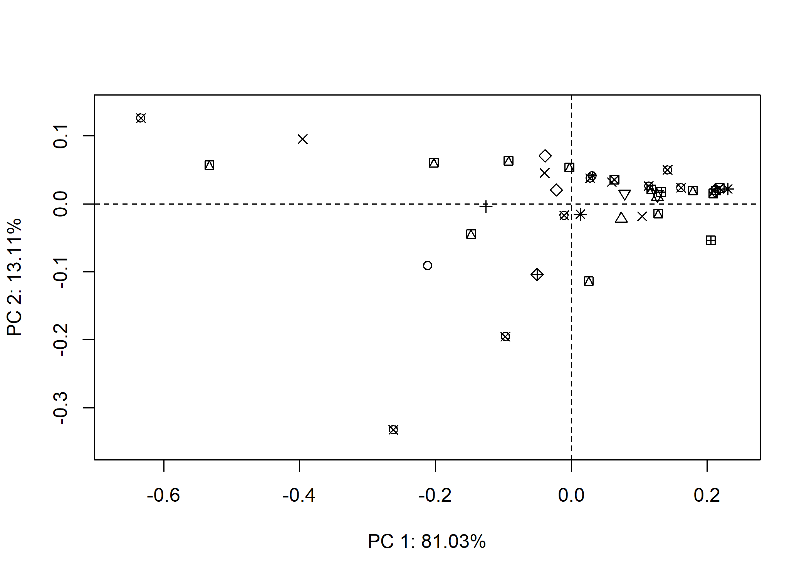
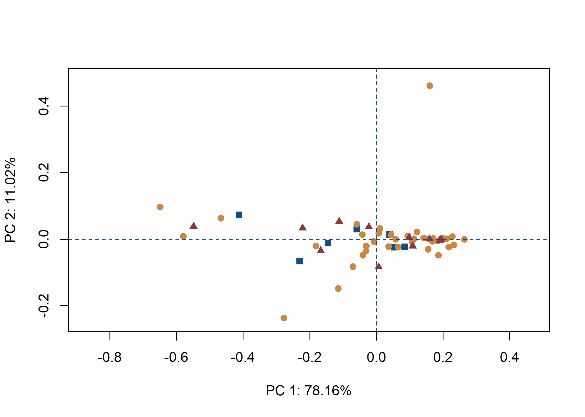
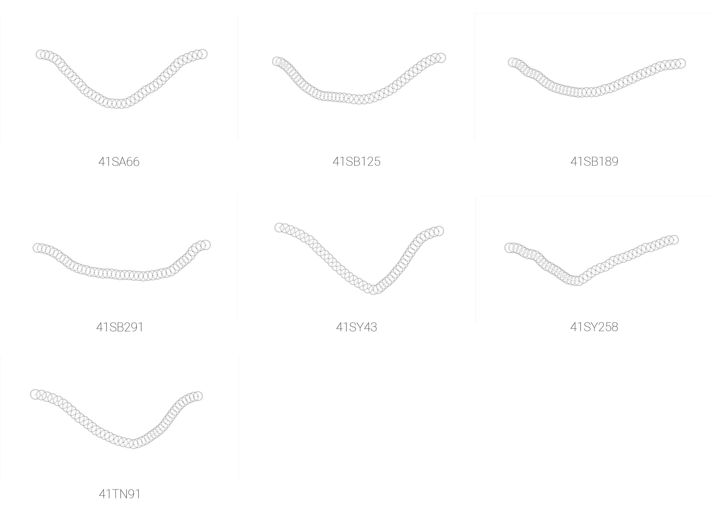

Supplementary materials for paper: Does similar ceramic incision
morphology provide inference to a common toolkit?
================
Robert Z. Selden, Jr.
19 May 2020

## Incision morphology

``` r
# location of landmarks

```


``` r
fig.cap="Location of landmarks (blue) and equidistant semilandmarks (white)."
```

``` r
# library(devtools)
# devtools::install_github("geomorphR/geomorph", ref = "Stable", build_vignettes = TRUE)
library(geomorph)
```

    ## Loading required package: RRPP

    ## Loading required package: rgl

``` r
setwd(getwd())
source('readmulti.csv.r')

# Read .csv files
setwd("./data")
filelist <- list.files(pattern = ".csv")
coords<-readmulti.csv(filelist)
setwd("../")

# read qualitative data
qdata<-read.csv("qdata.csv",header=TRUE,row.names=1)
qdata<-qdata[match(dimnames(coords)[[3]],rownames(qdata)),]
```

### Generalised Procrustes Analysis

``` r
Y.gpa<-gpagen(coords, PrinAxes = TRUE, print.progress = FALSE)

# 3D GPA plot

```


``` r
fig.cap="Results of generalized Procrustes analysis."

# geomorph data frame
gdf<-geomorph.data.frame(shape=Y.gpa$coords, size=Y.gpa$Csize, site=qdata$site, unit=qdata$unit, county=qdata$county) 
csz<-Y.gpa$Csize # attribute for boxplot
unt<-qdata$unit # attribute for boxplot
# boxplot of incision (centroid) size by nfgt unit
boxplot(csz~unt, 
        main = "Centroid size of Caddo incisions by NFGT Unit",
        names = c("AngelinaNF", "DavyCrockettNF", "SabineNF"),
        xlab = "Unit",
        ylab = "Centroid Size",
        col = c("dodgerblue4","indianred4","tan3")
        )
```



### Principal Components Analysis

``` r
# principal components analysis
pca<-gm.prcomp(Y.gpa$coords)
summary(pca)
```

    ## Importance of components: 
    ##                               PC1        PC2         PC3          PC4
    ## Tips variance          0.04682011 0.01123775 0.001716247 0.0005946012
    ## Proportion of variance 0.76242870 0.18299790 0.027947738 0.0096826148
    ## Cumulative Proportion  0.76242870 0.94542660 0.973374340 0.9830569547
    ##                                 PC5          PC6          PC7          PC8
    ## Tips variance          0.0004190271 0.0002460917 9.112202e-05 0.0000588871
    ## Proportion of variance 0.0068235282 0.0040074103 1.483851e-03 0.0009589303
    ## Cumulative Proportion  0.9898804829 0.9938878932 9.953717e-01 0.9963306740
    ##                                 PC9         PC10         PC11         PC12
    ## Tips variance          5.464406e-05 4.362301e-05 3.317206e-05 2.127599e-05
    ## Proportion of variance 8.898356e-04 7.103665e-04 5.401810e-04 3.464628e-04
    ## Cumulative Proportion  9.972205e-01 9.979309e-01 9.984711e-01 9.988175e-01
    ##                                PC13         PC14         PC15         PC16
    ## Tips variance          1.493385e-05 1.299774e-05 7.966257e-06 6.840308e-06
    ## Proportion of variance 2.431860e-04 2.116580e-04 1.297242e-04 1.113891e-04
    ## Cumulative Proportion  9.990607e-01 9.992724e-01 9.994021e-01 9.995135e-01
    ##                                PC17         PC18         PC19         PC20
    ## Tips variance          6.033744e-06 5.269483e-06 4.619322e-06 3.386989e-06
    ## Proportion of variance 9.825479e-05 8.580941e-05 7.522203e-05 5.515446e-05
    ## Cumulative Proportion  9.996117e-01 9.996975e-01 9.997728e-01 9.998279e-01
    ##                                PC21         PC22         PC23         PC24
    ## Tips variance          2.310100e-06 1.687064e-06 1.663348e-06 1.181242e-06
    ## Proportion of variance 3.761816e-05 2.747251e-05 2.708633e-05 1.923559e-05
    ## Cumulative Proportion  9.998655e-01 9.998930e-01 9.999201e-01 9.999393e-01
    ##                                PC25         PC26         PC27         PC28
    ## Tips variance          9.525529e-07 7.510022e-07 6.836982e-07 4.908448e-07
    ## Proportion of variance 1.551158e-05 1.222948e-05 1.113349e-05 7.993022e-06
    ## Cumulative Proportion  9.999548e-01 9.999671e-01 9.999782e-01 9.999862e-01
    ##                                PC29         PC30         PC31
    ## Tips variance          3.265809e-07 2.923910e-07 2.285941e-07
    ## Proportion of variance 5.318114e-06 4.761359e-06 3.722475e-06
    ## Cumulative Proportion  9.999915e-01 9.999963e-01 1.000000e+00

``` r
# set plot parameters
site <- qdata$site
pch.gps.site <- c(1,2,3,4,5,6,7)[as.factor(site)]
unit <- qdata$unit
pch.gps <- c(15,17,19)[as.factor(unit)]
col.gps <- c("dodgerblue4","indianred4","tan3")[as.factor(unit)]

# plotPCAbySite
pca.plot1<-plot(pca,
                pch = pch.gps.site)
```



``` r
# plotPCAbyUnit
pca.plot2<-plot(pca,
               pch = pch.gps,
               col = col.gps)
```



### Define models

``` r
fit.size<-procD.lm(shape ~ size, data = gdf, print.progress = FALSE, iter = 9999)
fit.sizesite<-procD.lm(size ~ site, data = gdf, print.progress = FALSE, iter = 9999)
fit.sizeunit<-procD.lm(size ~ unit, data = gdf, print.progress = FALSE, iter = 9999)
fit.sizecounty<-procD.lm(size ~ county, data = gdf, print.progress = FALSE, iter = 9999)
fit.shapesite<-procD.lm(shape ~ site, data = gdf, print.progress = FALSE, iter = 9999)
fit.shapeunit<-procD.lm(shape ~ unit, data = gdf, print.progress = FALSE, iter = 9999)
fit.shapecounty<-procD.lm(shape ~ county, data = gdf, print.progress = FALSE, iter = 9999)
```

### Size/Shape \~ Site/Unit/County?

``` r
# ANOVA: do incision sizes differ by site?
anova(fit.sizesite)
```

    ## 
    ## Analysis of Variance, using Residual Randomization
    ## Permutation procedure: Randomization of null model residuals 
    ## Number of permutations: 10000 
    ## Estimation method: Ordinary Least Squares 
    ## Sums of Squares and Cross-products: Type I 
    ## Effect sizes (Z) based on F distributions
    ## 
    ##           Df      SS     MS     Rsq      F      Z Pr(>F)  
    ## site       6  47.307 7.8845 0.37818 2.5341 1.5596  0.055 .
    ## Residuals 25  77.783 3.1113 0.62182                       
    ## Total     31 125.091                                      
    ## ---
    ## Signif. codes:  0 '***' 0.001 '**' 0.01 '*' 0.05 '.' 0.1 ' ' 1
    ## 
    ## Call: procD.lm(f1 = size ~ site, iter = 9999, data = gdf, print.progress = FALSE)

``` r
# ANOVA: do incision shapes differ by site?
anova(fit.shapesite)
```

    ## 
    ## Analysis of Variance, using Residual Randomization
    ## Permutation procedure: Randomization of null model residuals 
    ## Number of permutations: 10000 
    ## Estimation method: Ordinary Least Squares 
    ## Sums of Squares and Cross-products: Type I 
    ## Effect sizes (Z) based on F distributions
    ## 
    ##           Df     SS       MS     Rsq      F       Z Pr(>F)
    ## site       6 0.3828 0.063800 0.20108 1.0487 0.22809 0.3957
    ## Residuals 25 1.5209 0.060835 0.79892                      
    ## Total     31 1.9037                                       
    ## 
    ## Call: procD.lm(f1 = shape ~ site, iter = 9999, data = gdf, print.progress = FALSE)

``` r
# ANOVA: do incision sizes differ by unit?
anova(fit.sizeunit)
```

    ## 
    ## Analysis of Variance, using Residual Randomization
    ## Permutation procedure: Randomization of null model residuals 
    ## Number of permutations: 10000 
    ## Estimation method: Ordinary Least Squares 
    ## Sums of Squares and Cross-products: Type I 
    ## Effect sizes (Z) based on F distributions
    ## 
    ##           Df      SS     MS     Rsq     F        Z Pr(>F)
    ## unit       2   3.546 1.7730 0.02835 0.423 -0.24108 0.6617
    ## Residuals 29 121.545 4.1912 0.97165                      
    ## Total     31 125.091                                     
    ## 
    ## Call: procD.lm(f1 = size ~ unit, iter = 9999, data = gdf, print.progress = FALSE)

``` r
# ANOVA: do incision shapes differ by unit?
anova(fit.shapeunit)
```

    ## 
    ## Analysis of Variance, using Residual Randomization
    ## Permutation procedure: Randomization of null model residuals 
    ## Number of permutations: 10000 
    ## Estimation method: Ordinary Least Squares 
    ## Sums of Squares and Cross-products: Type I 
    ## Effect sizes (Z) based on F distributions
    ## 
    ##           Df      SS       MS    Rsq      F        Z Pr(>F)
    ## unit       2 0.05616 0.028080 0.0295 0.4408 -0.74549 0.7774
    ## Residuals 29 1.84752 0.063708 0.9705                       
    ## Total     31 1.90368                                       
    ## 
    ## Call: procD.lm(f1 = shape ~ unit, iter = 9999, data = gdf, print.progress = FALSE)

``` r
# ANOVA: do incision sizes differ by county?
anova(fit.sizecounty)
```

    ## 
    ## Analysis of Variance, using Residual Randomization
    ## Permutation procedure: Randomization of null model residuals 
    ## Number of permutations: 10000 
    ## Estimation method: Ordinary Least Squares 
    ## Sums of Squares and Cross-products: Type I 
    ## Effect sizes (Z) based on F distributions
    ## 
    ##           Df     SS     MS    Rsq      F       Z Pr(>F)
    ## county     3   3.69 1.2300 0.0295 0.2837 -0.9535 0.8411
    ## Residuals 28 121.40 4.3357 0.9705                      
    ## Total     31 125.09                                    
    ## 
    ## Call: procD.lm(f1 = size ~ county, iter = 9999, data = gdf, print.progress = FALSE)

``` r
# ANOVA: do incision shapes differ by county?
anova(fit.shapecounty)
```

    ## 
    ## Analysis of Variance, using Residual Randomization
    ## Permutation procedure: Randomization of null model residuals 
    ## Number of permutations: 10000 
    ## Estimation method: Ordinary Least Squares 
    ## Sums of Squares and Cross-products: Type I 
    ## Effect sizes (Z) based on F distributions
    ## 
    ##           Df      SS       MS     Rsq      F       Z Pr(>F)
    ## county     3 0.22396 0.074655 0.11765 1.2445 0.57951 0.2927
    ## Residuals 28 1.67972 0.059990 0.88235                      
    ## Total     31 1.90368                                       
    ## 
    ## Call: procD.lm(f1 = shape ~ county, iter = 9999, data = gdf, print.progress = FALSE)

### Morphological disparity

``` r
# morphological disparity: does incision morphology display greater shape variation among individuals relative to site, unit, or county?
# site
morphol.disparity(fit.shapesite, groups = qdata$site, data = gdf, print.progress = FALSE, iter = 9999)
```

    ## 
    ## Call:
    ## morphol.disparity(f1 = fit.shapesite, groups = qdata$site, iter = 9999,  
    ##     data = gdf, print.progress = FALSE) 
    ## 
    ## 
    ## 
    ## Randomized Residual Permutation Procedure Used
    ## 10000 Permutations
    ## 
    ## Procrustes variances for defined groups
    ##        sa66       sb125       sb189       sb291       sy258        sy43 
    ## 0.019971135 0.016669738 0.004299137 0.012458020 0.006946067 0.090934479 
    ##        tn91 
    ## 0.056009856 
    ## 
    ## 
    ## Pairwise absolute differences between variances
    ##              sa66       sb125       sb189       sb291       sy258       sy43
    ## sa66  0.000000000 0.003301397 0.015671998 0.007513115 0.013025069 0.07096334
    ## sb125 0.003301397 0.000000000 0.012370601 0.004211718 0.009723672 0.07426474
    ## sb189 0.015671998 0.012370601 0.000000000 0.008158883 0.002646930 0.08663534
    ## sb291 0.007513115 0.004211718 0.008158883 0.000000000 0.005511954 0.07847646
    ## sy258 0.013025069 0.009723672 0.002646930 0.005511954 0.000000000 0.08398841
    ## sy43  0.070963344 0.074264740 0.086635342 0.078476459 0.083988412 0.00000000
    ## tn91  0.036038721 0.039340117 0.051710719 0.043551835 0.049063789 0.03492462
    ##             tn91
    ## sa66  0.03603872
    ## sb125 0.03934012
    ## sb189 0.05171072
    ## sb291 0.04355184
    ## sy258 0.04906379
    ## sy43  0.03492462
    ## tn91  0.00000000
    ## 
    ## 
    ## P-Values
    ##         sa66  sb125  sb189  sb291  sy258   sy43   tn91
    ## sa66  1.0000 0.9208 0.6498 0.8267 0.7007 0.0904 0.3970
    ## sb125 0.9208 1.0000 0.7119 0.8982 0.7691 0.1291 0.3630
    ## sb189 0.6498 0.7119 1.0000 0.7920 0.9326 0.1233 0.2341
    ## sb291 0.8267 0.8982 0.7920 1.0000 0.8577 0.1409 0.3107
    ## sy258 0.7007 0.7691 0.9326 0.8577 1.0000 0.1335 0.2593
    ## sy43  0.0904 0.1291 0.1233 0.1409 0.1335 1.0000 0.3074
    ## tn91  0.3970 0.3630 0.2341 0.3107 0.2593 0.3074 1.0000

``` r
# unit
morphol.disparity(fit.shapeunit, groups = qdata$unit, data = gdf, print.progress = FALSE, iter = 9999)
```

    ## 
    ## Call:
    ## morphol.disparity(f1 = fit.shapeunit, groups = qdata$unit, iter = 9999,  
    ##     data = gdf, print.progress = FALSE) 
    ## 
    ## 
    ## 
    ## Randomized Residual Permutation Procedure Used
    ## 10000 Permutations
    ## 
    ## Procrustes variances for defined groups
    ## angelinaNF    davycNF   sabineNF 
    ## 0.01997114 0.05600986 0.06773716 
    ## 
    ## 
    ## Pairwise absolute differences between variances
    ##            angelinaNF    davycNF   sabineNF
    ## angelinaNF 0.00000000 0.03603872 0.04776602
    ## davycNF    0.03603872 0.00000000 0.01172730
    ## sabineNF   0.04776602 0.01172730 0.00000000
    ## 
    ## 
    ## P-Values
    ##            angelinaNF davycNF sabineNF
    ## angelinaNF     1.0000  0.5311   0.3404
    ## davycNF        0.5311  1.0000   0.7685
    ## sabineNF       0.3404  0.7685   1.0000

``` r
# county
morphol.disparity(fit.shapecounty, groups = qdata$county, data = gdf, print.progress = FALSE, iter = 9999)
```

    ## 
    ## Call:
    ## morphol.disparity(f1 = fit.shapecounty, groups = qdata$county,  
    ##     iter = 9999, data = gdf, print.progress = FALSE) 
    ## 
    ## 
    ## 
    ## Randomized Residual Permutation Procedure Used
    ## 10000 Permutations
    ## 
    ## Procrustes variances for defined groups
    ##        sabine san-augustine        shelby       trinity 
    ##    0.01566873    0.01997114    0.08740459    0.05600986 
    ## 
    ## 
    ## Pairwise absolute differences between variances
    ##                    sabine san-augustine     shelby    trinity
    ## sabine        0.000000000   0.004302405 0.07173586 0.04034113
    ## san-augustine 0.004302405   0.000000000 0.06743345 0.03603872
    ## shelby        0.071735858   0.067433453 0.00000000 0.03139473
    ## trinity       0.040341126   0.036038721 0.03139473 0.00000000
    ## 
    ## 
    ## P-Values
    ##               sabine san-augustine shelby trinity
    ## sabine        1.0000        0.9141 0.0562  0.2911
    ## san-augustine 0.9141        1.0000 0.1215  0.4462
    ## shelby        0.0562        0.1215 1.0000  0.3916
    ## trinity       0.2911        0.4462 0.3916  1.0000

``` r
# morphological disparity: does incision morphology display greater size variation among individuals relative to site, unit, or county?
# site
morphol.disparity(fit.sizesite, groups = qdata$site, data = gdf, print.progress = FALSE, iter = 9999)
```

    ## 
    ## Call:
    ## morphol.disparity(f1 = fit.sizesite, groups = qdata$site, iter = 9999,  
    ##     data = gdf, print.progress = FALSE) 
    ## 
    ## 
    ## 
    ## Randomized Residual Permutation Procedure Used
    ## 10000 Permutations
    ## 
    ## Procrustes variances for defined groups
    ##      sa66     sb125     sb189     sb291     sy258      sy43      tn91 
    ## 2.1746075 0.6155901 1.3865974 0.1269339 9.7527403 1.3306584 3.0964036 
    ## 
    ## 
    ## Pairwise absolute differences between variances
    ##            sa66     sb125      sb189     sb291    sy258       sy43      tn91
    ## sa66  0.0000000 1.5590174 0.78801009 2.0476736 7.578133 0.84394908 0.9217961
    ## sb125 1.5590174 0.0000000 0.77100733 0.4886561 9.137150 0.71506834 2.4808135
    ## sb189 0.7880101 0.7710073 0.00000000 1.2596635 8.366143 0.05593899 1.7098062
    ## sb291 2.0476736 0.4886561 1.25966346 0.0000000 9.625806 1.20372447 2.9694697
    ## sy258 7.5781328 9.1371502 8.36614291 9.6258064 0.000000 8.42208190 6.6563367
    ## sy43  0.8439491 0.7150683 0.05593899 1.2037245 8.422082 0.00000000 1.7657452
    ## tn91  0.9217961 2.4808135 1.70980621 2.9694697 6.656337 1.76574520 0.0000000
    ## 
    ## 
    ## P-Values
    ##         sa66  sb125  sb189  sb291  sy258   sy43   tn91
    ## sa66  1.0000 0.4905 0.7450 0.4225 0.0045 0.6630 0.6230
    ## sb125 0.4905 1.0000 0.7462 0.8336 0.0004 0.7541 0.1772
    ## sb189 0.7450 0.7462 1.0000 0.6138 0.0061 0.9816 0.4758
    ## sb291 0.4225 0.8336 0.6138 1.0000 0.0003 0.6331 0.1616
    ## sy258 0.0045 0.0004 0.0061 0.0003 1.0000 0.0010 0.0081
    ## sy43  0.6630 0.7541 0.9816 0.6331 0.0010 1.0000 0.2068
    ## tn91  0.6230 0.1772 0.4758 0.1616 0.0081 0.2068 1.0000

``` r
# unit
morphol.disparity(fit.sizeunit, groups = qdata$unit, data = gdf, print.progress = FALSE, iter = 9999)
```

    ## 
    ## Call:
    ## morphol.disparity(f1 = fit.sizeunit, groups = qdata$unit, iter = 9999,  
    ##     data = gdf, print.progress = FALSE) 
    ## 
    ## 
    ## 
    ## Randomized Residual Permutation Procedure Used
    ## 10000 Permutations
    ## 
    ## Procrustes variances for defined groups
    ## angelinaNF    davycNF   sabineNF 
    ##   2.174607   3.096404   4.634463 
    ## 
    ## 
    ## Pairwise absolute differences between variances
    ##            angelinaNF   davycNF sabineNF
    ## angelinaNF  0.0000000 0.9217961 2.459856
    ## davycNF     0.9217961 0.0000000 1.538060
    ## sabineNF    2.4598560 1.5380599 0.000000
    ## 
    ## 
    ## P-Values
    ##            angelinaNF davycNF sabineNF
    ## angelinaNF     1.0000  0.7564   0.3780
    ## davycNF        0.7564  1.0000   0.6208
    ## sabineNF       0.3780  0.6208   1.0000

``` r
# county
morphol.disparity(fit.sizeunit, groups = qdata$unit, data = gdf, print.progress = FALSE, iter = 9999)
```

    ## 
    ## Call:
    ## morphol.disparity(f1 = fit.sizeunit, groups = qdata$unit, iter = 9999,  
    ##     data = gdf, print.progress = FALSE) 
    ## 
    ## 
    ## 
    ## Randomized Residual Permutation Procedure Used
    ## 10000 Permutations
    ## 
    ## Procrustes variances for defined groups
    ## angelinaNF    davycNF   sabineNF 
    ##   2.174607   3.096404   4.634463 
    ## 
    ## 
    ## Pairwise absolute differences between variances
    ##            angelinaNF   davycNF sabineNF
    ## angelinaNF  0.0000000 0.9217961 2.459856
    ## davycNF     0.9217961 0.0000000 1.538060
    ## sabineNF    2.4598560 1.5380599 0.000000
    ## 
    ## 
    ## P-Values
    ##            angelinaNF davycNF sabineNF
    ## angelinaNF     1.0000  0.7564   0.3780
    ## davycNF        0.7564  1.0000   0.6208
    ## sabineNF       0.3780  0.6208   1.0000

### Mean shapes

``` r
# subset landmark coordinates to produce mean shapes by site
new.coords<-coords.subset(A = Y.gpa$coords, group = qdata$site)
names(new.coords)
```

    ## [1] "sa66"  "sb125" "sb189" "sb291" "sy258" "sy43"  "tn91"

``` r
# group shape means
mean<-lapply(new.coords, mshape)
# plot(mean$tn91)

```


``` r
fig.cap="Mean shapes for Caddo incisions from sites on the National Forests and Grasslands in Texas."
# end of code
```
