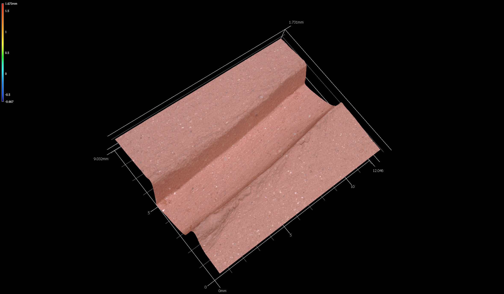
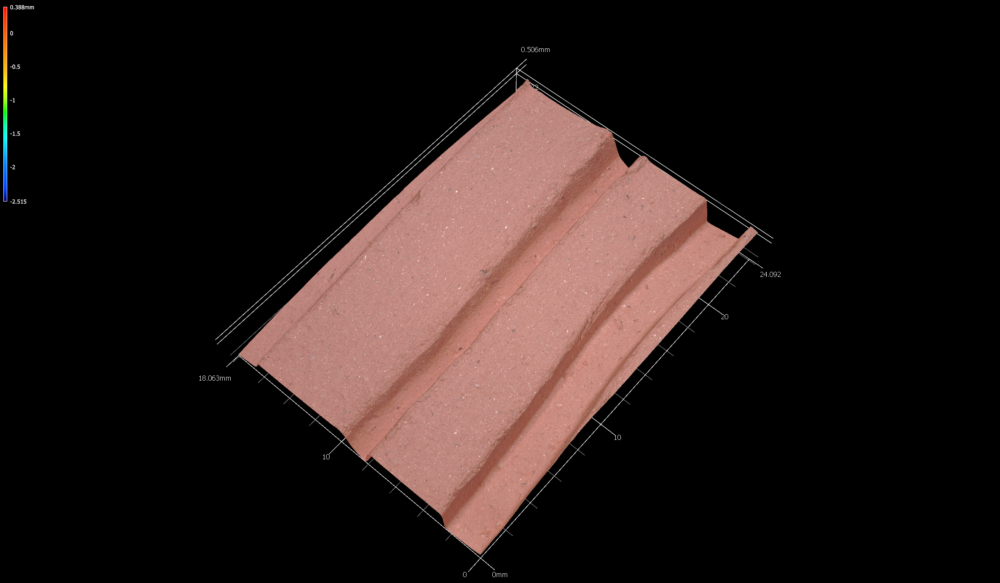
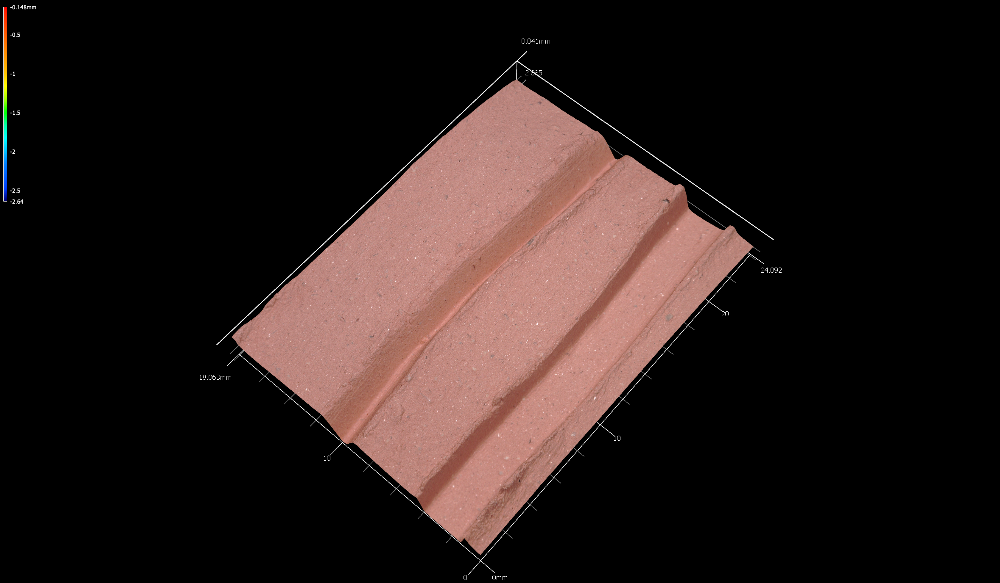
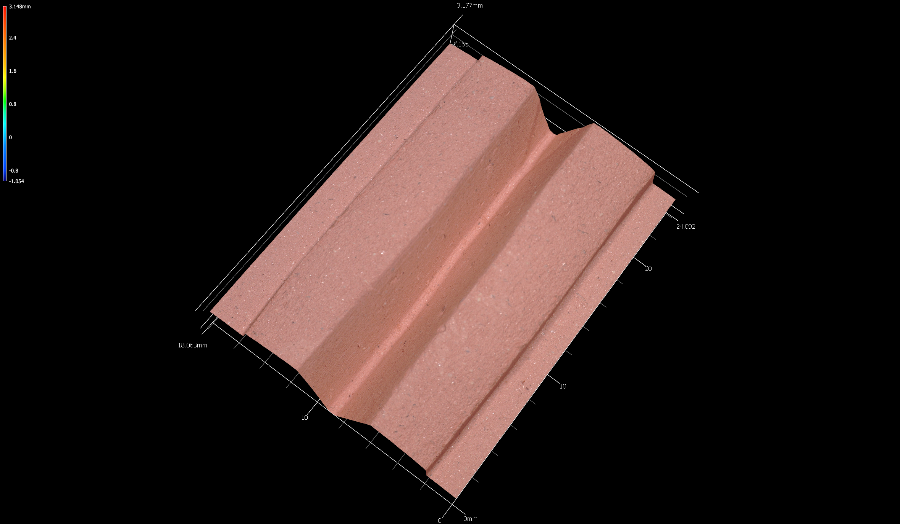

# Experimental sample

The experimental sample consisted of seven test tiles that were incised and fired to Cone 06 at the Arrowmont School of Arts and Crafts in Gatlinburg, Tennessee. The tiles were later transported to the National Center for Preservation Technology and Training where they were scanned, then to the Heritage Research Center at Stephen F. Austin State University for the analysis.

## Experimental tiles

The clay used for the experimental tiles was Red Stone from Highwater Clays. Each tile was moved to a dry box 15 minutes after the incision was made. The tiles were fired in five stages using an electric kiln at the Arrowmont School of Arts and Crafts:

|Stage | Rate/Hr   | Temp   | Hold
|:----:|:---------:|:------:|:-----------------------
| 1    | 100/hr    | 190&deg;F| Hold for seven hours
| 2    | 200/hr    | 400&deg;F| Hold for 10 minutes
| 3    | 250/hr    | 600&deg;F| Hold for 10 minutes
| 4    | 400/hr    |1200&deg;F| Hold for 10 minutes
| 5    | 500/hr    |1800&deg;F| Hold for 10 minutes

Royal Sovereign, Ltd, (UK) manufactured the chisels used to create the incisions, which included size 10/flat, size 9/flat, size 2/cup round, size 0/cup round, and size 0/cup chisel.

Experimental tile 1 included an impression of the chisel tip on each instrument, and was not included in the experimental sample. Experimental tiles 2-8 included two incisions on each tile. In some cases two scans were generated for a tile, capturing the incision of interest nearest the center of the scan. 

A Keyence VR-5000 optical profilometer was used to capture each three-dimensional image, which was rendered in the VR Series (VR-3000 G2 Series) Analyzer Software, then exported to Geomagic Design X (version 2019.0.3) where the landmarks were applied. 

### Experimental tile 2

```{r exp-tile2, out.width = "100%", dpi = 300, echo=TRUE, warning=FALSE}
# incision image

fig.cap="Incisions on experimental tile 2 were made with a Size 0 cup chisel (plan), and a Size 0 cup round (plan)."
```

### Experimental tile 3

```{r exp-tile3, out.width = "100%", dpi = 300, echo=TRUE, warning=FALSE}
# incision image
knitr::include_graphics('images/exp-tile3.png')
fig.cap="Incisions on experimental tile 3 were made with a Size 9 flat chisel (plan), and a Size 2 cup round (plan)."
```

### Experimental tile 4a

```{r exp-tile4a, out.width = "100%", dpi = 300, echo=TRUE, warning=FALSE}
# incision image
knitr::include_graphics('images/exp-tile4a.png')
fig.cap="Incisions on experimental tile 4a were made with a Size 0 cup chisel."
```

### Experimental tile 4b

```{r exp-tile4b, out.width = "100%", dpi = 300, echo=TRUE, warning=FALSE}
# incision image

fig.cap="Incisions on experimental tile 4b were made with a Size 0 cup chisel (profile)."
```

### Experimental tile 5

```{r exp-tile5, out.width = "100%", dpi = 300, echo=TRUE, warning=FALSE}
# incision image

fig.cap="Incisions on experimental tile 5 were made with a Size 0 cup chisel (plan), and a Size 0 cup round (plan)."
```

### Experimental tile 6a

```{r exp-tile6a, out.width = "100%", dpi = 300, echo=TRUE, warning=FALSE}
# incision image
knitr::include_graphics('images/exp-tile6a.png')
fig.cap="Incisions on experimental tile 6a were made with a Size 2 cup round (plan)."
```

### Experimental tile 6b

```{r exp-tile6b, out.width = "100%", dpi = 300, echo=TRUE, warning=FALSE}
# incision image
knitr::include_graphics('images/exp-tile6b.png')
fig.cap="Incisions on experimental tile 6b were made with a Size 2 cup round (profile)."
```

### Experimental tile 7a

```{r exp-tile7a, out.width = "100%", dpi = 300, echo=TRUE, warning=FALSE}
# incision image
knitr::include_graphics('images/exp-tile7a.png')
fig.cap="Incisions on experimental tile 7a were made with a Size 9 flat (plan)."
```

### Experimental tile 7b

```{r exp-tile7b, out.width = "100%", dpi = 300, echo=TRUE, warning=FALSE}
# incision image
knitr::include_graphics('images/exp-tile7b.png')
fig.cap="Incisions on experimental tile 7b were made with a Size 9 flat (profile)."
```

### Experimental tile 8a

```{r exp-tile8a, out.width = "100%", dpi = 300, echo=TRUE, warning=FALSE}
# incision image
knitr::include_graphics('images/exp-tile8a.png')
fig.cap="Incisions on experimental tile 8a were made with a Size 10 flat (plan)."
```

### Experimental tile 8a

```{r exp-tile8b, out.width = "100%", dpi = 300, echo=TRUE, warning=FALSE}
# incision image

fig.cap="Incisions on experimental tile 8b were made with a Size 10 flat (profile)."
```
