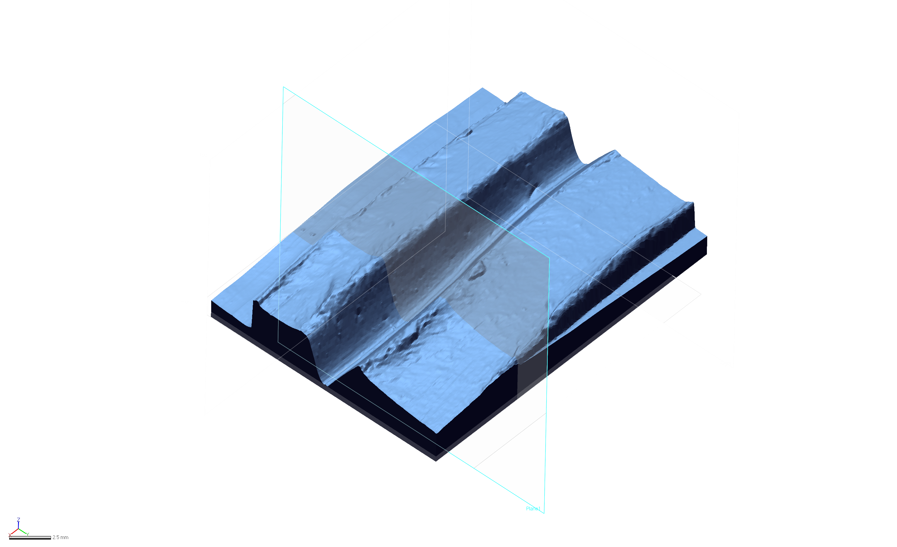
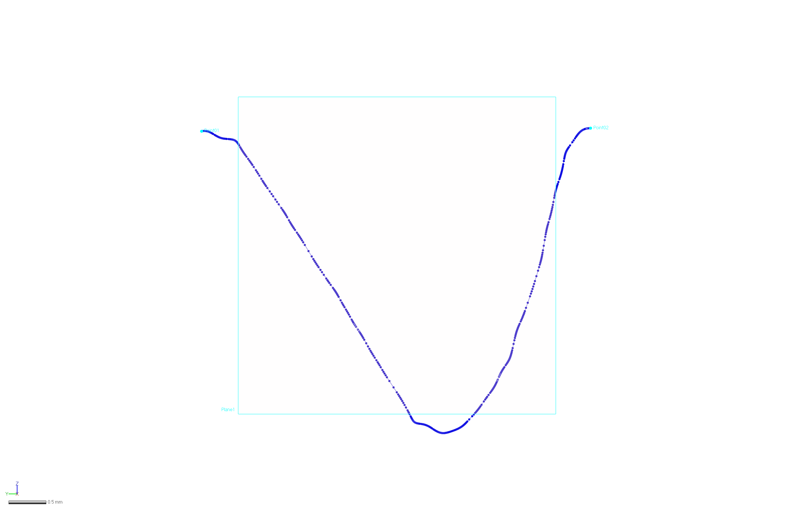
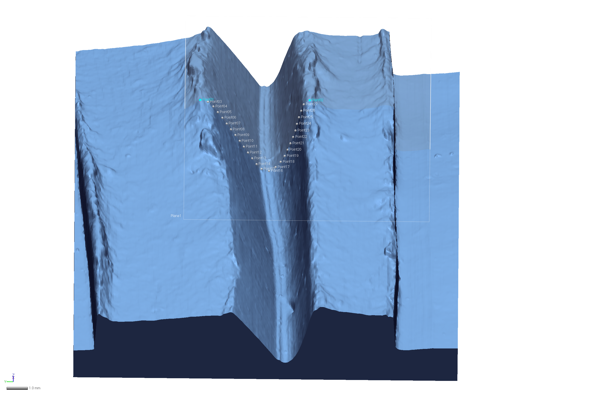

# Landmarking protocol

The characteristic points and tangents used in this landmarking protocol were inspired by the pioneering work of Birkhoff [-@RN11786]. The final configuration employs two horizontal tangents at either end of the curve with 25 equidistant semilandmarks placed along the dynamic contours of a spline.

## Calculating depth

The method of calculating the depth of each incision employed the use of two planes. one was places on the surface of each sherd by selecting three points outside of the area where the incision was made. The second plane was inserted using the `offset` function, and was extended to the limit of the mesh associated with the incision. A `reference point` was inserted at that location, used to identify the x coordinate of the cross-section.

## Placing the landmarks

Using Geomagic Design X, a plane was inserted at the location of the `reference point` to capture the deepest profile of each incision. The rationale behind selecting the deepest incision is that these marks were made when the vessel was not yet leather hard, and the deepest incision would provide the most complete representation of the tool employed in the application of the decorative motif.

```{r insertplane, out.width = "100%", dpi = 300, echo=TRUE, warning=FALSE}
# incision image

fig.cap="Reference plane (blue) inserted at deepest point of incision of experimental tile 6b."
```

The horizontal tangent was calculated for the rise in the clay matrix above the `reference plane` on either side of the incision, and was followed by calculating the linear distance between the tangents to identify the mid-point of the incision. Prior to the application of landmarks, the deepest point of the incision profile (identified in the depth measurement) was always oriented to the right of center.

```{r h.tangent, out.width = "100%", dpi = 300, echo=TRUE, warning=FALSE}
# incision image

fig.cap="Spline (500 interpolation points) that was cut at the location of horizontal tangents on each side, then oriented where the deepest part of the incision was to the right of center."
```

Once properly oriented, the horizontal tangent on the left was assigned as landmark (LM) 01, and the tangent on the right as LM 02. Twenty five equidistant landmarks were subsequently placed between the two landmarks along the spline.

```{r semi.land, out.width = "100%", dpi = 300, echo=TRUE, warning=FALSE}
# incision image

fig.cap="Placement of 25 equidistant semilandmarks (white) between LM01 and LM02 (blue)"
```

Landmarks and semilandmarks associated with each specimen were then exported as CSV files. These are included in the supplemental materials as `dataEX` for the experimental sample, and `data1` for the archaeological sample.
