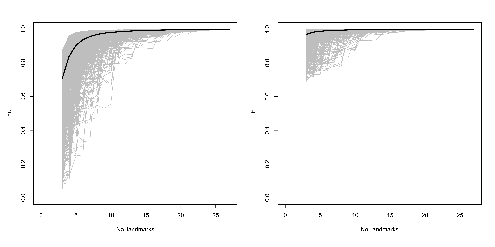
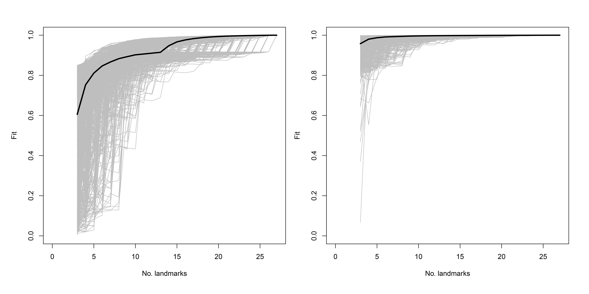

# Landmark Sampling Evaluation Curve (LaSEC)

The landmarking configuration used to analyse Caddo incisions was further scrutinised using the Landmark Sampling Error Curve, or `LaSEC` included in the `LaMBDA` package, as a means of assessing the fidelity of morphological characterisation by landmarks [@RN28913]. `LaSEC` was run twice for this study. Once on the experimental incisions, and a second time on the archaeological sample. 

LaSEC conducts the following procedure [@RN28913, 4-5]:

1. As is typical for extracting shape data, perform a generalized Procrustes alignment (`gpagen` function in the `geomorph` package) on a coordinate dataset (argument `coord.data`) in 2-D or 3-D (argument `n.dim`) and record the resulting shape coordinates and centroid size. Here, the shape coordinates are projected onto tangent space because pairwise distances among corresponding datasets later in the analysis are based on Euclidean distances and most shape analyses in the biological literature are conducted in tangent space instead of Procrustes shape space.
2. Subsample the same three randomly selected landmarks from all specimens. The subsampling begins with a subset of three landmarks because a minimum of three landmarks is required to define shape. Then, generate shape and centroid size data with generalized Procrustes superimposition on the subsampled data.
3. Perform an Ordinary Procrustes Alignment (`protest` function in the `vegan` R package) on the subsampled data to minimize the pairwise distances between corresponding landmarks in the parent data through translation, rotation, and scaling of data in full shape space. As stated above, note that this procedure is different from the typical implementation of Procrustes alignment on coordinate data in 2-D or 3-D space. The function then records the sum of these squared distances as measure of fit (PSS) between the relative locations of data points in the parent and subsampled datasets. Equivalent procedure is conducted on centroid size data.
4. Sample one additional, randomly chosen landmark and repeat step 3 until the entire set of landmarks in the parent dataset is sampled. The completion of this step represents one iteration of subsampling.
5. Repeat steps 2–5 for specified number of iterations (`iter` argument).
6. Create sampling curves by plotting the trajectory of “fit” (1–PSS) against the number of landmarks sampled from each iteration for both shape and centroid size as gray lines. Then, plot the median fit value for each number of landmarks sampled on the same plot as a thick, dark line. Finally, output these sampling curves: `LaSEC_SamplingCurve_Shape.pdf`, `LaSEC_SamplingCurve_Size.pdf`.

## Analysis of experimental sample

```{r, load.lasec.package.EX, echo=TRUE}
# load package
#devtools::install_github("akiopteryx/lambda")
library(LaMBDA)

# set working directory
setwd(getwd())
source('readmulti.csv.R')

# read .csv files
setwd("./dataEX")
filelist <- list.files(pattern = ".csv")
lmdata <- readmulti.csv(filelist)
lmdata <- two.d.array(lmdata)
setwd("../")

# analysis
lasec(coord.data = lmdata, n.dim = 3, iter = 1000)
```

Results demonstrate that five landmarks are necessary to achieve a median fit value of 0.90, seven to achieve a median fit value of 0.95, and 14 to achieve a fit value of 0.99. For centroid size, six landmarks were needed to achieve a median fit value of 0.99.

```{r fig.lasec.EX, fig.cap="Sampling curves from performing `LaSEC` on the experimental dataset with respect to characterising shape variation. Each gray line indicates fit values from one iteration of subsampling. Thick, dark line denotes median fit value at each number of landmarks. `LaSEC` sampling curve for shape (left), and for centroid size (right). Results produced using the code above for this 3D dataset, using 1,000 iterations. _Images converted to PNG following export._"}

```

Results demonstrate saltation, illustrating that some landmarks are critical for capturing shape information [@RN28913]. Dynamic as incisions may be in shape, that variation may be captured with a configuration of landmarks that employed fewer equidistant semilandmarks along the spline. The initial configuration of 50 semilandmarks was thus reduced by half based upon this result.

## Analysis of archaeological sample

```{r, load.lasec.package.arch, echo=TRUE}
# read .csv files
setwd("./data1")
filelist <- list.files(pattern = ".csv")
lmdata <- readmulti.csv(filelist)
lmdata <- two.d.array(lmdata)
setwd("../")

# analysis
lasec(coord.data = lmdata, n.dim = 3, iter = 1000)
```

Results demonstrate that 10 landmarks are necessary to achieve a median fit value of 0.90, 14 to achieve a median fit value of 0.95, and 19 to achieve a fit value of 0.99. For centroid size, three landmarks were needed to achieve a median fit value of 0.95, and six were needed to achieve a median fit value of 0.99.

```{r fig.lasec.arch, fig.cap="Sampling curves from performing `LaSEC` on the archaeological dataset with respect to characterising shape variation. Each gray line indicates fit values from one iteration of subsampling. Thick, dark line denotes median fit value at each number of landmarks. `LaSEC` sampling curve for shape (left), and for centroid size (right). Results produced using the code above for this 3D dataset, using 1,000 iterations. _Images converted to PNG following export._"}

```

Like the experimental sample, results demonstrate saltation, illustrating that some landmarks are critical for capturing shape information [@RN28913]. Dynamic as incisions may be in shape, that variation may be captured with a configuration of landmarks that employed fewer equidistant semilandmarks along the spline. The initial configuration of 50 semilandmarks was thus reduced by half based upon this result; however, it is noteworthy that the archaeological sample does require more landmarks than the experimental sample, and that saltation continues across the full range.
