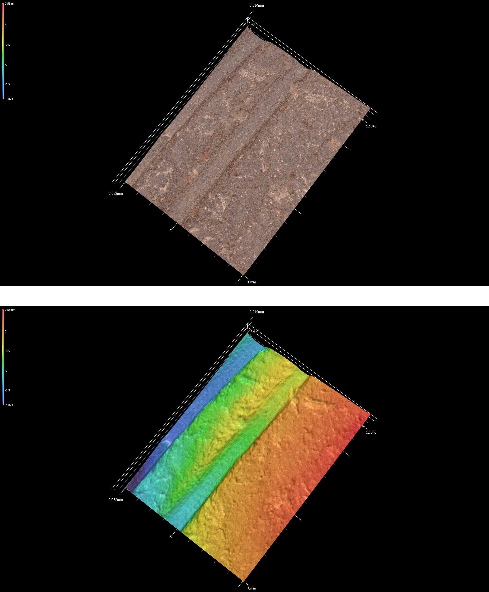
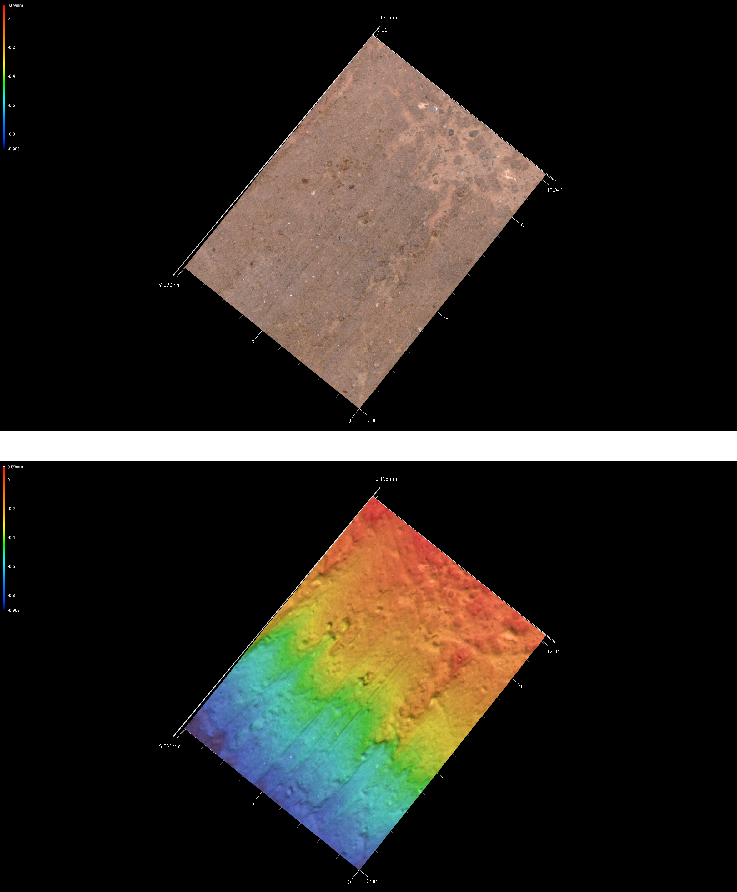

# Archaeological sample

## Temporal and spatial dynamics

The sample used in this study was generated through archaeological surveys, and there are no chronometric dates for any of the sites. Temporal assignments employ relative dates. Therefore, if a site spans the Woodland period through CE 1200 (41SA66), the date range is considered to range from 500 BCE to CE 1200. However, only those temporal assignments associated with Caddo components are plotted, so that the same plot for 41SA66 is altered to illustrate a span from CE 800-1200.

```{r temporal, out.width = "100%", dpi = 300, echo=TRUE, warning=FALSE}
# load ggplot2
library(ggplot2)

# gantt chart of (possible) relative dates for ceramic components
temp<-data.frame(Site=c('41SA66','41SB125','41SB189','41SB189','41SB291','41SY43','41SY43','41SY258','41SY280','41TN91'),
                 Date_Range_CE=c(800,1200,1000,1400,1200,1000,1450,800,1400,900), # in years BCE/CE
                 end=c(1200,1680,1200,1680,1680,1300,1680,1680,1680,1200) # in years CE
)
temp.site<-ggplot(temp,aes(x=Date_Range_CE,xend=end,y=Site,yend=Site,color=Site)) +
  geom_segment(size=2) +
  scale_color_brewer(palette = "Dark2") +
  theme(legend.position = "none")
# render figure
temp.site
```

All samples were collected in east Texas within San Augustine (SA), Sabine (SB), Shelby (SY), and Trinity (TN) counties. Smithsonian trinomials for each site indicate the state designation for Texas (41), the county (SA, SB, SY, or TN), and the site number. The coordinates for archaeological sites are redacted as mandated by law; however, county names and centroids that articulate with the sample are noted below.

```{r spatial, out.width = "100%", dpi = 300, echo=TRUE, warning=FALSE}
library(sf)
theme_set(theme_bw())
library(rnaturalearth)
library(rnaturalearthdata)
library(ggrepel)
library(ggspatial)

world <- ne_countries(scale = "medium", returnclass = "sf")
class(world)

library(maps)
states <- st_as_sf(map("state", plot = FALSE, fill = TRUE))
head(states)
states <- cbind(states, st_coordinates(st_centroid(states)))

library(tools)
states$ID <- toTitleCase(states$ID)
head(states)

counties <- st_as_sf(map("county", plot = FALSE, fill = TRUE))
counties <- subset(counties, grepl("texas", counties$ID))
counties$area <- as.numeric(st_area(counties))
head(counties)

scty <- data.frame(state = rep("Texas", 4), cty.cent = c("San Augustine", 
    "Sabine", "Shelby", "Trinity"), lat = c(31.4699, 
    31.2974, 31.8343, 31.0688), lng = c(-94.1514, 
    -93.8248, -94.1514, -95.1432))

(scty <- st_as_sf(scty, coords = c("lng", "lat"), remove = FALSE, 
    crs = 4326, agr = "constant"))

ggplot(data = world) +
    geom_sf() +
    geom_sf(data = counties, fill = NA, color = gray(.5)) +
    geom_sf(data = scty) +
    geom_text_repel(data = scty, aes(x = lng, y = lat, label = cty.cent), 
        fontface = "bold", nudge_x = c(-3, -1.5, -2, -2, 1), nudge_y = c(0.25, 
            -0.25, 0.75, 0.5, 1)) +
    annotation_scale(location = "bl", width_hint = 0.2) +
    annotation_north_arrow(location = "bl", which_north = "true", 
        pad_x = unit(0.06, "in"), pad_y = unit(0.2, "in"),
        style = north_arrow_fancy_orienteering) +
    coord_sf(xlim = c(-107, -93), ylim = c(25, 37), expand = FALSE) +
    xlab ("Longitude") + ylab("Latitude") +
    ggtitle("Texas County Locations of Samples", subtitle = "(archaeological site locations redacted)")
```

## 41SA66

The David Fox site (41SA66) is located in the Angelina National Forest on a high terrace overlooking the Attoyac Bayou floodplain and a small tributary. The site was initially described by Stephenson [-@RN5040] as being small and culturally poor, and was under active cultivation at that time [@RN793].

Woodland period and pre-CE 1200 Caddo components were found at 41SA66. The Woodland component includes eight _Goose Creek Plain_ body sherds from surface contexts [@RN5066, 57, Pl. 29]. The Caddo component is evidenced by 11 grog-tempered rim and body sherds. Three of the rims bear multiple (5-12 lines) horizontal incised lines, and three body sherds include 7-12 parallel incised lines. The other five sherds---four body sherds and a body/base sherd---are plain.

### 41sa66

```{r sa66, out.width = "100%", dpi = 300, echo=TRUE, warning=FALSE}
# incision image
knitr::include_graphics('images/sa66-inc.png')
fig.cap="Incisions on sherd 41sa66."
```

### 41sa66-4

```{r sa66-4, out.width = "100%", dpi = 300, echo=TRUE, warning=FALSE}
# incision image
knitr::include_graphics('images/sa66-4-inc.png')
fig.cap="Incisions on sherd 41sa66-4."
```

### 41sa66-5

```{r sa66-5, out.width = "100%", dpi = 300, echo=TRUE, warning=FALSE}
# incision image
knitr::include_graphics('images/sa66-5-inc.png')
fig.cap="Incisions on sherd 41sa66-5."
```

### 41sa66-6

```{r sa66-6, out.width = "100%", dpi = 300, echo=TRUE, warning=FALSE}
# incision image
knitr::include_graphics('images/sa66-6-inc.png')
fig.cap="Incisions on sherd 41sa66-6."
```

## 41SB125

Located in the Sabine National Forest, 41SB125 includes both Woodland and post-CE 1200 Caddo components. Diagnostic artifacts from the Woodland period component include 42 _Goose Creek Plain_ body sherds from eight shovel tests; these were recovered between 20-60 cmbs. There is another sandy paste sherd with incised and stamped decorative elements, potentially a Marksville Stamped body sherd [@RN5635, 65-74]. 

The Caddo component is marked by seven grog-tempered body sherds from four shovel tests, ranging from 20-75 cmbs. Three are plain grog-tempered body sherds. The decorated sherds include a body sherd with a single straight incised line (ST 20, 20-30 cmbs), another body sherd with parallel brushing marks (ST 11, 20-30 cmbs), a rim with a triangular incised zone filled with rows of cane punctates, and a body sherd with an incised zone filled with diagonal incised lines.

### 41sb125-2-st27-25cm-lot100

```{r 41sb125-2-st27-25cm-lot100, out.width = "100%", dpi = 300, echo=TRUE, warning=FALSE}
# incision image
knitr::include_graphics('images/41sb125-2-st27-25cm-lot100-inc.png')
fig.cap="Incisions on sherd 41sb125-2-st27-25cm-lot100."
```

### 41sb125-3-st27-lot99-inc

```{r 41sb125-3-st27-lot99, out.width = "100%", dpi = 300, echo=TRUE, warning=FALSE}
# incision image
knitr::include_graphics('images/41sb125-3-st27-lot99-inc.png')
fig.cap="Incisions on sherd 41sb125-3-st27-lot99."
```

### 41sb125-11-st11-lot50-inc

```{r 41sb125-11-st11-lot50-inc, out.width = "100%", dpi = 300, echo=TRUE, warning=FALSE}
# incision image
knitr::include_graphics('images/41sb125-11-st11-lot50-inc.png')
fig.cap="Incisions on sherd 41sb125-11-st11-lot50."
```

## 41SB189

There are several archeological components at 41SB189 in the Sabine National Forest. The earliest may date to the Middle Archaic period, based on the recovery of a possible Johnson dart point from Mound D that was manufactured from non-local white chert. Late Archaic use of the site is marked by a Williams dart point from Mound D that was manufactured from silicified wood.

The Woodland component at 41SB189 is more substantial, includes a chert Gary point from Mound A, three Friley arrow points (chert), and 15 _Goose Creek Plain_ body sherds. These were found in shovel tests, and range between 0-50 cmbs in Mounds A and H.

Temporally diagnostic artifacts indicate that the Caddo occupation at the site occurred during the Early Caddo period (CE 1000-1200). That assertion is based on the recovery of an Alba point from Mound A made of chert. The final Caddo occupation occurred after CE 1400, and includes a Bassett arrow point from Mound D made from chert, as well as grog-tempered body sherds from Mound A and D recovered between 0-60 cmbs in different shovel tests. Sherds recovered from that component include seven plain body sherds, and five decorated body sherds. One decorated sherd from Mound A includes parallel brushing marks, two others from Mound D exhibit parallel incised lines, and another bears a single engraved line. The last decorated body sherd comes from what may have been a carinated bowl found in looter backfill that was excavated from Mound D, which has diagonal opposed engraved lines.

### 41sb189-9-lot17

```{r 41SB189-9-lot17, out.width = "100%", dpi = 300, echo=TRUE, warning=FALSE}
# incision image
knitr::include_graphics('images/41SB189-9-lot17-inc.png')
fig.cap="Incisions on sherd 41sb189-9-lot17."
```

### 41sb189-10-Lot17

```{r 41sb189-10-Lot17-inc, out.width = "100%", dpi = 300, echo=TRUE, warning=FALSE}
# incision image
knitr::include_graphics('images/41sb189-10-Lot17-inc.png')
fig.cap="Incisions on sherd 41sb189-10-Lot17."
```

## 41SB291

Woodland and post-CE 1200 Caddo components were found at 41SB291 in the Sabine National Forest. The Woodland material culture remains include seven _Goose Creek Plain_ [@RN5066, 57, Pl. 29] body sherds from four different shovel tests (20-60 cmbs), as well as three dart points and a petrified wood biface preform. The dart points include Gary [@RN5066, 197, Pl. 99] and Kent [@RN5066, 199, Pl. 100] points manufactured from silicified wood and a black chert dart point blade and tip fragment.

Other chipped stone tools include a petrified wood early stage biface (ST 9, 20-30 cmbs) and a petrified wood biface tip (ST 12, 60-70 cmbs). There are also five unilateral flake tools in the assemblage of petrified wood, quartzite, a non-local black chert, and local reddish-brown chert from STs 16, 18, 21, 51, and 52 (0-60 cmbs).

The ancestral Caddo component is marked by four grog and/or bone-tempered rim and body sherds. One rim from ST 61 (50-55 cmbs) has vertical brushing marks (indicative of a post-CE 1200 Caddo vessel in this part of East Texas), and a body sherd from ST 64 (30-40 cm bs) has parallel incised lines. The other two sherds are plain, including a body sherd from ST 51 (20-30 cmbs) and a rim sherd from ST 26 (30-40 cmbs). The direct rim has a rounded lip.

### 41sb291-4-st64-3040-lot245

```{r 41sb291-4-st64-3040-lot245, out.width = "100%", dpi = 300, echo=TRUE, warning=FALSE}
# incision image
knitr::include_graphics('images/41sb291-4-st64-3040-lot245-inc.png')
fig.cap="Incisions on sherd 41sb291-4-st64-3040-lot245."
```

### 41sb291-9-st61-50-55-lot229

```{r 41sb291-9-st61-50-55-lot229, out.width = "100%", dpi = 300, echo=TRUE, warning=FALSE}
# incision image
knitr::include_graphics('images/41sb291-9-st61-50-55-lot229-inc.png')
fig.cap="Incisions on sherd 41sb291-9-st61-50-55-lot229."
```

## 41SY43

The Old Timers site was the location of the 2001 Passport in Time (PIT) excavation project conducted by the U.S. Forest Service between March 9-18, 2001. The site is on a sandy ridge overlooking Bayou Siepe, an eastward-flowing tributary to the Sabine River; it is a few miles west of one of the upper arms of Toledo Bend Reservoir.

In 1998, the Forest Service conducted  shovel tests at the Old Timers site to establish its boundaries and archeological content. A total of  31 shovel tests were excavated, and only one shovel test (ST 27) on the northwestern part of the landform did not contain archeological deposits. The site covered a 2000 m2 area.

Not including lithic debris or fire-cracked rock from the shovel tests, more than 162 artifacts of analytical value were recovered in 22 of the shovel tests. The majority of these artifacts include plain and decorated ancestral Caddo ceramic sherds (n=141), as well as Woodland period _Goose Creek Plain_  [@RN5066, 57, Pl. 29] sherds (n=2). Other recovered artifacts include arrow points, dart points, other lithic tools, as well as burned clay and daub.

### 41sy43-1

```{r 41sy43-1-inc, out.width = "100%", dpi = 300, echo=TRUE, warning=FALSE}
# incision image
knitr::include_graphics('images/41sy43-1-inc.png')
fig.cap="Incisions on sherd 41sy43-1."
```

### 41sy43-13-1191

```{r 41sy43-13-1191-inc, out.width = "100%", dpi = 300, echo=TRUE, warning=FALSE}
# incision image
knitr::include_graphics('images/41sy43-13-1191-inc.png')
fig.cap="Incisions on sherd 41sy43-13-1191."
```

### 41sy43-19

```{r 41sy43-19-inc, out.width = "100%", dpi = 300, echo=TRUE, warning=FALSE}
# incision image
knitr::include_graphics('images/41sy43-19-inc.png')
fig.cap="Incisions on sherd 41sy43-19."
```

### 41sy43-830

```{r 41SY43-830-inc, out.width = "100%", dpi = 300, echo=TRUE, warning=FALSE}
# incision image
knitr::include_graphics('images/41sy43-830-inc.png')
fig.cap="Incisions on sherd 41sy43-830."
```

### 41sy43-k-2-27-37

```{r 41sy43-k-2-27-37, out.width = "100%", dpi = 300, echo=TRUE, warning=FALSE}
# incision image

fig.cap="Incisions on sherd 41sy43-k-2-27-37."
```

### 41sy43-K-6-1020

```{r 41sy43-K-6-1020-inc, out.width = "100%", dpi = 300, echo=TRUE, warning=FALSE}
# incision image
knitr::include_graphics('images/41sy43-K-6-1020-inc.png')
fig.cap="Incisions on sherd 41sy43-K-6-1020."
```

### 41sy43-k8-17

```{r 41sy43-k8-17-inc, out.width = "100%", dpi = 300, echo=TRUE, warning=FALSE}
# incision image
knitr::include_graphics('images/41sy43-k8-17-inc.png')
fig.cap="Incisions on sherd 41sy43-k8-17."
```

### 41sy43-lot1035-2030

```{r 41sy43-lot1035-2030-inc, out.width = "100%", dpi = 300, echo=TRUE, warning=FALSE}
# incision image
knitr::include_graphics('images/41sy43-lot1035-2030-inc.png')
fig.cap="Incisions on sherd 41sy43-lot1035-2030."
```

## 41SY258

41SY258 consists of a large aboriginal campsite situated on a terrace knoll near the northern bank of Patroon Bayou along the southern margin of SNF Compartment 53 in Shelby County, Texas. It consists of a subsurface scatter of lithic and ceramic artifacts--as well Perdiz, Kent-like, Yarbrough-like, and Palmer-like projectile points--suggesting an occupation that occurred at some point or recurrently between the Middle Archaic and Late Caddoan periods periods (4000 BCE to CE 1680).

### 41sy258-st2-10-20

```{r 41sy258-st2-10-20-inc, out.width = "100%", dpi = 300, echo=TRUE, warning=FALSE}
# incision image

fig.cap="Incisions on sherd 41sy258-st2-10-20."
```

### 41sy258-st3-2030

```{r 41sy258-st3-2030-inc, out.width = "100%", dpi = 300, echo=TRUE, warning=FALSE}
# incision image
knitr::include_graphics('images/41sy258-st3-2030-inc.png')
fig.cap="Incisions on sherd 41sy258-st3-2030."
```

## 41SY280

41SY280 is located in the Sabine National Forest along the shoreline of Toledo Bend Reservoir. The site had been looted in the past, is exposed to shoreline fluctuations, and large quantities of archaeological material remains were also exposed on the site surface. The combination of looting and surface exposure led to the identification of 26 surface collection areas.

More than 1625 plain and decorated sherds have been collected from 21 surface collection areas at 41SY280. The distribution of high sherd density collection areas and the locations of daub/burned clay clusters is suggestive of an ancestral Caddo occupation (hamlet?). The high sherd density areas have a circular distribution at the southern end of the site, and the six daub/burned clay clusters occur within the circular zone of high sherd densities. The daub/burned clay clusters are potential locations of burned clay and thatch-covered Caddo structures, and the high sherd density areas represent the accumulation of discarded broken ceramic vessels in outdoor work areas and trash disposal locations. 

Taking into consideration the wide range in decorated sherd sample sizes in the different surface collection areas, there does appear to be a consistent range of the same decorative methods in the sherds distributed across the site. The most common decorative methods from the surface collection areas include brushed (95 percent); incised (81 percent); engraved (67 percent); brushed-incised (62 percent); ridged (52 percent); and punctated (48 percent). It is reasonable to conclude that there is one contemporaneous ancestral Caddo ceramic assemblage at the site that dates well after CE 1400 in the Late Caddo period. 

### 41sy280

```{r 41sy280-inc, out.width = "100%", dpi = 300, echo=TRUE, warning=FALSE}
# incision image
knitr::include_graphics('images/41sy280-inc.png')
fig.cap="Incisions on sherd 41sy280."
```

### 41sy280-11

```{r 41sy280-11-inc, out.width = "100%", dpi = 300, echo=TRUE, warning=FALSE}
# incision image
knitr::include_graphics('images/41sy280-11-inc.png')
fig.cap="Incisions on sherd 41sy280-11."
```

### 41sy280-18

```{r 41sy280-18-inc, out.width = "100%", dpi = 300, echo=TRUE, warning=FALSE}
# incision image
knitr::include_graphics('images/41sy280-18-inc.png')
fig.cap="Incisions on sherd 41sy280-18."
```

### 41sy280-20

```{r 41sy280-20-inc, out.width = "100%", dpi = 300, echo=TRUE, warning=FALSE}
# incision image
knitr::include_graphics('images/41sy280-20-inc.png')
fig.cap="Incisions on sherd 41sy280-20."
```

### 41sy280-84

```{r 41sy280-84-inc, out.width = "100%", dpi = 300, echo=TRUE, warning=FALSE}
# incision image
knitr::include_graphics('images/41sy280-84-inc.png')
fig.cap="Incisions on sherd 41sy280-84."
```

### 41sy280-101

```{r 41sy280-101-inc, out.width = "100%", dpi = 300, echo=TRUE, warning=FALSE}
# incision image
knitr::include_graphics('images/41sy280-101-inc.png')
fig.cap="Incisions on sherd 41sy280-101."
```

### 41sy280-127

```{r 41sy280-127-inc, out.width = "100%", dpi = 300, echo=TRUE, warning=FALSE}
# incision image
knitr::include_graphics('images/41sy280-127-inc.png')
fig.cap="Incisions on sherd 41sy280-127."
```

### 41sy280-lot31

```{r 41sy280-lot31-inc, out.width = "100%", dpi = 300, echo=TRUE, warning=FALSE}
# incision image
knitr::include_graphics('images/41sy280-lot31-inc.png')
fig.cap="Incisions on sherd 41sy280-lot31."
```

### 41sy280-lot48

```{r 41sy280-lot48-inc, out.width = "100%", dpi = 300, echo=TRUE, warning=FALSE}
# incision image
knitr::include_graphics('images/41sy280-lot48-inc.png')
fig.cap="Incisions on sherd 41sy280-lot48."
```

### 41sy280-lot50

```{r 41SY280-lot50-inc, out.width = "100%", dpi = 300, echo=TRUE, warning=FALSE}
# incision image
knitr::include_graphics('images/41sy280-lot50-inc.png')
fig.cap="Incisions on sherd 41SY280-lot50."
```

### 41sy280-lot52

```{r 41sy280-lot52-inc, out.width = "100%", dpi = 300, echo=TRUE, warning=FALSE}
# incision image
knitr::include_graphics('images/41sy280-lot52-inc.png')
fig.cap="Incisions on sherd 41sy280-lot52."
```

### 41sy280-lot90

```{r 41sy280-lot90, out.width = "100%", dpi = 300, echo=TRUE, warning=FALSE}
# incision image

fig.cap="Incisions on sherd 41sy280-lot90."
```

### 41sy280-lot91

```{r 41sy280-lot91-inc, out.width = "100%", dpi = 300, echo=TRUE, warning=FALSE}
# incision image
knitr::include_graphics('images/41sy280-lot91-inc.png')
fig.cap="Incisions on sherd 41sy280-lot91."
```

### 41sy280-lot94

```{r 41sy280-lot94-inc, out.width = "100%", dpi = 300, echo=TRUE, warning=FALSE}
# incision image
knitr::include_graphics('images/41sy280-lot94-inc.png')
fig.cap="Incisions on sherd 41sy280-lot94."
```

### 41sy280-lot107

```{r 41sy280-lot107-inc, out.width = "100%", dpi = 300, echo=TRUE, warning=FALSE}
# incision image
knitr::include_graphics('images/41sy280-lot107-inc.png')
fig.cap="Incisions on sherd 41sy280-lot107."
```

### 41sy280-lot112

```{r 41sy280-lot112-inc, out.width = "100%", dpi = 300, echo=TRUE, warning=FALSE}
# incision image
knitr::include_graphics('images/41sy280-lot112-inc.png')
fig.cap="Incisions on sherd 41sy280-lot112."
```

### 41sy280-lot125

```{r 41sy280-lot125-inc, out.width = "100%", dpi = 300, echo=TRUE, warning=FALSE}
# incision image

fig.cap="Incisions on sherd 41sy280-lot125."
```

## 41TN91

Multiple archeological components were found at 41TN91 in the Davy Crockett National Forest, which begins with a Late Archaic occupation marked by a petrified wood Williams dart point. A second component dates to the Woodland period, and includes a quartzite Gary dart point and _Goose Creek Plain_ sherds, and a later Woodland occupation defined by a petrified wood Steiner arrow point. Late Prehistoric occupations dating from CE 900 to after CE 1200 are represented by a petrified wood Catahoula arrow point, a red chert Bonham arrow point, and a petrified wood Perdiz arrow point.

The ceramic sherd assemblage from 41TN91 is unique among other sites in Trinity County on USFS lands that it has a high proportion of grog-tempered wares (89 percent), and few _Goose Creek Plain_ sherds (9.3 percent). The entire ceramic assemblage postdates CE 800, where sandy paste ceramic vessels were not commonly made or used, and the decorated motifs and elements in the sherds strongly suggests occupation by the Caddo. It is possible that the ceramic vessel sherds are a product of one or more temporally distinct occupations, one dating sometime before CE 1200, and the other dating sometime after CE 1200.

### 41tn91-u1-0-10

```{r 41tn91-u1-0-10-inc, out.width = "100%", dpi = 300, echo=TRUE, warning=FALSE}
# incision image
knitr::include_graphics('images/41tn91-u1-0-10-inc.png')
fig.cap="Incisions on sherd 41tn91-u1-0-10."
```

### 41tn91-u1-2030

```{r 41tn91-u1-2030-inc, out.width = "100%", dpi = 300, echo=TRUE, warning=FALSE}
# incision image
knitr::include_graphics('images/41tn91-u1-2030-inc.png')
fig.cap="Incisions on sherd 41tn91-u1-2030."
```

### 41tn91-u2-1020

```{r 41tn91-u2-1020-inc, out.width = "100%", dpi = 300, echo=TRUE, warning=FALSE}
# incision image
knitr::include_graphics('images/41tn91-u2-1020-inc.png')
fig.cap="Incisions on sherd 41tn91-u2-1020."
```

### 41tn91-u3-2030

```{r 41tn91-u3-2030-inc, out.width = "100%", dpi = 300, echo=TRUE, warning=FALSE}
# incision image
knitr::include_graphics('images/41tn91-u3-2030-inc.png')
fig.cap="Incisions on sherd 41tn91-u3-2030."
```

### 41tn91-u4-0-20

```{r 41tn91-u4-0-20-inc, out.width = "100%", dpi = 300, echo=TRUE, warning=FALSE}
# incision image
knitr::include_graphics('images/41tn91-u4-0-20-inc.png')
fig.cap="Incisions on sherd 41tn91-u4-0-20."
```

### 41tn91-u4-4050

```{r 41tn91-u4-4050-inc, out.width = "100%", dpi = 300, echo=TRUE, warning=FALSE}
# incision image
knitr::include_graphics('images/41tn91-u4-4050-inc.png')
fig.cap="Incisions on sherd 41tn91-u4-4050."
```

### 41tn91-u4-5060

```{r 41tn91-u4-5060-inc, out.width = "100%", dpi = 300, echo=TRUE, warning=FALSE}
# incision image
knitr::include_graphics('images/41tn91-u4-5060-inc.png')
fig.cap="Incisions on sherd 41tn91-u4-5060."
```

### 41tn91-u6-3040

```{r 41tn91-u6-3040, out.width = "100%", dpi = 300, echo=TRUE, warning=FALSE}
# incision image
knitr::include_graphics('images/41tn91-u6-3040-inc.png')
fig.cap="Incisions on sherd 41tn91-u6-3040."
```

### 41tn91-u7-30-40

```{r 41tn91-u7-30-40-inc, out.width = "100%", dpi = 300, echo=TRUE, warning=FALSE}
# incision image
knitr::include_graphics('images/41tn91-u7-30-40-inc.png')
fig.cap="Incisions on sherd 41tn91-u7-30-40."
```

### 41tn91-u8-1020

```{r 41tn91-u8-1020, out.width = "100%", dpi = 300, echo=TRUE, warning=FALSE}
# incision image
knitr::include_graphics('images/41tn91-u8-1020-inc.png')
fig.cap="Incisions on sherd 41tn91-u8-1020."
```

### 41tn91-unit2-lot17

```{r 41tn91-unit2-lot17-inc, out.width = "100%", dpi = 300, echo=TRUE, warning=FALSE}
# incision image
knitr::include_graphics('images/41tn91-unit2-lot17-inc.png')
fig.cap="Incisions on sherd 41tn91-unit2-lot17."
```
