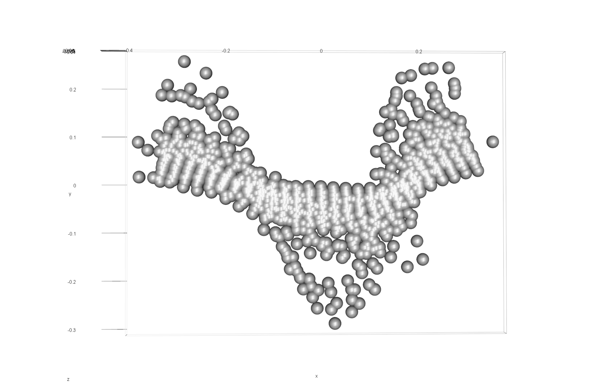
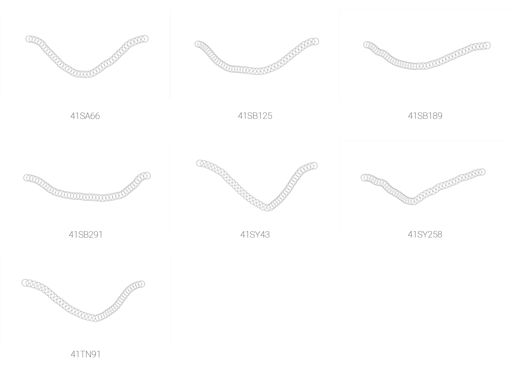

# Archaeological sample - analysis

```{r loadsetwd, out.width = "100%", dpi = 300, echo=TRUE, warning=FALSE}
# library(devtools)
# devtools::install_github("geomorphR/geomorph", ref = "Stable", build_vignettes = TRUE)
library(geomorph)
library(wesanderson)
setwd(getwd())
source('readmulti.csv.R')

# Read .csv files
setwd("./data1")
filelist <- list.files(pattern = ".csv")
coords <- readmulti.csv(filelist)
setwd("../")

# read qualitative data
qdata <- read.csv("qdata1.csv",header=TRUE,row.names=1)
qdata <- qdata[match(dimnames(coords)[[3]],rownames(qdata)),]
qdata
```

## Generalised Procrustes Analysis

```{r gpa, out.width = "100%", dpi = 300, echo=TRUE, warning=FALSE}
Y.gpa <- gpagen(coords, PrinAxes = TRUE, ProcD = TRUE, Proj = TRUE, print.progress = FALSE)

# 3D GPA plot

fig.cap="Results of generalized Procrustes analysis."

# geomorph data frame
gdf <- geomorph.data.frame(shape = Y.gpa$coords, size = Y.gpa$Csize, site = qdata$site, unit = qdata$unit, county = qdata$county) 

csz <- Y.gpa$Csize # attribute for boxplot
sit <- qdata$site # attribute for boxplot
cty <- qdata$county # attribute for boxplot
unt <- qdata$unit # attribute for boxplot

# boxplot of incision (centroid) size by site
boxplot(csz~sit,
        main = "Centroid size of Caddo incisions by Site",
        names = c("SA66","SB125","SB189","SB291","SY258","SY280","SY43","TN91"),
        xlab = "Site",
        ylab = "Centroid Size",
        col = wes_palette("Cavalcanti1"),
        )
fig.cap = "Boxplot of incision profiles for the 41SA66, 41SB125, 41SB189, 41SB291, 41SY258, 41SY280, 41SY43, and 41TN91 sites."

# boxplot of incision (centroid) size by county (potential east-west spatial differences)
boxplot(csz~cty,
        main = "Centroid size of Caddo incisions by County",
        names = c("San Augustine","Sabine","Shelby","Trinity"),
        xlab = "County",
        ylab = "Centroid Size",
        col = wes_palette("Cavalcanti1"),
        )
fig.cap = "Boxplot of incision profiles for San Augustine, Sabine, Shelby, and Trinity Counties."

# boxplot of incision (centroid) size by nfgt unit
boxplot(csz~unt, 
        main = "Centroid size of Caddo incisions by NFGT Unit",
        names = c("AngelinaNF", "DavyCrockettNF", "SabineNF"),
        xlab = "Unit",
        ylab = "Centroid Size",
        col = wes_palette("Cavalcanti1"),
        )
fig.cap = "Boxplot of incision profiles for the Angelina, Davy Crockett, and Sabine National Forests."
```

## Principal Components Analysis

```{r pca, out.width = "100%", dpi = 300, echo=TRUE, warning=FALSE}
# principal components analysis
pca<-gm.prcomp(Y.gpa$coords)
summary(pca)

# set plot parameters
site <- qdata$site
pch.gps.site <- c(15:22)[as.factor(site)]
col.gps.site <- wes_palette("Cavalcanti1")[as.factor(site)]

# plotPCAbySite
pca.plot1 <- plot(pca, asp = 1,
                pch = pch.gps.site,
                col = pch.gps.site)
```

## Define models

```{r define-models, out.width = "100%", dpi = 300, echo=TRUE, warning=FALSE}
fit.size <- procD.lm(shape ~ size, data = gdf, print.progress = FALSE, iter = 9999)
fit.sizesite <- procD.lm(size ~ site, data = gdf, print.progress = FALSE, iter = 9999)
fit.sizeunit <- procD.lm(size ~ unit, data = gdf, print.progress = FALSE, iter = 9999)
fit.sizecounty <- procD.lm(size ~ county, data = gdf, print.progress = FALSE, iter = 9999)
fit.shapesite <- procD.lm(shape ~ site, data = gdf, print.progress = FALSE, iter = 9999)
fit.shapeunit <- procD.lm(shape ~ unit, data = gdf, print.progress = FALSE, iter = 9999)
fit.shapecounty <- procD.lm(shape ~ county, data = gdf, print.progress = FALSE, iter = 9999)
```

## Size/Shape ~ Site?

```{r shszsite, out.width = "100%", dpi = 300, echo=TRUE, warning=FALSE}
# ANOVA: do incision sizes differ by site?
anova(fit.sizesite)
# pairwise comparison of LS means = which differ?
sz.site <- pairwise(fit.sizesite, groups = qdata$site)
summary(sz.site, confidence = 0.95, test.type = "dist")
# pairwise distance between variances = standardization?
summary(sz.site, confidence = 0.95, test.type = "var")

# ANOVA: do incision shapes differ by site?
anova(fit.shapesite)
# pairwise comparison of LS means = which differ?
sh.site <- pairwise(fit.shapesite, groups = qdata$site)
summary(sh.site, confidence = 0.95, test.type = "dist")
# pairwise distance between variances = standardization?
summary(sh.site, confidence = 0.95, test.type = "var")
```

## Size/Shape ~ Unit?

```{r szshpunit, out.width = "100%", dpi = 300, echo=TRUE, warning=FALSE}
# ANOVA: do incision sizes differ by unit?
anova(fit.sizeunit)
# pairwise comparison of LS means = which differ?
sz.unit <- pairwise(fit.sizeunit, groups = qdata$unit)
summary(sz.unit, confidence = 0.95, test.type = "dist")
# pairwise distance between variances = standardization?
summary(sz.unit, confidence = 0.95, test.type = "var")

# ANOVA: do incision shapes differ by unit?
anova(fit.shapeunit)
# pairwise comparison of LS means = which differ?
sh.unit <- pairwise(fit.shapeunit, groups = qdata$unit)
summary(sh.unit, confidence = 0.95, test.type = "dist")
# pairwise distance between variances = standardization?
summary(sh.unit, confidence = 0.95, test.type = "var")
```

## Size/Shape ~ County?

```{r szshpcounty, out.width = "100%", dpi = 300, echo=TRUE, warning=FALSE}
# ANOVA: do incision sizes differ by county?
anova(fit.sizecounty)
# pairwise comparison of LS means = which differ?
sz.county <- pairwise(fit.sizecounty, groups = qdata$county)
summary(sz.county, confidence = 0.95, test.type = "dist")
# pairwise distance between variances = standardization?
summary(sz.county, confidence = 0.95, test.type = "var")

# ANOVA: do incision shapes differ by county?
anova(fit.shapecounty)
# pairwise comparison of LS means = which differ?
sh.county <- pairwise(fit.shapecounty, groups = qdata$county)
summary(sh.county, confidence = 0.95, test.type = "dist")
# pairwise distance between variances = standardization?
summary(sh.county, confidence = 0.95, test.type = "var")
```

## Morphological disparity

```{r m-disparity}
# morphological disparity: does incision morphology display greater shape variation among individuals relative to site, unit, or county?
# site
morphol.disparity(fit.shapesite, groups = qdata$site, data = gdf, print.progress = FALSE, iter = 9999)
# unit
morphol.disparity(fit.shapeunit, groups = qdata$unit, data = gdf, print.progress = FALSE, iter = 9999)
# county
morphol.disparity(fit.shapecounty, groups = qdata$county, data = gdf, print.progress = FALSE, iter = 9999)

# morphological disparity: does incision morphology display greater size variation among individuals relative to site, unit, or county?
# site
morphol.disparity(fit.sizesite, groups = qdata$site, data = gdf, print.progress = FALSE, iter = 9999)
# unit
morphol.disparity(fit.sizeunit, groups = qdata$unit, data = gdf, print.progress = FALSE, iter = 9999)
# county
morphol.disparity(fit.sizecounty, groups = qdata$county, data = gdf, print.progress = FALSE, iter = 9999)
```

## Mean shapes

```{r m-shapes}
# subset landmark coordinates to produce mean shapes by site
new.coords <- coords.subset(A = Y.gpa$coords, group = qdata$site)
names(new.coords)
# group shape means
mean <- lapply(new.coords, mshape)
# plot(mean$tn91)

# mean shapes

fig.cap = "Mean shapes for Caddo incisions from sites on the National Forests and Grasslands in Texas."
# end of code
```
