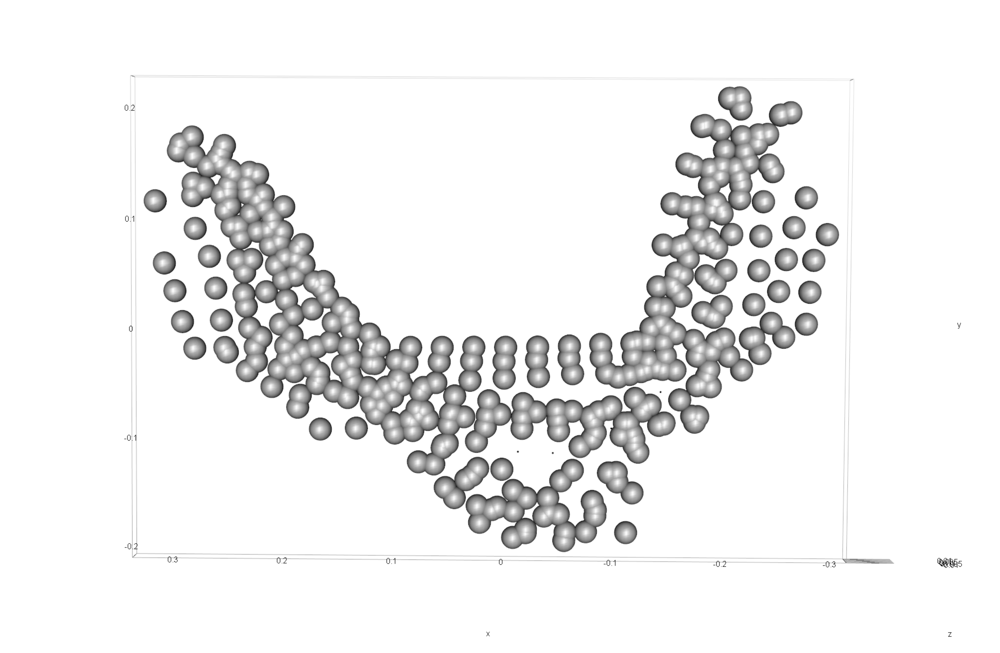

# Experimental sample - analysis

The `inc` field in the qdataEX file relates to two primary differences in shape. One U-shaped, and the other V-shaped. The `inc2` field in the qdataEX file relates to the differences in shape that were noted when reviewing general incision morphology. Some were U-shaped and narrow, others U-shaped and wide (twice as wide as they are deep), and the remainder were V-shaped.

The narrow and wide U-shaped incisions were made by different tools; however, it is not difficult to imagine a scenario where both of the U-shaped incisions could also have been produced with two different sides of the same tool. It is thus necessary to use abundant caution when interpreting potential tool shape, or the number of tools employed in the application of incisions. To avoid confounding the issue, the tip of each of the tools used to generate the incision is referred to as a bit in the remainder of this document. Tools may have multiple bits, but each bit is capable of generating different incision profiles.

## Load packages + data

```{r loadsetwdEX, out.width = "100%", dpi = 300, echo=TRUE, warning=FALSE}
# devtools::install_github("geomorphR/geomorph", ref = "Stable", build_vignettes = TRUE)
library(here)
library(geomorph)
library(tidyverse)
library(wesanderson)

# Read .csv files
setwd("./dataEX")
filelist <- list.files(pattern = ".csv")
coords <- readmulti.csv(filelist)
setwd("../")

# read qualitative data
qdata <- read.csv("qdataEX.csv",header=TRUE,row.names=1)
qdata <- qdata[match(dimnames(coords)[[3]],rownames(qdata)),]

# print qdata
knitr::kable(qdata, align = "cc", caption = "Attributes included in qdata.")
```

## Generalised Procrustes Analysis

```{r gpaEX, out.width = "100%", dpi = 300, echo=TRUE, warning=FALSE, fig.cap = "Results of generalised Procrustes analysis."}
Y.gpa <- gpagen(coords, PrinAxes = TRUE, ProcD = TRUE, 
                Proj = TRUE, print.progress = FALSE)

# 3D GPA plot


# geomorph data frame
gdf <- geomorph.data.frame(shape = Y.gpa$coords, size = Y.gpa$Csize, 
                           inc = qdata$incision, inc2 = qdata$inc2)
```

```{r boxEX, out.width = "100%", dpi = 300, echo=TRUE, warning=FALSE}
# add centroid size to qdata
qdata$csz <- Y.gpa$Csize

# attributes for boxplots
csz <- qdata$csz
inc <- qdata$incision
inc2 <- qdata$inc2

# print qdata + centroid size
knitr::kable(qdata, align = "ccc", caption = "Attributes included in qdata.")
```

```{r box1, out.width = "100%", dpi = 300, echo=TRUE, warning=FALSE, fig.cap = "Boxplot of experimental incision profile types (U-shaped and V-shaped)."}
# boxplot of incision (centroid) size by profile type (inc)
csz.inc.ex <- ggplot(qdata, aes(x = inc, y = csz, color = inc)) +
  geom_boxplot() +
  geom_dotplot(binaxis = 'y', stackdir = 'center', dotsize = 0.3) +
  scale_color_manual(values = wes_palette("Moonrise2")) +
  theme(legend.position = "none") +
  labs(x = 'Incision', y = 'Centroid Size')

#render plot
csz.inc.ex
```

```{r box2, out.width = "100%", dpi = 300, echo=TRUE, warning=FALSE,fig.cap = "Boxplot of experimental incision profile types (U-narrow, U-Wide, and V)."}
# boxplot of incision (centroid) size by profile type (inc2)
csz.inc2.ex <- ggplot(qdata, aes(x = inc2, y = csz, color = inc2)) +
  geom_boxplot() +
  geom_dotplot(binaxis = 'y', stackdir = 'center', dotsize = 0.3) +
  scale_color_manual(values = wes_palette("Moonrise2")) +
  theme(legend.position = "none") +
  labs(x = 'Incision', y = 'Centroid Size')

#render plot
csz.inc2.ex
```

## Principal Components Analysis

```{r pcaEX, out.width = "100%", dpi = 300, echo=TRUE, warning=FALSE}
# principal components analysis
pca <- gm.prcomp(Y.gpa$coords)
summary(pca)
```

```{r pcaEX1, out.width = "100%", dpi = 300, echo=TRUE, warning=FALSE, fig.cap = "Plot of PC1 and PC2 for U- (gray) and V-shaped (orange) incisions."}
# set plot parameters
pch.gps.1 <- c(15,17)[as.factor(inc)]
col.gps.1 <- wes_palette("Moonrise2")[as.factor(inc)]
col.hull.1 <- c("#798E87","#C27D38")

# plotPCAbyinc2
pc.plot.1 <- plot(pca,asp = 1,
            pch = pch.gps.1,
            col = col.gps.1)
            shapeHulls(pc.plot.1, 
                       groups = inc,
                       group.cols = col.hull.1)
```

```{r pcaEX2, out.width = "100%", dpi = 300, echo=TRUE, warning=FALSE,fig.cap = "Plot of PC1 and PC2; tan circles, V-shaped incisions; gray squares, U-narrow incisions; and orange triangles, U-wide incisions."}
# set plot parameters
pch.gps.2 <- c(15,17,19)[as.factor(inc2)]
col.gps.2 <- wes_palette("Moonrise2")[as.factor(inc2)]
col.hull.2 <- c("#798E87","#C27D38","#CCC591")

# plotPCAbyinc2
pc.plot.2 <- plot(pca,asp = 1,
            pch = pch.gps.2,
            col = col.gps.2)
            shapeHulls(pc.plot.2, 
                       groups = inc2,
                       group.cols = col.hull.2)
```

## Define models

```{r defmodEX, out.width = "100%", dpi = 300, echo=TRUE, warning=FALSE}
# allometry
fit.size <- procD.lm(shape ~ size, data = gdf, 
                     print.progress = FALSE, iter = 9999)
# allometry - common allometry, different means -> inc
fit.sz.cinc <- procD.lm(shape ~ size + inc, data = gdf, 
                        print.progress = FALSE, iter = 9999)
# allometry - unique allometries -> inc
fit.sz.uinc <- procD.lm(shape ~ size * inc, data = gdf, 
                        print.progress = FALSE, iter = 9999)
# allometry - common allometry, different means -> inc2
fit.sz.cinc2 <- procD.lm(shape ~ size + inc2, data = gdf, 
                         print.progress = FALSE, iter = 9999)
# allometry - unique allometries -> inc2
fit.sz.uinc2 <- procD.lm(shape ~ size * inc2, data = gdf, 
                         print.progress = FALSE, iter = 9999)

# size as a function of group
fit.sizeinc <- procD.lm(size ~ inc, data = gdf, 
                        print.progress = FALSE, iter = 9999)
fit.sizeinc2 <- procD.lm(size ~ inc2, data = gdf, 
                         print.progress = FALSE, iter = 9999)

# shape as a function of group
fit.shapeinc <- procD.lm(shape ~ inc, data = gdf, 
                         print.progress = FALSE, iter = 9999)
fit.shapeinc2 <- procD.lm(shape ~ inc2, data = gdf, 
                          print.progress = FALSE, iter = 9999)
```

## Allometry

```{r allometryEX, out.width = "100%", dpi = 300, echo=TRUE, warning=FALSE}
# allometry - does shape change with size?
anova(fit.size)
```

### Common allometry

```{r common.all.ex, out.width = "100%", dpi = 300, echo=TRUE, warning=FALSE}
# inc
anova(fit.sz.cinc) # common allometry (inc)

# inc2
anova(fit.sz.cinc2) # common allometry (inc2)

```

```{r allom.plot1.ex, out.width = "100%", dpi = 300, echo=TRUE, warning=FALSE}
# allometry plots
# regscore (Drake and Klingenberg 2008)
plot(fit.size, type = "regression", reg.type = "RegScore", 
     predictor = log(gdf$size), pch = pch.gps.1, col = col.gps.1)
plot(fit.size, type = "regression", reg.type = "RegScore", 
     predictor = log(gdf$size), pch = pch.gps.2, col = col.gps.2)
```

```{r allom.plot2.ex, out.width = "100%", dpi = 300, echo=TRUE, warning=FALSE}
# common allometric component (Mitteroecker 2004)
plotAllometry(fit.size, size = gdf$size, logsz = TRUE, method = "CAC", 
              pch = pch.gps.1, col = col.gps.1)
plotAllometry(fit.size, size = gdf$size, logsz = TRUE, method = "CAC", 
              pch = pch.gps.2, col = col.gps.2)
```

```{r allom.plot3.ex, out.width = "100%", dpi = 300, echo=TRUE, warning=FALSE}
# size-shape pca (Mitteroecker 2004)
plotAllometry(fit.size, size = gdf$size, logsz = TRUE, method = "size.shape", 
              pch = pch.gps.1, col = col.gps.1)
plotAllometry(fit.size, size = gdf$size, logsz = TRUE, method = "size.shape", 
              pch = pch.gps.2, col = col.gps.2)
```

### Unique allometry

```{r unique.all.ex, out.width = "100%", dpi = 300, echo=TRUE, warning=FALSE}
# inc
anova(fit.sz.uinc) # unique allometry (inc)

# inc2
anova(fit.sz.uinc2) # unique allometry (inc2)
```

```{r unique.allom.plot, out.width = "100%", dpi = 300, echo=TRUE, warning=FALSE}
# predline (Adams and Nistri 2010)
plotAllometry(fit.sz.uinc, size = gdf$size, logsz = TRUE, method = "PredLine", 
              pch = pch.gps.1, col = col.gps.1)
plotAllometry(fit.sz.uinc2, size = gdf$size, logsz = TRUE, method = "PredLine", 
              pch = pch.gps.2, col = col.gps.2)
```

## Size/Shape ~ Incision Profile?

```{r shszsiteEX, out.width = "100%", dpi = 300, echo=TRUE, warning=FALSE}
# ANOVA: do incision shapes differ by profile?
anova(fit.shapeinc)

# ANOVA: do incision sizes differ by profile?
anova(fit.sizeinc)
```

## Size/Shape ~ Incision Profile 2?

```{r szshpinc2EX, out.width = "100%", dpi = 300, echo=TRUE, warning=FALSE}
# ANOVA: do incision shapes differ (inc2)?
anova(fit.shapeinc2)
# pairwise comparison of LS means = which differ?
sh.inc2 <- pairwise(fit.shapeinc2, groups = qdata$inc2)
summary(sh.inc2, confidence = 0.95, test.type = "dist")
# pairwise distance between variances = standardization?
summary(sh.inc2, confidence = 0.95, test.type = "var")

# ANOVA: do incision sizes differ (inc2)?
anova(fit.sizeinc2)
# pairwise comparison of LS means = which differ?
sz.inc2 <- pairwise(fit.sizeinc2, groups = qdata$inc2)
summary(sz.inc2, confidence = 0.95, test.type = "dist")
# pairwise distance between variances = standardization?
summary(sz.inc2, confidence = 0.95, test.type = "var")
```

## Morphological disparity

```{r m-disparityEX}
# morphological disparity: does incision morphology display greater shape variation among individuals relative to incision profile shape?
morphol.disparity(fit.shapeinc, groups = qdata$inc2, data = gdf, 
                  print.progress = FALSE, iter = 9999)

# morphological disparity: does incision morphology display greater size variation among individuals relative to incision profile size?
morphol.disparity(fit.sizeinc, groups = qdata$inc2, data = gdf, 
                  print.progress = FALSE, iter = 9999)
```

## Mean shapes

```{r m-shapesEX, out.width = "100%", dpi = 300, echo=TRUE, warning=FALSE, fig.cap = "Mean shapes for incision profiles Un, Uw, and V."}
# subset landmark coordinates to produce mean shapes by site
new.coords <- coords.subset(A = Y.gpa$coords, group = qdata$inc2)
names(new.coords)
# group shape means
mean <- lapply(new.coords, mshape)
# plot(mean$Uw)

# mean shapes
knitr::include_graphics('images/mshapeEX.png')
```
