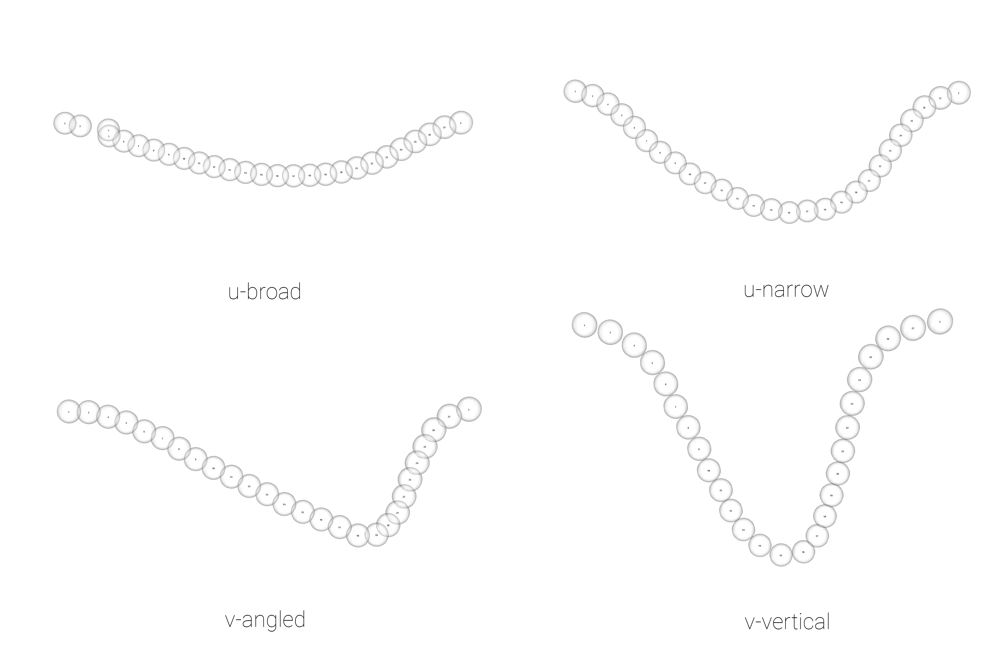

# Archaeological sample - analysis

## Load packages + data

```{r load.arch, out.width = "100%", dpi = 300, echo=TRUE, warning=FALSE}
library(here)
library(geomorph)
library(tidyverse)
library(wesanderson)

# read shape data
source('readmulti.csv.R')
setwd("./data1")
filelist <- list.files(pattern = ".csv")
coords <- readmulti.csv(filelist)
setwd("../")

# read qualitative data
qdata <- read.csv("qdata1.csv",
                  header = TRUE,
                  row.names = 1)
qdata <- qdata[match(dimnames(coords)[[3]],rownames(qdata)),]

# print qdata
knitr::kable(qdata, 
             align = "ccccc", 
             caption = "Attributes included in qdata.")
```

## Generalised Procrustes Analysis

```{r gpa, out.width = "100%", dpi = 300, echo=TRUE, warning=FALSE,fig.cap="Results of generalized Procrustes analysis."}
# gpa
Y.gpa <- gpagen(coords, 
                PrinAxes = TRUE, 
                ProcD = TRUE, 
                Proj = TRUE, 
                print.progress = FALSE)

# gpa plot
knitr::include_graphics('images/gpa3d.png')

# geomorph data frame
gdf <- geomorph.data.frame(shape = Y.gpa$coords, 
                           size = Y.gpa$Csize, 
                           site = qdata$site, 
                           unit = qdata$unit, 
                           county = qdata$county, 
                           inc = qdata$incision, 
                           inc2 = qdata$inc2) 
```

```{r categorical.arch,, out.width = "100%", dpi = 300, echo=TRUE, warning=FALSE}
# add centroid size to qdata
qdata$csz <- Y.gpa$Csize

# attributes for boxplots
csz <- Y.gpa$Csize
inc <- qdata$incision
inc2 <- qdata$inc2

# print qdata + centroid size
knitr::kable(qdata, 
             align = "cccccc", 
             caption = "Attributes included in qdata.")
```

```{r box1.arch, out.width = "100%", dpi = 300, echo=TRUE, warning=FALSE,fig.cap = "Boxplot of incision profile types (inc)."}
# boxplot of incision (centroid) size by profile type (inc)
csz.inc <- ggplot(qdata, aes(x = inc, y = csz, color = inc)) +
  geom_boxplot() +
  geom_dotplot(binaxis = 'y', stackdir = 'center', dotsize = 0.3) +
  scale_color_manual(values = wes_palette("Moonrise2")) +
  theme(legend.position = "none") +
  labs(x = 'Incision', y = 'Centroid Size')

#render plot
csz.inc
```

```{r box2.arch, out.width = "100%", dpi = 300, echo=TRUE, warning=FALSE,fig.cap = "Boxplot of incision profile types (inc2)."}
# boxplot of incision (centroid) size by profile type (inc2)
csz.inc2 <- ggplot(qdata, aes(x = inc2, y = csz, color = inc2)) +
  geom_boxplot() +
  geom_dotplot(binaxis = 'y', stackdir = 'center', dotsize = 0.3) +
  scale_color_manual(values = wes_palette("Moonrise2")) +
  theme(legend.position = "none") +
  labs(x = 'Incision', y = 'Centroid Size')

#render plot
csz.inc2
```

## Principal Components Analysis

```{r pca1.arch, out.width = "100%", dpi = 300, echo=TRUE, warning=FALSE,fig.cap = "Plot of PC1 and PC2 for U- (gray square) and V-shaped (orange triangle) incisions."}
# principal components analysis
pca<-gm.prcomp(Y.gpa$coords)
summary(pca)

# set plot parameters to plot by incision type
inc <- qdata$incision
pch.gps.inc <- c(15,17)[as.factor(inc)]
col.gps.inc <- wes_palette("Moonrise2")[as.factor(inc)]
col.hull <- c("#C27D38","#798E87")

# plot pca by incision profile
pc.plot1 <- plot(pca, asp = 1,
                  pch = pch.gps.inc,
                  col = col.gps.inc)
                  shapeHulls(pc.plot1, 
                             groups = inc,
                             group.cols = col.hull)
```

```{r pca2.arch,, out.width = "100%", dpi = 300, echo=TRUE, warning=FALSE,fig.cap = "Plot of PC1 and PC2 for U-broad (gray square), U-narrow (orange triangle) and V-shaped (tan circle) incisions."}
# set plot parameters to plot by incision profile (inc2)
inc2 <- qdata$inc2
pch.gps.inc2 <- c(15,17,19)[as.factor(inc2)]
col.gps.inc2 <- wes_palette("Moonrise2")[as.factor(inc2)]
col.hull2 <- c("#CCC591","#798E87","#C27D38")

# plot pca by incision profile (inc2)
pc.plot2 <- plot(pca, asp = 1,
                  pch = pch.gps.inc2,
                  col = col.gps.inc2)
                  shapeHulls(pc.plot2, 
                             groups = inc2,
                             group.cols = col.hull2)
```

## Define models

```{r define-models, out.width = "100%", dpi = 300, echo=TRUE, warning=FALSE}
# allometry
fit.size.a <- procD.lm(shape ~ size, 
                       data = gdf, 
                       print.progress = FALSE, 
                       iter = 9999)

# allometry - common allometry, different means -> inc
fit.sz.cinc.a <- procD.lm(shape ~ size + inc, 
                          data = gdf, 
                          print.progress = FALSE, 
                          iter = 9999)

# allometry - unique allometries -> inc
fit.sz.uinc.a <- procD.lm(shape ~ size * inc, 
                          data = gdf, 
                          print.progress = FALSE, 
                          iter = 9999)

# allometry - common allometry, different means -> inc2
fit.sz.cinc2.a <- procD.lm(shape ~ size + inc2, 
                           data = gdf, 
                           print.progress = FALSE, 
                           iter = 9999)

# allometry - unique allometries -> inc2
fit.sz.uinc2.a <- procD.lm(shape ~ size * inc2, 
                           data = gdf, 
                           print.progress = FALSE, 
                           iter = 9999)

# size as a function of group
fit.sizeinc <- procD.lm(size ~ inc, 
                        data = gdf, 
                        print.progress = FALSE, 
                        iter = 9999)

fit.sizeinc2 <- procD.lm(size ~ inc2, 
                         data = gdf, 
                         print.progress = FALSE, 
                         iter = 9999)

# shape as a function of group
fit.shapeinc <- procD.lm(shape ~ inc, 
                         data = gdf, 
                         print.progress = FALSE, 
                         iter = 9999)

fit.shapeinc2 <- procD.lm(shape ~ inc2, 
                          data = gdf, 
                          print.progress = FALSE, 
                          iter = 9999)
```

## Allometry

```{r allometry.arch, out.width = "100%", dpi = 300, echo=TRUE, warning=FALSE}
# allometry - does shape change with size?
anova(fit.size.a)
```

### Common allometry

```{r common.all.arch, out.width = "100%", dpi = 300, echo=TRUE, warning=FALSE}
# inc
anova(fit.sz.cinc.a) # common allometry (inc)

# inc2
anova(fit.sz.cinc2.a) # common allometry (inc2)

```

```{r allom.plot1.arch, out.width = "100%", dpi = 300, echo=TRUE, warning=FALSE}
# allometry plots
# regscore (Drake and Klingenberg 2008)
plot(fit.size.a, 
     type = "regression", 
     reg.type = "RegScore", 
     predictor = log(gdf$size), 
     pch = pch.gps.inc, 
     col = col.gps.inc)

plot(fit.size.a, 
     type = "regression", 
     reg.type = "RegScore", 
     predictor = log(gdf$size), 
     pch = pch.gps.inc2, 
     col = col.gps.inc2)
```

```{r allom.plot2.arch, out.width = "100%", dpi = 300, echo=TRUE, warning=FALSE}
# common allometric component (Mitteroecker 2004)
plotAllometry(fit.size.a, 
              size = gdf$size, 
              logsz = TRUE, 
              method = "CAC", 
              pch = pch.gps.inc, 
              col = col.gps.inc)

plotAllometry(fit.size.a, 
              size = gdf$size, 
              logsz = TRUE, 
              method = "CAC", 
              pch = pch.gps.inc2, 
              col = col.gps.inc2)
```

```{r allom.plot3.arch, out.width = "100%", dpi = 300, echo=TRUE, warning=FALSE}
# size-shape pca (Mitteroecker 2004)
plotAllometry(fit.size.a, 
              size = gdf$size, 
              logsz = TRUE, 
              method = "size.shape", 
              pch = pch.gps.inc, 
              col = col.gps.inc)

plotAllometry(fit.size.a, 
              size = gdf$size, 
              logsz = TRUE, 
              method = "size.shape", 
              pch = pch.gps.inc2, 
              col = col.gps.inc2)
```

### Unique allometry

```{r unique.all.arch, out.width = "100%", dpi = 300, echo=TRUE, warning=FALSE}
# inc
anova(fit.sz.uinc.a) # unique allometry (inc)

# inc2
anova(fit.sz.uinc2.a) # unique allometry (inc2)
```

```{r unique.allom.plot.arch, out.width = "100%", dpi = 300, echo=TRUE, warning=FALSE}
# predline (Adams and Nistri 2010)
plotAllometry(fit.sz.uinc.a, 
              size = gdf$size, 
              logsz = TRUE, 
              method = "PredLine", 
              pch = pch.gps.inc, 
              col = col.gps.inc)

plotAllometry(fit.sz.uinc2.a, 
              size = gdf$size,
              logsz = TRUE, 
              method = "PredLine", 
              pch = pch.gps.inc2, 
              col = col.gps.inc2)
```

## Size/Shape ~ Incision Profile?

```{r szshpinc, out.width = "100%", dpi = 300, echo=TRUE, warning=FALSE}
# ANOVA: do incision shapes differ?
anova(fit.shapeinc)

# ANOVA: do incision sizes differ?
anova(fit.sizeinc)
```

## Size/Shape ~ Incision Profile 2?

```{r szshpinc2, out.width = "100%", dpi = 300, echo=TRUE, warning=FALSE}
# ANOVA: do incision shapes differ (inc2)?
anova(fit.shapeinc2)

# pairwise comparison of LS means = which differ?
sh.inc2 <- pairwise(fit.shapeinc2, 
                    groups = qdata$inc2)

summary(sh.inc2, 
        confidence = 0.95, 
        test.type = "dist")

# pairwise distance between variances = standardization?
summary(sh.inc2, 
        confidence = 0.95, 
        test.type = "var")

# ANOVA: do incision sizes differ (inc2)?
anova(fit.sizeinc2)

# pairwise comparison of LS means = which differ?
sz.inc2 <- pairwise(fit.sizeinc2, 
                    groups = qdata$inc2)
summary(sz.inc2, 
        confidence = 0.95, 
        test.type = "dist")

# pairwise distance between variances = standardization?
summary(sz.inc2, 
        confidence = 0.95, 
        test.type = "var")
```

## Morphological disparity

```{r m-disparity}
# morphological disparity: does incision morphology display greater shape variation among individuals relative to incision profile (inc or inc2)?
# incision
morphol.disparity(fit.shapeinc, 
                  groups = qdata$incision, 
                  data = gdf, 
                  print.progress = FALSE, 
                  iter = 9999)

# inc2
morphol.disparity(fit.shapeinc2, 
                  groups = qdata$inc2, 
                  data = gdf, 
                  print.progress = FALSE, 
                  iter = 9999)

# morphological disparity: does incision morphology display greater size variation among individuals relative to incision profile (inc or inc2)?
# incision
morphol.disparity(fit.sizeinc, 
                  groups = qdata$incision, 
                  data = gdf, 
                  print.progress = FALSE, 
                  iter = 9999)
# inc2
morphol.disparity(fit.sizeinc2, 
                  groups = qdata$inc2, 
                  data = gdf, 
                  print.progress = FALSE, 
                  iter = 9999)
```

## Mean shapes

```{r m-shapes, out.width = "100%", dpi = 300, echo=TRUE, warning=FALSE, fig.cap = "Mean shapes for u-shaped broad, u-shaped narrow, v-shaped angled, and v-shaped vertical Caddo incision profiles (inc2)."}
# subset landmark coordinates to produce mean shapes by site
new.coords <- coords.subset(A = Y.gpa$coords, 
                            group = qdata$inc2)

names(new.coords)

# group shape means
mean <- lapply(new.coords, mshape)
# plot(mean$vv)

# mean shapes
#
# end of code
```
