--- 
title: "Supplementary materials for paper: Do differences in ceramic incision morphology provide inference to a common toolkit?"
author: 
    - Robert Z. Selden, Jr.^[Heritage Research Center, Stephen F. Austin State University and Cultural Heritage Department, Jean Monnet University, zselden@sfasu.edu]
date: "`r Sys.Date()`"
site: bookdown::bookdown_site
documentclass: book
bibliography: [book.bib, packages.bib]
biblio-style: apalike
link-citations: yes
description: "Morphological analysis of Caddo ceramic incisions"
---

# Preface {-}

>Reproducibility—the ability to recompute results—and replicability—the chances other experimenters will achieve a consistent result—are two foundational characteristics of successful scientific research [@RN20918].

This volume is written in _Markdown_, and all files needed to reproduce it are included in the [GitHub repository](https://github.com/aksel-blaise/incision), as well as the [Open Science Framework (DOI: 10.17605/OSF.IO/SH7WR)](https://osf.io/sh7wr/). The reproducible nature of this undertaking provides a means for others to critically assess and evaluate the various analytical components [@RN20915;@RN20916;@RN20917], which is a necessary requirement for the production of reliable knowledge.

Reproducibility projects in [psychology](https://osf.io/ezcuj/) and [cancer biology](https://www.cos.io/rpcb) are impacting current research practices across all domains. Examples of reproducible research are becoming more abundant in archaeology [@RN20804;@RN21009;@RN21001], and the next generation of archaeologists are learning those tools and methods needed to reproduce and/or replicate research results [@RN21007]. Reproducible and replicable research work flows are often employed at the highest levels of humanities-based inquiries to mitigate concern or doubt regarding proper execution, and is of particular import should the results have—explicitly or implicitly—a major impact on scientific progress [@RN21008].

Components of the undertaking presented in this volume are novel, and this basic research endeavour is rooted in archaeological epistemology. Sharing data is not enough, and if investigators share only data absent their analysis code, that places a substantive burden on those who may seek to build upon or replicate their work in the future. In this instance, the choice to pursue a replicable work flow occurs based on the simple fact that this work is foundational, and meant to begin a meaningful discussion related to the similarities and differences between tools used to apply—whether incised, engraved, or etched—the many decorative motifs that adorn ceramic artefacts.

As an exploratory research endeavour, this study was not [preregistered](https://www.cos.io/prereg).

## Acknowledgments

I extend my gratitude to the Caddo Tribe of Oklahoma and the National Forests and Grasslands in Texas for the requisite permissions and access needed to generate the scans of the Caddo incisions, and to the National Center for Preservation Technology and Training for access to the optical profilometer. 

This volume enlists a variety of tools from the [Open Review Toolkit](https://www.openreviewtoolkit.org/), as well as the code provided for the `bookdown` package. I extend my gratitude to all who contribute comments and constructive criticisms throughout the development and maturation of this project. This document will remain in open review until the article is published.

## Funding

Components of the analytical workflow were developed and funded by a Preservation Technology and Training grant (P14AP00138) to RZS from the National Center for Preservation Technology and Training, as well as grants to RZS from the Caddo Nation of Oklahoma, National Forests and Grasslands in Texas (15-PA-11081300-033) and the United States Forest Service (20-PA-11081300-074).

## Colophon

This version of the analysis was generated on `r Sys.time()` using the following computational environment and dependencies: 

```{r colophon, cache = FALSE}
# what R packages and versions were used?
if ("devtools" %in% installed.packages()) devtools::session_info()
```

Current Git commit details are:

```{r}
# where can I find this commit? 
if ("git2r" %in% installed.packages() & git2r::in_repository(path = ".")) git2r::repository(here::here())  
```


<!--chapter:end:index.Rmd-->

# Introduction

This document contains supplementary materials associated with the article, _"Do apparent differences in ceramic incision morphology provide inference to a common toolkit?"_ The volume is organised by chapter, and provides details associated with the experimental and archaeological samples, as well as the geometric morphometric analyses. Images of each sample are included; however, processed and unprocessed 3D scan data are embargoed for a period of five years from the most recent submission within which they are employed.

The incision project is part of a long-term research programme, representing an expansion of previous efforts to better comprehend the vagaries associated with ceramic [@RN11521;@RN11782;@RN11801;@RN11716;@RN1994] and lithic morphology [@RN11783;@RN21001], which provided insights into inter- and intraspecific differences in morphology that articulate with Caddo bottles and bifaces [@RN20697]. 

The genesis of this project occurred during a slip, glazing, and atmospheric firing workshop at the Arrowmont School of Arts and Crafts in Gatlinburg, Tennessee, where access to the materials, dry box, and electric kilns provided a means to produce the experimental sample. The archaeological sample was provided with permission and support from the Caddo Tribe of Oklahoma, and the incised sherds comes from sites on the Angelina, Davy Crockett, and Sabine National Forests; units of the National Forests and Grasslands in Texas (NFGT). Partial funding for this project came from a Media Grant to the Caddo Tribe of Oklahoma through the National Center for Preservation Technology and Training (NCPTT), and additional funding was provided by grants from the NFGT (15-PA-11081300-033 and 20-PA-11081300-074). NCPTT provided access and training for the optical profilometer used to generate 3D meshes for the experimental and archaeological samples at their laboratory in Natchitoches, Louisiana, as well as a copy of the Keyence VR Series Analyzer Software used to render and export the meshes.

The landmarking protocol (see Section 3.1) is identical on both the experimental and archaeological samples, and was designed to capture the profile of the business end of the instrument used to apply each incision. One insight made clear by the experimental analysis is that a single tool could have been used to apply incisions that render differing marks in profile. Since incisions are made while the clay body is not yet dry, the range of variation is potentially greater than that of engraved, trailed, or etched designs, and the deepest cross-section of each incision should provide the most complete profile of the tool employed by Caddo potters to apply these marks.

## Incised Caddo types

Temporal attributes for incised Caddo types were aggregated from published type books [@RN5066;@RN4302], and arranged chronologically. The list of incised Caddo types includes those types where the decorative treatments described in the type book made note of incised elements. This provides a basic temporal framework from which chronological components can begin to be isolated. None of the incised sherds used in this study include enough of a decorative pattern to be assigned to a type, meaning that this sample could span the full temporal range of incised Caddo types. As this study is expanded, incisions from specific types will be included to explore whether Caddo potters may have employed different tools to apply the various decorative motifs that include incised elements.

### Chronology for incised Caddo types

```{r typetemporal, out.width = "100%", dpi = 300, echo=TRUE, warning=FALSE}
# load ggplot2
library(ggplot2)

# gantt chart of relative dates for incised Caddo ceramic types
temp<-data.frame(Type = c('Belcher Ridged (Bossier)', 'Belcher Ridged (Belcher)', 'Canton Incised', 'Clements Brushed', 'Cowhide Stamped', 'Crockett Curvilinear Incised', 'Davis Incised', 'Dunkin Incised', 'East Incised', 'Foster Trailed-Incised', 'Fulton Aspect Effigy Bowls', 'Haley Complicated Incised', 'Harleton Appliqued', 'Hudson Engraved', 'Karnack Brushed-Incised', 'Kiam Incised', 'Maydelle Incised', 'Military Road Incised', 'Nash Neck Banded', 'Pease Brushed-Incised', 'Pennington Punctated-Incised', 'Spiro Engraved', 'Weches Fingernail Impressed'), # canton/east incised types date to AD 1000, but were modified to 990-1010 so that it would show on the gantt chart
                 Date_Range_CE = c(1100, 1300, 990, 1500, 1200, 500, 500, 500, 990, 1200, 1200, 800, 1200, 1500, 1200, 500, 1200, 1200, 1400, 1100, 500, 500, 500), # in years CE
                 end = c(1300, 1500, 1010, 1800, 1500, 1000, 1000, 1000, 1010, 1600, 1700, 1200, 1500, 1800, 1500, 1200, 1500, 1500, 1700, 1300, 1000, 1000, 1000) # in years CE
)

# reorder types by beginning of relative date range
temp$Type <- factor(temp$Type, levels = temp$Type[order(temp$Date_Range_CE)])

# arrange figure
type.time <- ggplot(temp, aes(x = Date_Range_CE, xend = end, y = factor(Type, 
       levels = rev(levels(factor(Type)))), yend = Type, color = Type)) +
  geom_segment(size = 2) +
  scale_colour_discrete() +
  theme(legend.position = "none") +
  labs(y = "Incised Caddo Types", x = "Date Range CE")

# render figure
type.time
```

<!--chapter:end:01-intro.Rmd-->

# Landmarking protocol

The characteristic points and tangents used in this landmarking protocol were inspired by the pioneering work of Birkhoff [-@RN11786]. The final configuration employs two horizontal tangents at either end of the curve with 25 equidistant semilandmarks placed along the dynamic contours of a spline.

## Calculating depth

The method of calculating the depth of each incision employed the use of two planes. one was places on the surface of each sherd by selecting three points outside of the area where the incision was made. The second plane was inserted using the `offset` function, and was extended to the limit of the mesh associated with the incision. A `reference point` was inserted at that location, used to identify the x coordinate of the cross-section.

## Placing the landmarks

Using Geomagic Design X, a plane was inserted at the location of the `reference point` to capture the deepest profile of each incision. The rationale behind selecting the deepest incision is that these marks were made when the vessel was not yet leather hard, and the deepest incision would provide the most complete representation of the tool employed in the application of the decorative motif.

```{r insertplane, out.width = "100%", dpi = 300, echo=TRUE, warning=FALSE}
# incision image
knitr::include_graphics('images/insertplane.png')
fig.cap="Reference plane (blue) inserted at deepest point of incision of experimental tile 6b."
```

The horizontal tangent was calculated for the rise in the clay matrix above the `reference plane` on either side of the incision, and was followed by calculating the linear distance between the tangents to identify the mid-point of the incision. Prior to the application of landmarks, the deepest point of the incision profile (identified in the depth measurement) was always oriented to the right of center.

```{r h.tangent, out.width = "100%", dpi = 300, echo=TRUE, warning=FALSE}
# incision image
knitr::include_graphics('images/h-tangents.png')
fig.cap="Spline (500 interpolation points) that was cut at the location of horizontal tangents on each side, then oriented where the deepest part of the incision was to the right of center."
```

Once properly oriented, the horizontal tangent on the left was assigned as landmark (LM) 01, and the tangent on the right as LM 02. Twenty five equidistant landmarks were subsequently placed between the two landmarks along the spline.

```{r semi.land, out.width = "100%", dpi = 300, echo=TRUE, warning=FALSE}
# incision image
knitr::include_graphics('images/semiland.png')
fig.cap="Placement of 25 equidistant semilandmarks (white) between LM01 and LM02 (blue)"
```

Landmarks and semilandmarks associated with each specimen were then exported as CSV files. These are included in the supplemental materials as `dataEX` for the experimental sample, and `data1` for the archaeological sample.

<!--chapter:end:02-lmprotocol.Rmd-->

# Landmark Sampling Evaluation Curve (LaSEC)

The landmarking configuration used to analyse Caddo incisions was further scrutinised using the Landmark Sampling Error Curve, or `LaSEC` included in the `LaMBDA` package, as a means of assessing the fidelity of morphological characterisation by landmarks [@RN28913]. `LaSEC` was run twice for this study. Once on the experimental incisions, and a second time on the archaeological sample. 

LaSEC conducts the following procedure [@RN28913, 4-5]:

1. As is typical for extracting shape data, perform a generalized Procrustes alignment (`gpagen` function in the `geomorph` package) on a coordinate dataset (argument `coord.data`) in 2-D or 3-D (argument `n.dim`) and record the resulting shape coordinates and centroid size. Here, the shape coordinates are projected onto tangent space because pairwise distances among corresponding datasets later in the analysis are based on Euclidean distances and most shape analyses in the biological literature are conducted in tangent space instead of Procrustes shape space.
2. Subsample the same three randomly selected landmarks from all specimens. The subsampling begins with a subset of three landmarks because a minimum of three landmarks is required to define shape. Then, generate shape and centroid size data with generalized Procrustes superimposition on the subsampled data.
3. Perform an Ordinary Procrustes Alignment (`protest` function in the `vegan` R package) on the subsampled data to minimize the pairwise distances between corresponding landmarks in the parent data through translation, rotation, and scaling of data in full shape space. As stated above, note that this procedure is different from the typical implementation of Procrustes alignment on coordinate data in 2-D or 3-D space. The function then records the sum of these squared distances as measure of fit (PSS) between the relative locations of data points in the parent and subsampled datasets. Equivalent procedure is conducted on centroid size data.
4. Sample one additional, randomly chosen landmark and repeat step 3 until the entire set of landmarks in the parent dataset is sampled. The completion of this step represents one iteration of subsampling.
5. Repeat steps 2–5 for specified number of iterations (`iter` argument).
6. Create sampling curves by plotting the trajectory of “fit” (1–PSS) against the number of landmarks sampled from each iteration for both shape and centroid size as gray lines. Then, plot the median fit value for each number of landmarks sampled on the same plot as a thick, dark line. Finally, output these sampling curves: `LaSEC_SamplingCurve_Shape.pdf`, `LaSEC_SamplingCurve_Size.pdf`.

## Analysis of experimental sample

```{r, load.lasec.package.EX, echo=TRUE}
# load package
#devtools::install_github("akiopteryx/lambda")
library(LaMBDA)

# set working directory
setwd(getwd())
source('readmulti.csv.R')

# read .csv files
setwd("./dataEX")
filelist <- list.files(pattern = ".csv")
lmdata <- readmulti.csv(filelist)
lmdata <- two.d.array(lmdata)
setwd("../")

# analysis
lasec(coord.data = lmdata, n.dim = 3, iter = 1000)
```

Results demonstrate that five landmarks are necessary to achieve a median fit value of 0.90, seven to achieve a median fit value of 0.95, and 14 to achieve a fit value of 0.99. For centroid size, six landmarks were needed to achieve a median fit value of 0.99.

```{r fig.lasec.EX, fig.cap="Sampling curves from performing `LaSEC` on the experimental dataset with respect to characterising shape variation. Each gray line indicates fit values from one iteration of subsampling. Thick, dark line denotes median fit value at each number of landmarks. `LaSEC` sampling curve for shape (left), and for centroid size (right). Results produced using the code above for this 3D dataset, using 1,000 iterations. _Images converted to PNG following export._"}
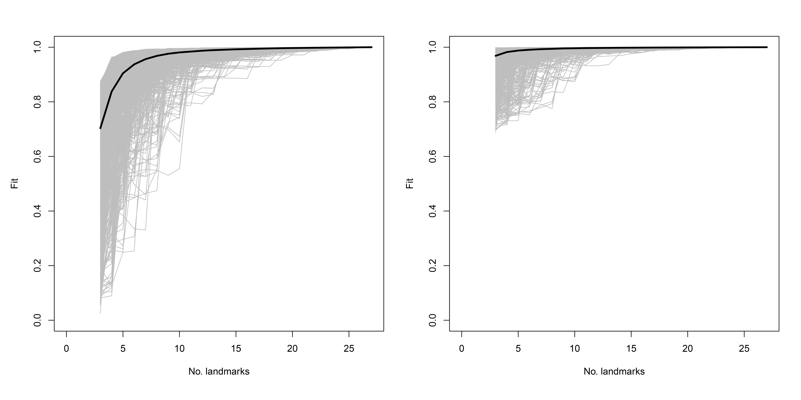
```

Results demonstrate saltation, illustrating that some landmarks are critical for capturing shape information [@RN28913]. Dynamic as incisions may be in shape, that variation may be captured with a configuration of landmarks that employed fewer equidistant semilandmarks along the spline. The initial configuration of 50 semilandmarks was thus reduced by half based upon this result.

## Analysis of archaeological sample

```{r, load.lasec.package.arch, echo=TRUE}
# read .csv files
setwd("./data1")
filelist <- list.files(pattern = ".csv")
lmdata <- readmulti.csv(filelist)
lmdata <- two.d.array(lmdata)
setwd("../")

# analysis
lasec(coord.data = lmdata, n.dim = 3, iter = 1000)
```

Results demonstrate that 10 landmarks are necessary to achieve a median fit value of 0.90, 14 to achieve a median fit value of 0.95, and 19 to achieve a fit value of 0.99. For centroid size, three landmarks were needed to achieve a median fit value of 0.95, and six were needed to achieve a median fit value of 0.99.

```{r fig.lasec.arch, fig.cap="Sampling curves from performing `LaSEC` on the archaeological dataset with respect to characterising shape variation. Each gray line indicates fit values from one iteration of subsampling. Thick, dark line denotes median fit value at each number of landmarks. `LaSEC` sampling curve for shape (left), and for centroid size (right). Results produced using the code above for this 3D dataset, using 1,000 iterations. _Images converted to PNG following export._"}
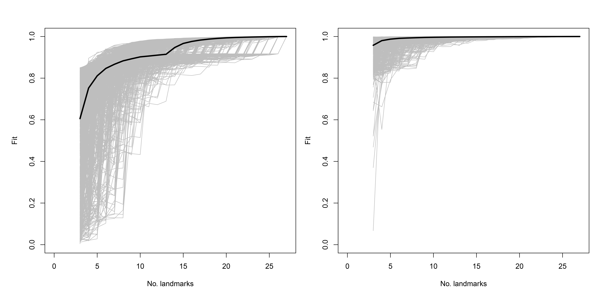
```

Like the experimental sample, results demonstrate saltation, illustrating that some landmarks are critical for capturing shape information [@RN28913]. Dynamic as incisions may be in shape, that variation may be captured with a configuration of landmarks that employed fewer equidistant semilandmarks along the spline. The initial configuration of 50 semilandmarks was thus reduced by half based upon this result; however, it is noteworthy that the archaeological sample does require more landmarks than the experimental sample, and that saltation continues across the full range.

<!--chapter:end:03-lasec.Rmd-->

# Experimental sample

The experimental sample consisted of seven test tiles that were incised and fired to Cone 06 at the Arrowmont School of Arts and Crafts in Gatlinburg, Tennessee. The tiles were later transported to the National Center for Preservation Technology and Training where they were scanned, then to the Heritage Research Center at Stephen F. Austin State University for the analysis.

## Experimental tiles

The clay used for the experimental tiles was Red Stone from Highwater Clays. Each tile was moved to a dry box 15 minutes after the incision was made. The tiles were fired in five stages using an electric kiln at the Arrowmont School of Arts and Crafts:

|Stage | Rate/Hr   | Temp   | Hold
|:----:|:---------:|:------:|:-----------------------
| 1    | 100/hr    | 190&deg;F| Hold for seven hours
| 2    | 200/hr    | 400&deg;F| Hold for 10 minutes
| 3    | 250/hr    | 600&deg;F| Hold for 10 minutes
| 4    | 400/hr    |1200&deg;F| Hold for 10 minutes
| 5    | 500/hr    |1800&deg;F| Hold for 10 minutes

Royal Sovereign, Ltd, (UK) manufactured the chisels used to create the incisions, which included size 10/flat, size 9/flat, size 2/cup round, size 0/cup round, and size 0/cup chisel.

Experimental tile 1 included an impression of the chisel tip on each instrument, and was not included in the experimental sample. Experimental tiles 2-8 included two incisions on each tile. In some cases two scans were generated for a tile, capturing the incision of interest nearest the middle of the scan. 

A Keyence VR-5000 optical profilometer was used to capture each three-dimensional image, which was rendered in the VR Series (VR-3000 G2 Series) Analyzer Software, then exported to Geomagic Design X _Version 2020.0.2, Build 55_ where the landmarks were applied. 

### Experimental tile 2

```{r exp-tile2, out.width = "100%", dpi = 300, echo=TRUE, warning=FALSE, fig.cap="Incisions on experimental tile 2 were made with a Size 0 cup chisel (plan), and a Size 0 cup round (plan)."}
# incision image
knitr::include_graphics('images/exp-tile2.png')
```

### Experimental tile 3

```{r exp-tile3, out.width = "100%", dpi = 300, echo=TRUE, warning=FALSE, fig.cap="Incisions on experimental tile 3 were made with a Size 9 flat chisel (plan), and a Size 2 cup round (plan)."}
# incision image
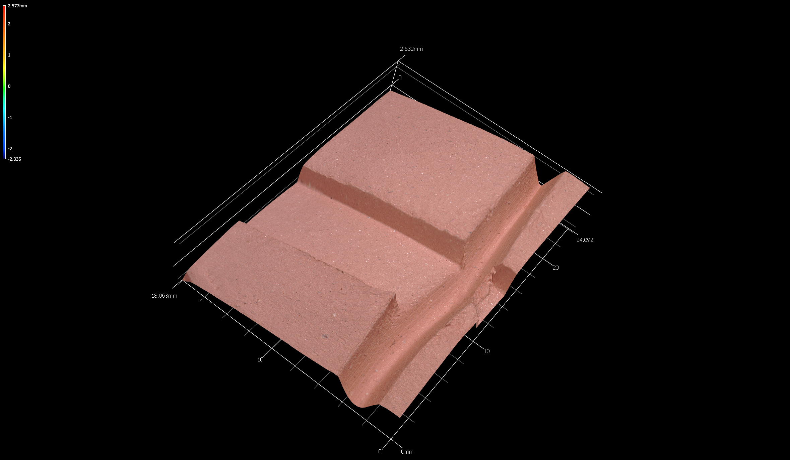
```

### Experimental tile 4a

```{r exp-tile4a, out.width = "100%", dpi = 300, echo=TRUE, warning=FALSE,fig.cap="Incisions on experimental tile 4a were made with a Size 0 cup chisel."}
# incision image
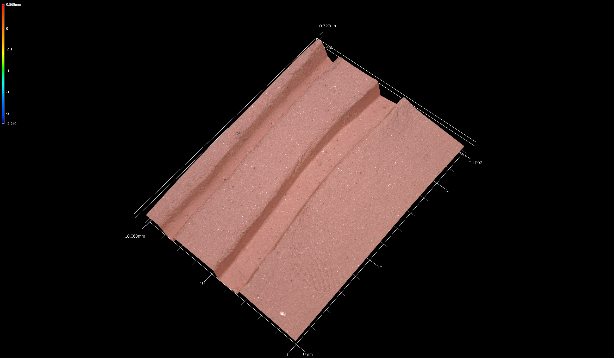
```

### Experimental tile 4b

```{r exp-tile4b, out.width = "100%", dpi = 300, echo=TRUE, warning=FALSE, fig.cap="Incisions on experimental tile 4b were made with a Size 0 cup chisel (profile)."}
# incision image
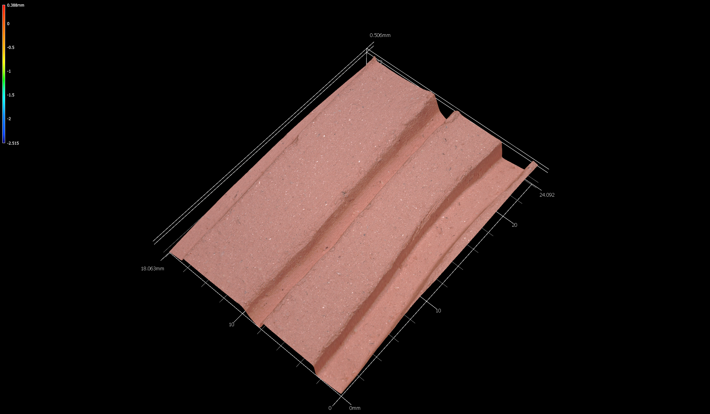
```

### Experimental tile 5

```{r exp-tile5, out.width = "100%", dpi = 300, echo=TRUE, warning=FALSE, fig.cap="Incisions on experimental tile 5 were made with a Size 0 cup chisel (plan), and a Size 0 cup round (plan)."}
# incision image
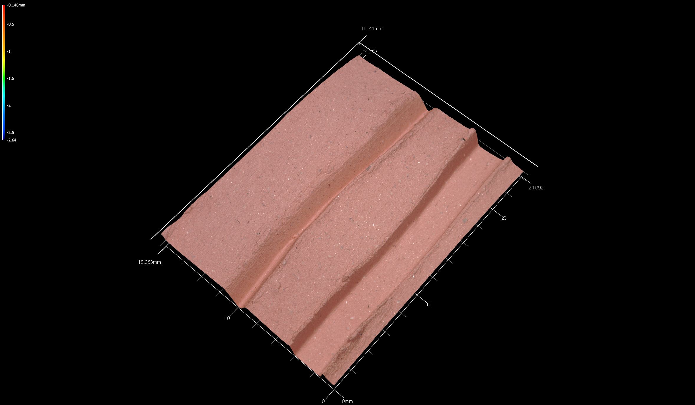
```

### Experimental tile 6a

```{r exp-tile6a, out.width = "100%", dpi = 300, echo=TRUE, warning=FALSE, fig.cap="Incisions on experimental tile 6a were made with a Size 2 cup round (plan)."}
# incision image
knitr::include_graphics('images/exp-tile6a.png')
```

### Experimental tile 6b

```{r exp-tile6b, out.width = "100%", dpi = 300, echo=TRUE, warning=FALSE, fig.cap="Incisions on experimental tile 6b were made with a Size 2 cup round (profile)."}
# incision image
knitr::include_graphics('images/exp-tile6b.png')
```

### Experimental tile 7a

```{r exp-tile7a, out.width = "100%", dpi = 300, echo=TRUE, warning=FALSE, fig.cap="Incisions on experimental tile 7a were made with a Size 9 flat (plan)."}
# incision image
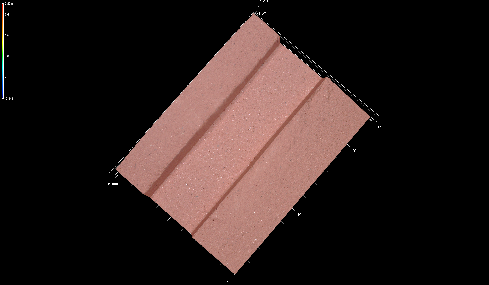
```

### Experimental tile 7b

```{r exp-tile7b, out.width = "100%", dpi = 300, echo=TRUE, warning=FALSE, fig.cap="Incisions on experimental tile 7b were made with a Size 9 flat (profile)."}
# incision image
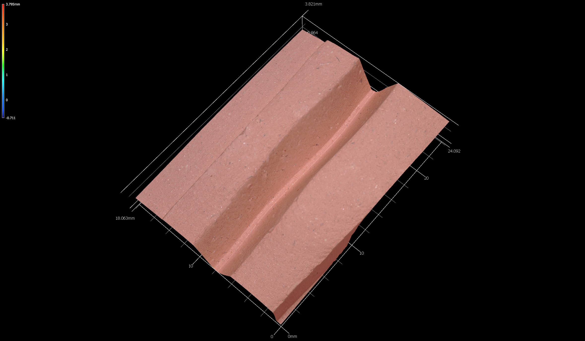
```

### Experimental tile 8a

```{r exp-tile8a, out.width = "100%", dpi = 300, echo=TRUE, warning=FALSE, fig.cap="Incisions on experimental tile 8a were made with a Size 10 flat (plan)."}
# incision image
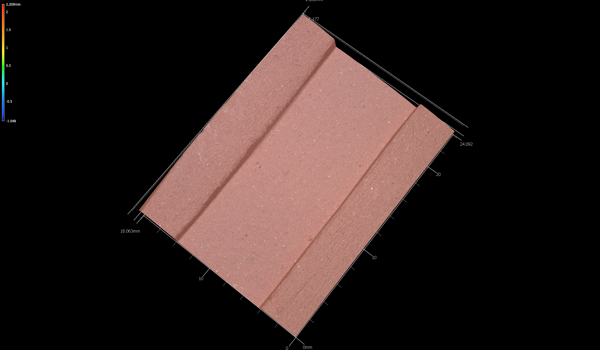
```

### Experimental tile 8a

```{r exp-tile8b, out.width = "100%", dpi = 300, echo=TRUE, warning=FALSE, fig.cap="Incisions on experimental tile 8b were made with a Size 10 flat (profile)."}
# incision image
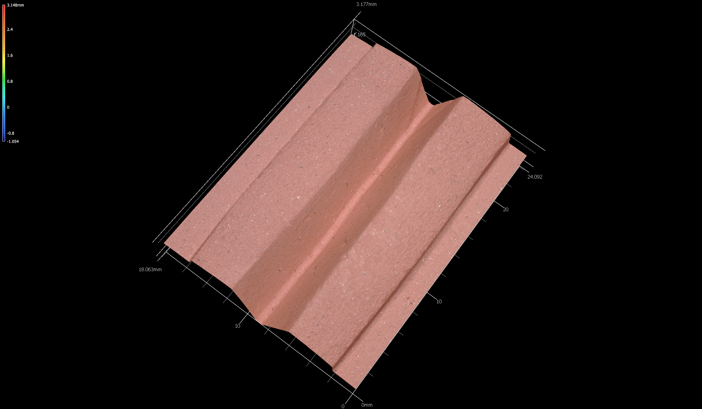
```

<!--chapter:end:04-experiment.Rmd-->

# Experimental sample - analysis

The `inc` field in the qdataEX file relates to two primary differences in shape. One U-shaped, and the other V-shaped. The `inc2` field in the qdataEX file relates to the differences in shape that were noted when reviewing general incision morphology. Some were U-shaped and narrow, others U-shaped and wide (twice as wide as they are deep), and the remainder were V-shaped. The V-shaped incisions were the only incisions applied using multiple tools. 

In this study, the narrow and wide U-shaped incisions were made by different tools; however, it is not difficult to imagine a scenario where both of the U-shaped incisions could also have been produced with two different sides of the same tool. It is thus necessary to use abundant caution when interpreting potential tool shape, or the number of tools employed in the application of incisions. To avoid confounding the issue, the tip of each of the tools used to generate the incision is referred to as a bit in the remainder of this document. Tools may have multiple bits, but each bit is capable of generating different incision profiles.

## Load packages + data

```{r loadsetwdEX, out.width = "100%", dpi = 300, echo=TRUE, warning=FALSE}
# devtools::install_github("geomorphR/geomorph", ref = "Stable", build_vignettes = TRUE)
library(geomorph)
library(tidyverse)
library(wesanderson)

# setwd
setwd(getwd())
source('readmulti.csv.R')

# Read .csv files
setwd("./dataEX")
filelist <- list.files(pattern = ".csv")
coords <- readmulti.csv(filelist)
setwd("../")

# read qualitative data
qdata <- read.csv("qdataEX.csv",header=TRUE,row.names=1)
qdata <- qdata[match(dimnames(coords)[[3]],rownames(qdata)),]

# print qdata
knitr::kable(qdata, align = "cc", caption = "Attributes included in qdata.")
```

## Generalised Procrustes Analysis

```{r gpaEX, out.width = "100%", dpi = 300, echo=TRUE, warning=FALSE, fig.cap = "Results of generalised Procrustes analysis."}
Y.gpa <- gpagen(coords, PrinAxes = TRUE, ProcD = TRUE, 
                Proj = TRUE, print.progress = FALSE)

# 3D GPA plot
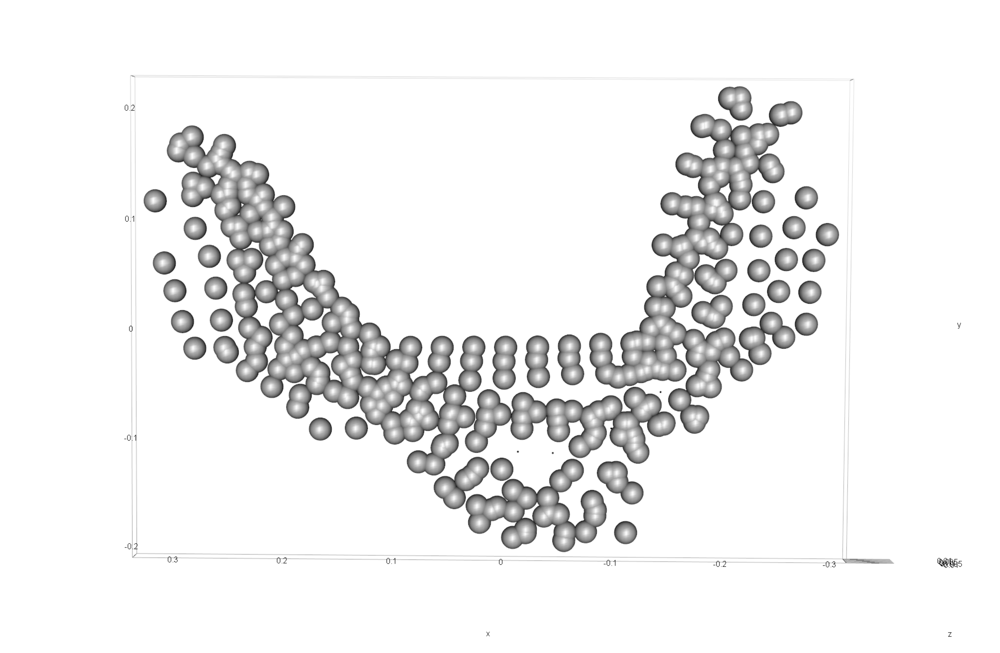

# geomorph data frame
gdf <- geomorph.data.frame(shape = Y.gpa$coords, size = Y.gpa$Csize, 
                           inc = qdata$incision, inc2 = qdata$inc2)
```

```{r boxEX, out.width = "100%", dpi = 300, echo=TRUE, warning=FALSE}
# add centroid size to qdata
qdata$csz <- Y.gpa$Csize

# attributes for boxplots
csz <- qdata$csz
inc <- qdata$incision
inc2 <- qdata$inc2

# print qdata + centroid size
knitr::kable(qdata, align = "ccc", caption = "Attributes included in qdata.")
```

```{r box1, out.width = "100%", dpi = 300, echo=TRUE, warning=FALSE, fig.cap = "Boxplot of experimental incision profile types (U-shaped and V-shaped)."}
# boxplot of incision (centroid) size by profile type (inc)
csz.inc.ex <- ggplot(qdata, aes(x = inc, y = csz, color = inc)) +
  geom_boxplot() +
  geom_dotplot(binaxis = 'y', stackdir = 'center', dotsize = 0.3) +
  scale_color_manual(values = wes_palette("Moonrise2")) +
  theme(legend.position = "none") +
  labs(x = 'Incision', y = 'Centroid Size')

#render plot
csz.inc.ex
```

```{r box2, out.width = "100%", dpi = 300, echo=TRUE, warning=FALSE,fig.cap = "Boxplot of experimental incision profile types (U-narrow, U-Wide, and V)."}
# boxplot of incision (centroid) size by profile type (inc2)
csz.inc2.ex <- ggplot(qdata, aes(x = inc2, y = csz, color = inc2)) +
  geom_boxplot() +
  geom_dotplot(binaxis = 'y', stackdir = 'center', dotsize = 0.3) +
  scale_color_manual(values = wes_palette("Moonrise2")) +
  theme(legend.position = "none") +
  labs(x = 'Incision', y = 'Centroid Size')

#render plot
csz.inc2.ex
```

## Principal Components Analysis

```{r pcaEX, out.width = "100%", dpi = 300, echo=TRUE, warning=FALSE}
# principal components analysis
pca <- gm.prcomp(Y.gpa$coords)
summary(pca)
```

```{r pcaEX1, out.width = "100%", dpi = 300, echo=TRUE, warning=FALSE, fig.cap = "Plot of PC1 and PC2 for U- (gray) and V-shaped (orange) incisions."}
# set plot parameters
pch.gps.1 <- c(15,17)[as.factor(inc)]
col.gps.1 <- wes_palette("Moonrise2")[as.factor(inc)]
col.hull.1 <- c("#798E87","#C27D38")

# plotPCAbyinc2
pc.plot.1 <- plot(pca,asp = 1,
            pch = pch.gps.1,
            col = col.gps.1)
            shapeHulls(pc.plot.1, 
                       groups = inc,
                       group.cols = col.hull.1)
```

```{r pcaEX2, out.width = "100%", dpi = 300, echo=TRUE, warning=FALSE,fig.cap = "Plot of PC1 and PC2; tan circles, V-shaped incisions; gray squares, U-narrow incisions; and orange triangles, U-wide incisions."}
# set plot parameters
pch.gps.2 <- c(15,17,19)[as.factor(inc2)]
col.gps.2 <- wes_palette("Moonrise2")[as.factor(inc2)]
col.hull.2 <- c("#798E87","#C27D38","#CCC591")

# plotPCAbyinc2
pc.plot.2 <- plot(pca,asp = 1,
            pch = pch.gps.2,
            col = col.gps.2)
            shapeHulls(pc.plot.2, 
                       groups = inc2,
                       group.cols = col.hull.2)
```

## Define models

```{r defmodEX, out.width = "100%", dpi = 300, echo=TRUE, warning=FALSE}
# allometry
fit.size <- procD.lm(shape ~ size, data = gdf, 
                     print.progress = FALSE, iter = 9999)
# allometry - common allometry, different means -> inc
fit.sz.cinc <- procD.lm(shape ~ size + inc, data = gdf, 
                        print.progress = FALSE, iter = 9999)
# allometry - unique allometries -> inc
fit.sz.uinc <- procD.lm(shape ~ size * inc, data = gdf, 
                        print.progress = FALSE, iter = 9999)
# allometry - common allometry, different means -> inc2
fit.sz.cinc2 <- procD.lm(shape ~ size + inc2, data = gdf, 
                         print.progress = FALSE, iter = 9999)
# allometry - unique allometries -> inc2
fit.sz.uinc2 <- procD.lm(shape ~ size * inc2, data = gdf, 
                         print.progress = FALSE, iter = 9999)

# size as a function of group
fit.sizeinc <- procD.lm(size ~ inc, data = gdf, 
                        print.progress = FALSE, iter = 9999)
fit.sizeinc2 <- procD.lm(size ~ inc2, data = gdf, 
                         print.progress = FALSE, iter = 9999)

# shape as a function of group
fit.shapeinc <- procD.lm(shape ~ inc, data = gdf, 
                         print.progress = FALSE, iter = 9999)
fit.shapeinc2 <- procD.lm(shape ~ inc2, data = gdf, 
                          print.progress = FALSE, iter = 9999)
```

## Allometry

```{r allometryEX, out.width = "100%", dpi = 300, echo=TRUE, warning=FALSE}
# allometry - does shape change with size?
anova(fit.size)
```

### Common allometry

```{r common.all.ex, out.width = "100%", dpi = 300, echo=TRUE, warning=FALSE}
# inc
anova(fit.sz.cinc) # common allometry (inc)

# inc2
anova(fit.sz.cinc2) # common allometry (inc2)

```

```{r allom.plot1.ex, out.width = "100%", dpi = 300, echo=TRUE, warning=FALSE}
# allometry plots
# regscore (Drake and Klingenberg 2008)
plot(fit.size, type = "regression", reg.type = "RegScore", 
     predictor = log(gdf$size), pch = pch.gps.1, col = col.gps.1)
plot(fit.size, type = "regression", reg.type = "RegScore", 
     predictor = log(gdf$size), pch = pch.gps.2, col = col.gps.2)
```

```{r allom.plot2.ex, out.width = "100%", dpi = 300, echo=TRUE, warning=FALSE}
# common allometric component (Mitteroecker 2004)
plotAllometry(fit.size, size = gdf$size, logsz = TRUE, method = "CAC", 
              pch = pch.gps.1, col = col.gps.1)
plotAllometry(fit.size, size = gdf$size, logsz = TRUE, method = "CAC", 
              pch = pch.gps.2, col = col.gps.2)
```

```{r allom.plot3.ex, out.width = "100%", dpi = 300, echo=TRUE, warning=FALSE}
# size-shape pca (Mitteroecker 2004)
plotAllometry(fit.size, size = gdf$size, logsz = TRUE, method = "size.shape", 
              pch = pch.gps.1, col = col.gps.1)
plotAllometry(fit.size, size = gdf$size, logsz = TRUE, method = "size.shape", 
              pch = pch.gps.2, col = col.gps.2)
```

### Unique allometry

```{r unique.all.ex, out.width = "100%", dpi = 300, echo=TRUE, warning=FALSE}
# inc
anova(fit.sz.uinc) # unique allometry (inc)

# inc2
anova(fit.sz.uinc2) # unique allometry (inc2)
```

```{r unique.allom.plot, out.width = "100%", dpi = 300, echo=TRUE, warning=FALSE}
# predline (Adams and Nistri 2010)
plotAllometry(fit.sz.uinc, size = gdf$size, logsz = TRUE, method = "PredLine", 
              pch = pch.gps.1, col = col.gps.1)
plotAllometry(fit.sz.uinc2, size = gdf$size, logsz = TRUE, method = "PredLine", 
              pch = pch.gps.2, col = col.gps.2)
```

## Size/Shape ~ Incision Profile?

```{r shszsiteEX, out.width = "100%", dpi = 300, echo=TRUE, warning=FALSE}
# ANOVA: do incision shapes differ by profile?
anova(fit.shapeinc)

# ANOVA: do incision sizes differ by profile?
anova(fit.sizeinc)
```

## Size/Shape ~ Incision Profile 2?

```{r szshpinc2EX, out.width = "100%", dpi = 300, echo=TRUE, warning=FALSE}
# ANOVA: do incision shapes differ (inc2)?
anova(fit.shapeinc2)
# pairwise comparison of LS means = which differ?
sh.inc2 <- pairwise(fit.shapeinc2, groups = qdata$inc2)
summary(sh.inc2, confidence = 0.95, test.type = "dist")
# pairwise distance between variances = standardization?
summary(sh.inc2, confidence = 0.95, test.type = "var")

# ANOVA: do incision sizes differ (inc2)?
anova(fit.sizeinc2)
# pairwise comparison of LS means = which differ?
sz.inc2 <- pairwise(fit.sizeinc2, groups = qdata$inc2)
summary(sz.inc2, confidence = 0.95, test.type = "dist")
# pairwise distance between variances = standardization?
summary(sz.inc2, confidence = 0.95, test.type = "var")
```

## Morphological disparity

```{r m-disparityEX}
# morphological disparity: does incision morphology display greater shape variation among individuals relative to incision profile shape?
morphol.disparity(fit.shapeinc, groups = qdata$inc2, data = gdf, 
                  print.progress = FALSE, iter = 9999)

# morphological disparity: does incision morphology display greater size variation among individuals relative to incision profile size?
morphol.disparity(fit.sizeinc, groups = qdata$inc2, data = gdf, 
                  print.progress = FALSE, iter = 9999)
```

## Mean shapes

```{r m-shapesEX, out.width = "100%", dpi = 300, echo=TRUE, warning=FALSE, fig.cap = "Mean shapes for incision profiles Un, Uw, and V."}
# subset landmark coordinates to produce mean shapes by site
new.coords <- coords.subset(A = Y.gpa$coords, group = qdata$inc2)
names(new.coords)
# group shape means
mean <- lapply(new.coords, mshape)
# plot(mean$Uw)

# mean shapes
knitr::include_graphics('images/mshapeEX.png')
```

<!--chapter:end:05-exanalysis.Rmd-->

# Archaeological sample

The sample used in this study was generated through archaeological surveys, and there are no chronometric dates for any of the sites. Temporal assignments employ relative dates. Therefore, if a site spans the Woodland period through CE 1200 (41SA66), the date range is considered to range from 500 BCE to CE 1200. However, only those temporal assignments associated with Caddo components are plotted, so that the same plot for 41SA66 is altered to illustrate a span from CE 800-1200.

```{r temporal, out.width = "100%", dpi = 300, echo=TRUE, warning=FALSE}
# load ggplot2
library(ggplot2)
library(wesanderson)

# temporal attributes
pal <- wes_palette("Moonrise2", 8, type = "continuous")

# gantt chart of (possible) relative dates for ceramic components
temp<-data.frame(Site = c('41SA66','41SB125','41SB189','41SB189','41SB291','41SY43','41SY43','41SY258','41SY280','41TN91'),
                 Date_Range_CE = c(800, 1200, 1000, 1400, 1200, 1000, 1450, 800, 1400, 900), # in years CE
                 end = c(1200, 1680, 1200, 1680, 1680, 1300, 1680, 1680, 1680, 1200) # in years CE
)

# reorder types by beginning of relative date range
temp$Site <- factor(temp$Site, levels = temp$Site[order(temp$Date_Range_CE)])
# arrange figure
temp.site <- ggplot(temp, 
                    aes(x = Date_Range_CE, 
                        xend = end, 
                        y = factor(Site,
                                   levels = rev(levels(factor(Site)))), 
                        yend = Site, 
                        color = Site)) +
  geom_segment(size = 2) +
  scale_colour_manual(values = pal) +
  theme(legend.position = "none") +
  labs(y = "Site", x = "Date Range CE")

# render figure
temp.site
```

All samples were collected in east Texas within San Augustine (SA), Sabine (SB), Shelby (SY), and Trinity (TN) counties. Smithsonian trinomials for each site indicate the state designation for Texas (41), the county (SA, SB, SY, or TN), and the site number.

## 41SA66

The David Fox site (41SA66) is located in the Angelina National Forest on a high terrace overlooking the Attoyac Bayou floodplain and a small tributary. The site was initially described by Stephenson [-@RN5040] as being small and culturally poor, and was under active cultivation at that time [@RN793].

Woodland period and pre-CE 1200 Caddo components were found at 41SA66. The Woodland component includes eight _Goose Creek Plain_ body sherds from surface contexts [@RN5066, 57, Pl. 29]. The Caddo component is evidenced by 11 grog-tempered rim and body sherds. Three of the rims bear multiple (5-12 lines) horizontal incised lines, and three body sherds include 7-12 parallel incised lines. The other five sherds---four body sherds and a body/base sherd---are plain.

### 41sa66

```{r sa66, out.width = "100%", dpi = 300, echo=TRUE, warning=FALSE, fig.cap="Incisions on sherd 41sa66."}
# incision image
knitr::include_graphics('images/sa66-inc.png')
```

### 41sa66-4

```{r sa66-4, out.width = "100%", dpi = 300, echo=TRUE, warning=FALSE, fig.cap="Incisions on sherd 41sa66-4."}
# incision image
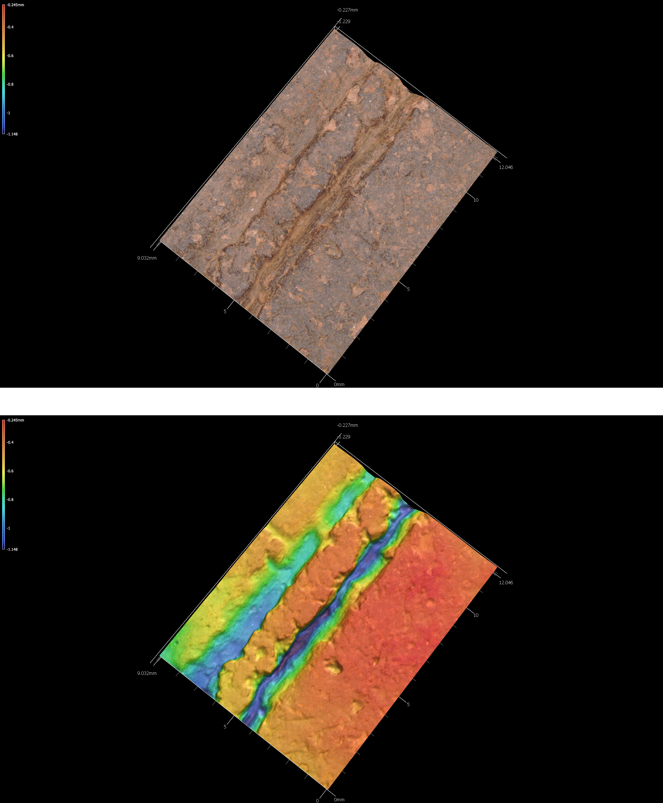
```

### 41sa66-5

```{r sa66-5, out.width = "100%", dpi = 300, echo=TRUE, warning=FALSE, fig.cap="Incisions on sherd 41sa66-5."}
# incision image
knitr::include_graphics('images/sa66-5-inc.png')
```

### 41sa66-6

```{r sa66-6, out.width = "100%", dpi = 300, echo=TRUE, warning=FALSE, fig.cap="Incisions on sherd 41sa66-6."}
# incision image
knitr::include_graphics('images/sa66-6-inc.png')
```

## 41SB125

Located in the Sabine National Forest, 41SB125 includes both Woodland and post-CE 1200 Caddo components. Diagnostic artifacts from the Woodland component includes 42 _Goose Creek Plain_ body sherds from eight shovel tests that were recovered between 20-60 cmbs. There is another sandy paste sherd (Marksville Stamped body sherd [@RN5635, 65-74]?) bearing incised and stamped decorative elements. 

The Caddo component is delimited by seven grog-tempered body sherds from four shovel tests, ranging in depth from 20-75 cmbs. Three are plain grog-tempered body sherds. The decorated sherds include a body sherd with a single straight incised line (ST 20, 20-30 cmbs), a body sherd with parallel brushing marks (ST 11, 20-30 cmbs), a rim with a triangular incised zone filled with rows of cane punctates, and a body sherd with an incised zone filled with diagonal incised lines.

### 41sb125-2-st27-25cm-lot100

```{r 41sb125-2-st27-25cm-lot100, out.width = "100%", dpi = 300, echo=TRUE, warning=FALSE, fig.cap="Incisions on sherd 41sb125-2-st27-25cm-lot100."}
# incision image
knitr::include_graphics('images/41sb125-2-st27-25cm-lot100-inc.png')
```

### 41sb125-3-st27-lot99-inc

```{r 41sb125-3-st27-lot99, out.width = "100%", dpi = 300, echo=TRUE, warning=FALSE, fig.cap="Incisions on sherd 41sb125-3-st27-lot99."}
# incision image
knitr::include_graphics('images/41sb125-3-st27-lot99-inc.png')
```

### 41sb125-11-st11-lot50-inc

```{r 41sb125-11-st11-lot50-inc, out.width = "100%", dpi = 300, echo=TRUE, warning=FALSE, fig.cap="Incisions on sherd 41sb125-11-st11-lot50."}
# incision image
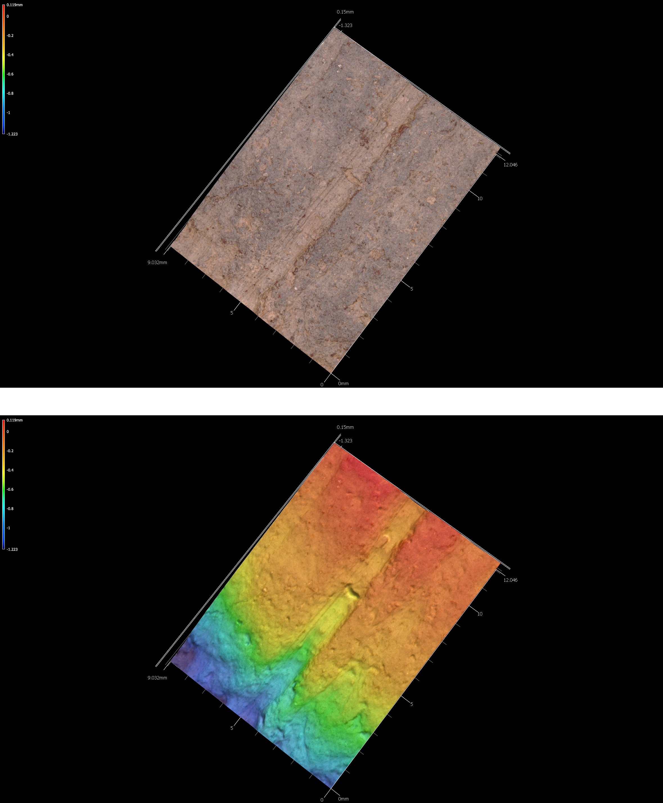
```

## 41SB189

There are several archeological components at 41SB189 in the Sabine National Forest. The earliest may date to the Middle Archaic period, based on the recovery of a possible Johnson dart point from Mound D manufactured from non-local white chert. Late Archaic use of the site is marked by a Williams dart point from Mound D manufactured from silicified wood.

The Woodland component at 41SB189 is more substantial, includes a chert Gary point from Mound A, three Friley arrow points (chert), and 15 _Goose Creek Plain_ body sherds. These were found in shovel tests, and range between 0-50 cmbs in Mounds A and H.

Temporally diagnostic artifacts indicate that the Caddo occupation at the site occurred during the Early Caddo period (CE 1000-1200). That assertion is based upon the recovery of an Alba point made of chert in Mound A. The final Caddo occupation occurred after CE 1400, and includes a Bassett arrow point made from chert in Mound D, as well as grog-tempered body sherds from Mound A and D recovered from different shovel tests between 0-60 cmbs. Sherds recovered from that component include seven plain body sherds, and five decorated body sherds. One decorated sherd from Mound A includes parallel brushing marks, two others from Mound D exhibit parallel incised lines, and another bears a single engraved line. The last decorated body sherd comes from what may have been a carinated bowl found in looter backfill that was excavated from Mound D, which bears diagonal opposed engraved lines.

### 41sb189-9-lot17

```{r 41SB189-9-lot17, out.width = "100%", dpi = 300, echo=TRUE, warning=FALSE, fig.cap="Incisions on sherd 41sb189-9-lot17."}
# incision image
knitr::include_graphics('images/41SB189-9-lot17-inc.png')
```

### 41sb189-10-Lot17

```{r 41sb189-10-Lot17-inc, out.width = "100%", dpi = 300, echo=TRUE, warning=FALSE, fig.cap="Incisions on sherd 41sb189-10-Lot17."}
# incision image
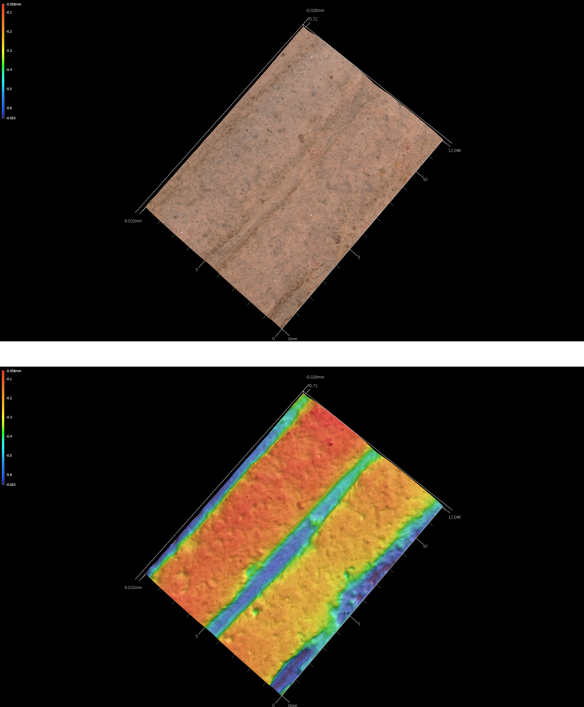
```

## 41SB291

Woodland and post-CE 1200 Caddo components were found at 41SB291 in the Sabine National Forest. The Woodland material culture remains include seven _Goose Creek Plain_ [@RN5066, 57, Pl. 29] body sherds from four different shovel tests (20-60 cmbs), as well as three dart points and a petrified wood biface preform. The dart points include Gary [@RN5066, 197, Pl. 99] and Kent [@RN5066, 199, Pl. 100] points manufactured from silicified wood and a black chert dart point blade and tip fragment.

Other chipped stone tools include a petrified wood early stage biface (ST 9, 20-30 cmbs) and a petrified wood biface tip (ST 12, 60-70 cmbs). There are also five unilateral flake tools in the assemblage of petrified wood, quartzite, a non-local black chert, and local reddish-brown chert from STs 16, 18, 21, 51, and 52 (0-60 cmbs).

The ancestral Caddo component is marked by four grog and/or bone-tempered rim and body sherds. One rim from ST 61 (50-55 cmbs) has vertical brushing marks (indicative of a post-CE 1200 Caddo vessel in this part of East Texas), and a body sherd from ST 64 (30-40 cm bs) has parallel incised lines. The other two sherds are plain, including a body sherd from ST 51 (20-30 cmbs) and a rim sherd from ST 26 (30-40 cmbs). The direct rim has a rounded lip.

### 41sb291-4-st64-3040-lot245

```{r 41sb291-4-st64-3040-lot245, out.width = "100%", dpi = 300, echo=TRUE, warning=FALSE, fig.cap="Incisions on sherd 41sb291-4-st64-3040-lot245."}
# incision image
knitr::include_graphics('images/41sb291-4-st64-3040-lot245-inc.png')
```

### 41sb291-9-st61-50-55-lot229

```{r 41sb291-9-st61-50-55-lot229, out.width = "100%", dpi = 300, echo=TRUE, warning=FALSE, fig.cap="Incisions on sherd 41sb291-9-st61-50-55-lot229."}
# incision image
knitr::include_graphics('images/41sb291-9-st61-50-55-lot229-inc.png')
```

## 41SY43

The Old Timers' site was the location of the 2001 Passport in Time (PIT) excavation project conducted by the U.S. Forest Service between March 9-18, 2001. The site is located on a sandy ridge overlooking Bayou Siepe, an eastward-flowing tributary of the Sabine River. In 1998, the Forest Service conducted  shovel tests at the Old Timers' site to delineate site boundaries and identify potential cultural affiliations. A total of 31 shovel tests were excavated, and only one shovel test (ST 27) on the northwestern part of the landform did not contain archeological deposits. The site covered a 2000 m2 area.

Not including lithic debris or fire-cracked rock from the shovel tests, more than 162 artifacts of analytical value were recovered in 22 of the shovel tests. The majority of these artifacts include plain and decorated ancestral Caddo ceramic sherds (n = 141), as well as Woodland period _Goose Creek Plain_ sherds (n = 2) [@RN5066, 57, Pl. 29]. Other artifacts recovered at the site include arrow points, dart points, and lithic tools, as well as burned clay and daub.

### 41sy43-1

```{r 41sy43-1-inc, out.width = "100%", dpi = 300, echo=TRUE, warning=FALSE, fig.cap="Incisions on sherd 41sy43-1."}
# incision image
knitr::include_graphics('images/41sy43-1-inc.png')
```

### 41sy43-13-1191

```{r 41sy43-13-1191-inc, out.width = "100%", dpi = 300, echo=TRUE, warning=FALSE, fig.cap="Incisions on sherd 41sy43-13-1191."}
# incision image
knitr::include_graphics('images/41sy43-13-1191-inc.png')
```

### 41sy43-19

```{r 41sy43-19-inc, out.width = "100%", dpi = 300, echo=TRUE, warning=FALSE, fig.cap="Incisions on sherd 41sy43-19."}
# incision image
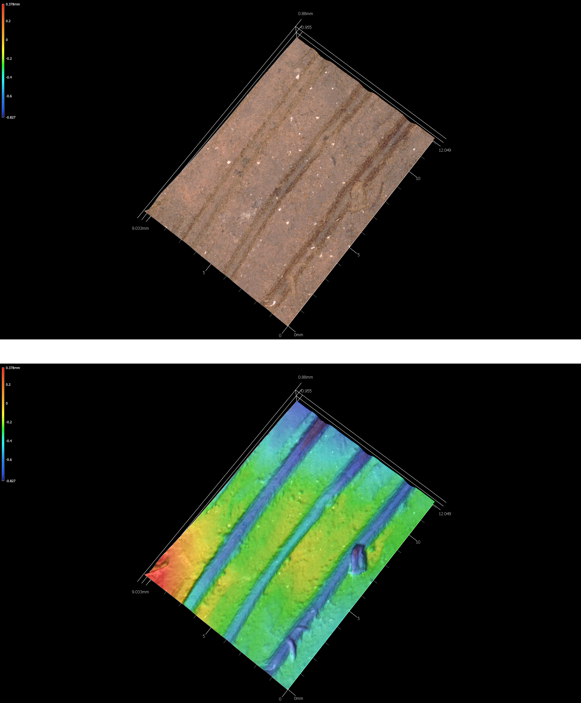
```

### 41sy43-830

```{r 41SY43-830-inc, out.width = "100%", dpi = 300, echo=TRUE, warning=FALSE, fig.cap="Incisions on sherd 41sy43-830."}
# incision image
knitr::include_graphics('images/41sy43-830-inc.png')
```

### 41sy43-k-2-27-37

```{r 41sy43-k-2-27-37, out.width = "100%", dpi = 300, echo=TRUE, warning=FALSE, fig.cap="Incisions on sherd 41sy43-k-2-27-37."}
# incision image
knitr::include_graphics('images/41sy43-k-2-27-37-inc.png')
```

### 41sy43-K-6-1020

```{r 41sy43-K-6-1020-inc, out.width = "100%", dpi = 300, echo=TRUE, warning=FALSE, fig.cap="Incisions on sherd 41sy43-K-6-1020."}
# incision image
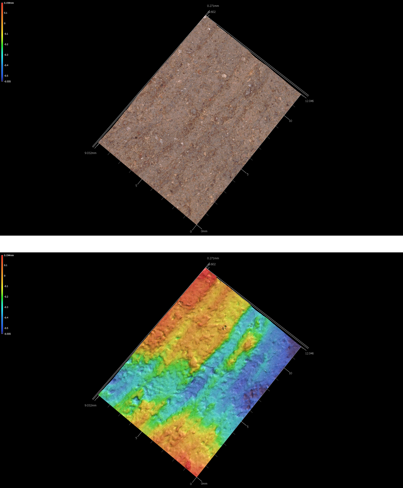
```

### 41sy43-k8-17

```{r 41sy43-k8-17-inc, out.width = "100%", dpi = 300, echo=TRUE, warning=FALSE, fig.cap="Incisions on sherd 41sy43-k8-17."}
# incision image
knitr::include_graphics('images/41sy43-k8-17-inc.png')
```

### 41sy43-lot1035-2030

```{r 41sy43-lot1035-2030-inc, out.width = "100%", dpi = 300, echo=TRUE, warning=FALSE, fig.cap="Incisions on sherd 41sy43-lot1035-2030."}
# incision image
knitr::include_graphics('images/41sy43-lot1035-2030-inc.png')
```

## 41SY258

41SY258 consists of a large campsite situated on a terrace knoll near the northern bank of Patroon Bayou along the southern margin of SNF Compartment 53 in Shelby County, Texas. It consists of a subsurface scatter of lithic and ceramic artifacts--as well Perdiz, Kent-like, Yarbrough-like, and Palmer-like projectile points--suggesting an occupation that occurred at some point or recurrently between the Middle Archaic and Late Caddoan periods periods (4000 BCE to CE 1680).

### 41sy258-st2-10-20

```{r 41sy258-st2-10-20-inc, out.width = "100%", dpi = 300, echo=TRUE, warning=FALSE, fig.cap="Incisions on sherd 41sy258-st2-10-20."}
# incision image
knitr::include_graphics('images/41sy258-st2-10-20-inc.png')
```

### 41sy258-st3-2030

```{r 41sy258-st3-2030-inc, out.width = "100%", dpi = 300, echo=TRUE, warning=FALSE, fig.cap="Incisions on sherd 41sy258-st3-2030."}
# incision image
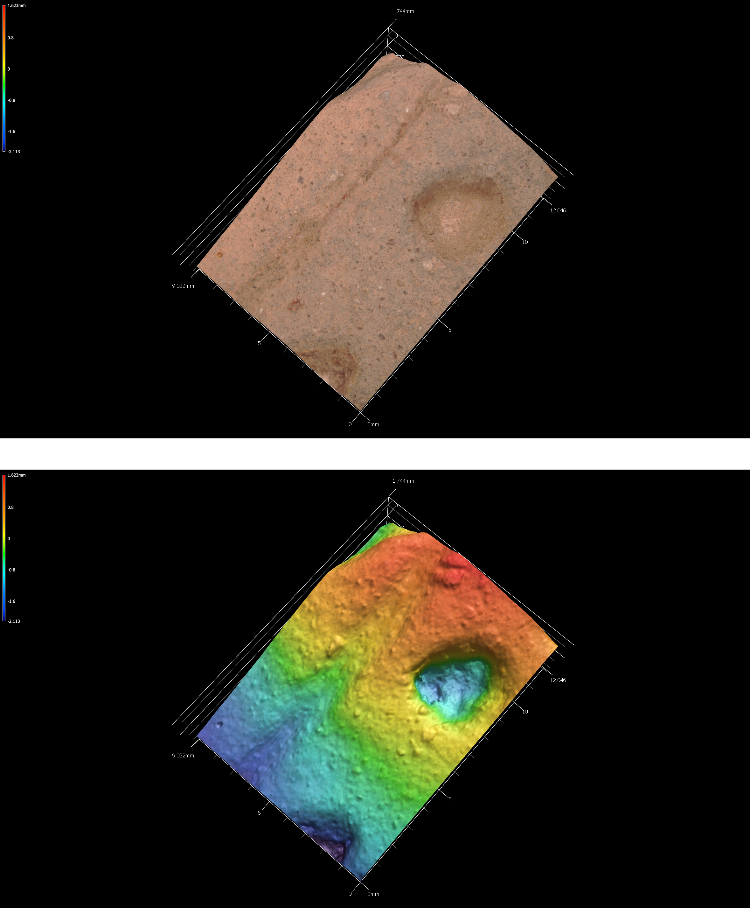
```

## 41SY280

41SY280 is located in the Sabine National Forest along the shoreline of Toledo Bend Reservoir. The site had been looted in the past, is exposed to shoreline fluctuations, and large quantities of archaeological material remains were also exposed on the site surface. The combination of looting and surface exposure led to the identification of 26 surface collection areas.

More than 1625 plain and decorated sherds have been collected from 21 surface collection areas at 41SY280. The distribution of high sherd density collection areas and the locations of daub/burned clay clusters is suggestive of an ancestral Caddo occupation (hamlet?). The high sherd density areas have a circular distribution at the southern end of the site, and the six daub/burned clay clusters occur within the circular zone of high sherd densities. The daub/burned clay clusters are potential locations of burned clay and thatch-covered Caddo structures, and the high sherd density areas represent the accumulation of discarded broken ceramic vessels in outdoor work areas and trash disposal locations. 

Taking into consideration the wide range in decorated sherd sample sizes in the different surface collection areas, there does appear to be a consistent range of the same decorative methods in the sherds distributed across the site. The most common decorative methods from the surface collection areas include brushed (95 percent); incised (81 percent); engraved (67 percent); brushed-incised (62 percent); ridged (52 percent); and punctated (48 percent). It is reasonable to conclude that there is one contemporaneous ancestral Caddo ceramic assemblage at the site that dates well after CE 1400 in the Late Caddo period. 

### 41sy280

```{r 41sy280-inc, out.width = "100%", dpi = 300, echo=TRUE, warning=FALSE, fig.cap="Incisions on sherd 41sy280."}
# incision image
knitr::include_graphics('images/41sy280-inc.png')
```

### 41sy280-11

```{r 41sy280-11-inc, out.width = "100%", dpi = 300, echo=TRUE, warning=FALSE, fig.cap="Incisions on sherd 41sy280-11."}
# incision image
knitr::include_graphics('images/41sy280-11-inc.png')
```

### 41sy280-18

```{r 41sy280-18-inc, out.width = "100%", dpi = 300, echo=TRUE, warning=FALSE, fig.cap="Incisions on sherd 41sy280-18."}
# incision image
knitr::include_graphics('images/41sy280-18-inc.png')
```

### 41sy280-20

```{r 41sy280-20-inc, out.width = "100%", dpi = 300, echo=TRUE, warning=FALSE, fig.cap="Incisions on sherd 41sy280-20."}
# incision image
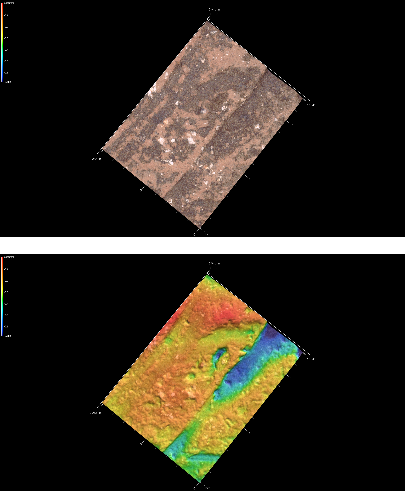
```

### 41sy280-84

```{r 41sy280-84-inc, out.width = "100%", dpi = 300, echo=TRUE, warning=FALSE, fig.cap="Incisions on sherd 41sy280-84."}
# incision image
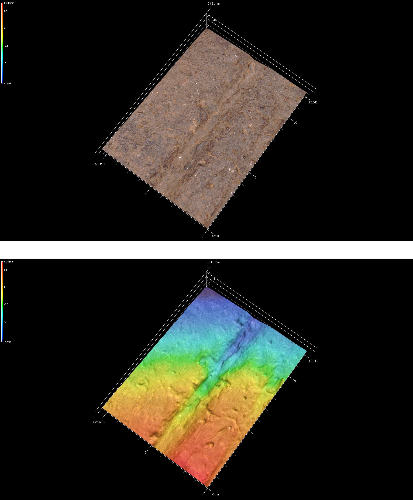
```

### 41sy280-101

```{r 41sy280-101-inc, out.width = "100%", dpi = 300, echo=TRUE, warning=FALSE, fig.cap="Incisions on sherd 41sy280-101."}
# incision image
knitr::include_graphics('images/41sy280-101-inc.png')
```

### 41sy280-127

```{r 41sy280-127-inc, out.width = "100%", dpi = 300, echo=TRUE, warning=FALSE, fig.cap="Incisions on sherd 41sy280-127."}
# incision image
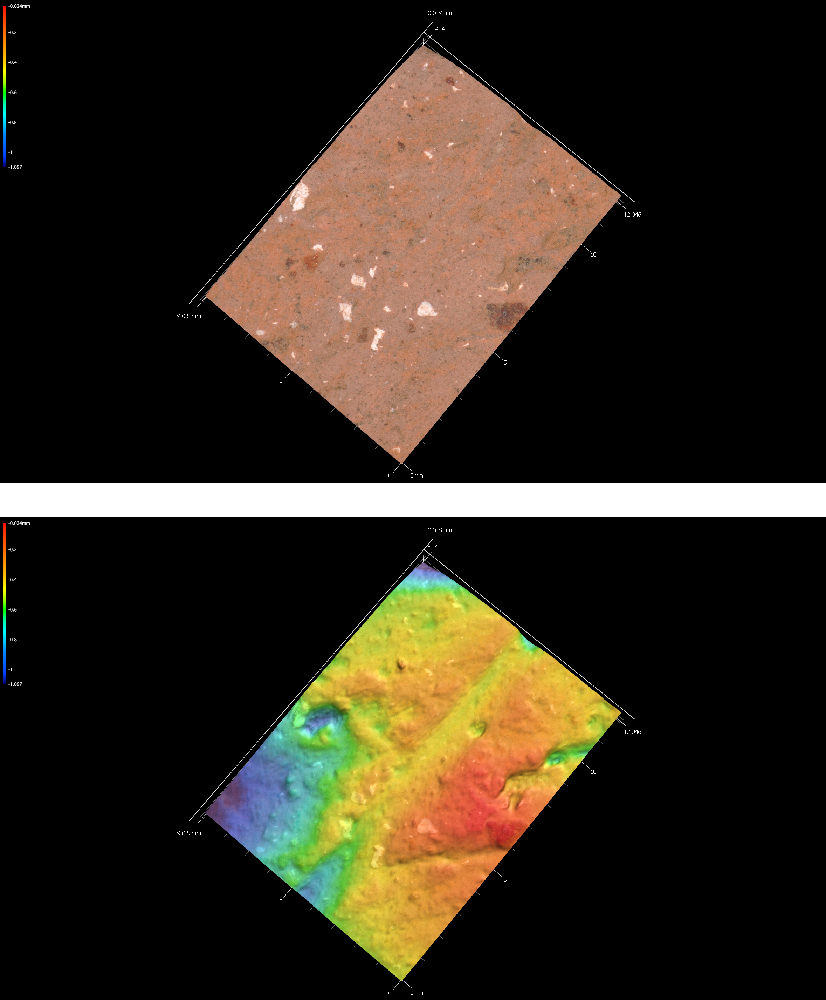
```

### 41sy280-lot31

```{r 41sy280-lot31-inc, out.width = "100%", dpi = 300, echo=TRUE, warning=FALSE, fig.cap="Incisions on sherd 41sy280-lot31."}
# incision image
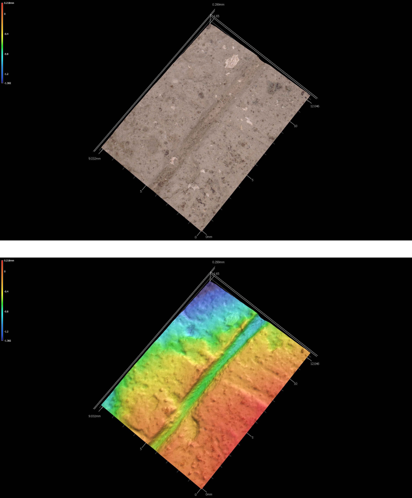
```

### 41sy280-lot48

```{r 41sy280-lot48-inc, out.width = "100%", dpi = 300, echo=TRUE, warning=FALSE, fig.cap="Incisions on sherd 41sy280-lot48."}
# incision image
knitr::include_graphics('images/41sy280-lot48-inc.png')
```

### 41sy280-lot50

```{r 41SY280-lot50-inc, out.width = "100%", dpi = 300, echo=TRUE, warning=FALSE, fig.cap="Incisions on sherd 41SY280-lot50."}
# incision image
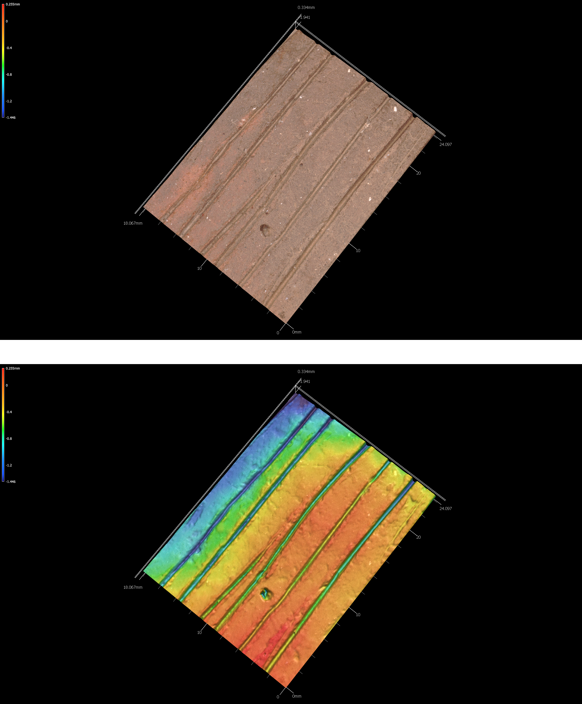
```

### 41sy280-lot52

```{r 41sy280-lot52-inc, out.width = "100%", dpi = 300, echo=TRUE, warning=FALSE, fig.cap="Incisions on sherd 41sy280-lot52."}
# incision image
knitr::include_graphics('images/41sy280-lot52-inc.png')
```

### 41sy280-lot90

```{r 41sy280-lot90, out.width = "100%", dpi = 300, echo=TRUE, warning=FALSE, fig.cap="Incisions on sherd 41sy280-lot90."}
# incision image
knitr::include_graphics('images/41sy280-lot90-inc.png')
```

### 41sy280-lot91

```{r 41sy280-lot91-inc, out.width = "100%", dpi = 300, echo=TRUE, warning=FALSE, fig.cap="Incisions on sherd 41sy280-lot91."}
# incision image
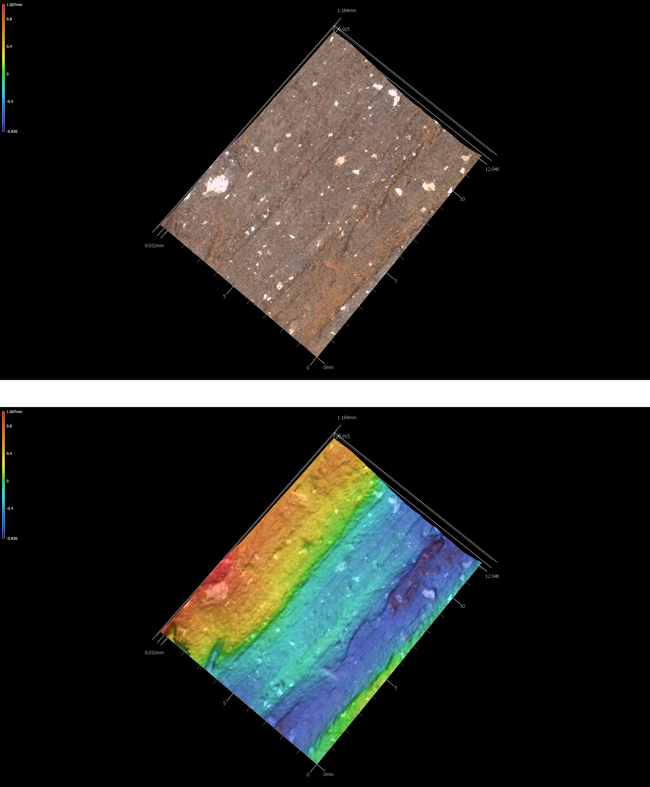
```

### 41sy280-lot94

```{r 41sy280-lot94-inc, out.width = "100%", dpi = 300, echo=TRUE, warning=FALSE, fig.cap="Incisions on sherd 41sy280-lot94."}
# incision image
knitr::include_graphics('images/41sy280-lot94-inc.png')
```

### 41sy280-lot107

```{r 41sy280-lot107-inc, out.width = "100%", dpi = 300, echo=TRUE, warning=FALSE, fig.cap="Incisions on sherd 41sy280-lot107."}
# incision image
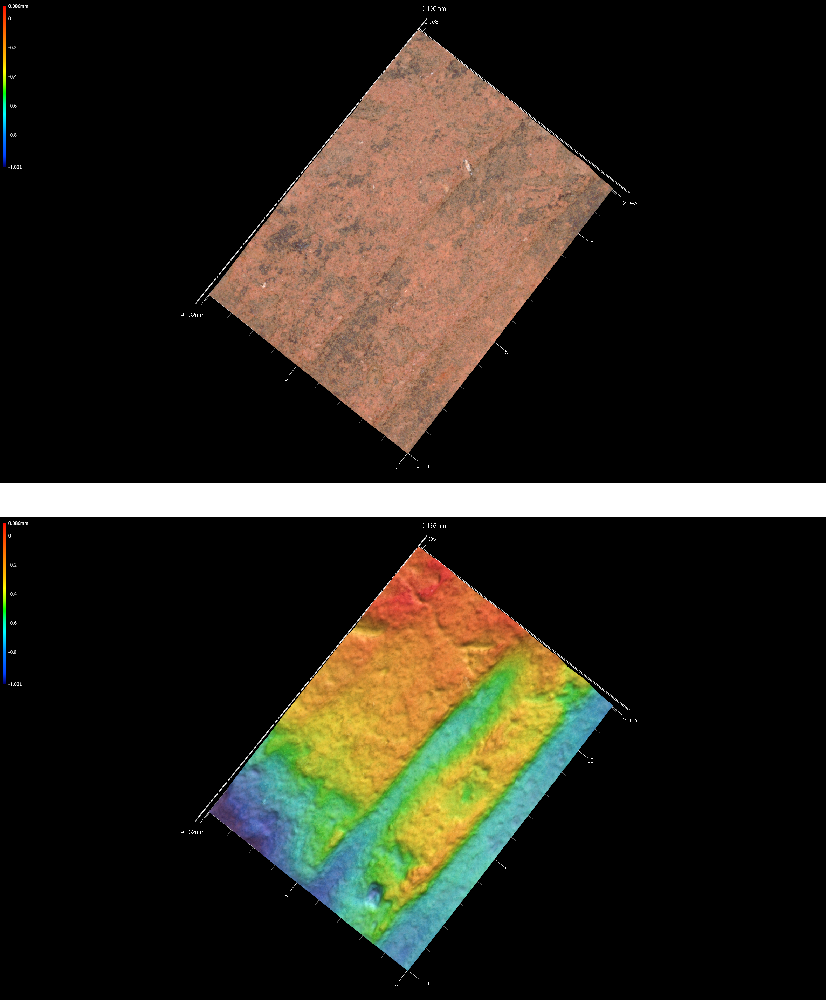
```

### 41sy280-lot112

```{r 41sy280-lot112-inc, out.width = "100%", dpi = 300, echo=TRUE, warning=FALSE, fig.cap="Incisions on sherd 41sy280-lot112."}
# incision image
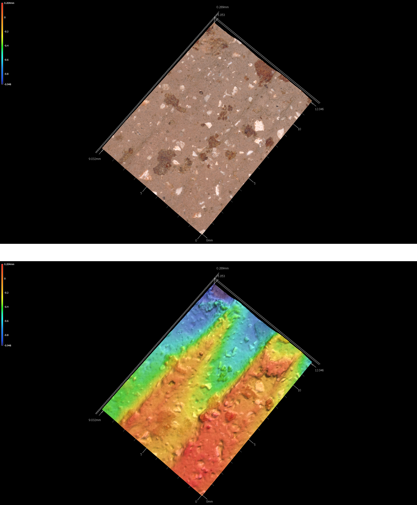
```

### 41sy280-lot125

```{r 41sy280-lot125-inc, out.width = "100%", dpi = 300, echo=TRUE, warning=FALSE, fig.cap="Incisions on sherd 41sy280-lot125."}
# incision image
knitr::include_graphics('images/41sy280-lot125-inc.png')
```

## 41TN91

Multiple archeological components were found at 41TN91 in the Davy Crockett National Forest, and that temporal sequence begins with a Late Archaic occupation identified by the presence of a petrified wood Williams dart point. A second component dates to the Woodland period, includes a quartzite Gary dart point and _Goose Creek Plain_ sherds, and a later Woodland occupation defined by a petrified wood Steiner arrow point. Late Prehistoric occupations dating from CE 900 to after CE 1200 are represented by a petrified wood Catahoula arrow point, a red chert Bonham arrow point, and a petrified wood Perdiz arrow point.

The ceramic sherd assemblage from 41TN91 is unique among other sites in Trinity County on USFS lands that it has a high proportion of grog-tempered wares (89 percent), and few _Goose Creek Plain_ sherds (9.3 percent). The entire ceramic assemblage postdates CE 800, where sandy paste ceramic vessels were not commonly made or used, and the decorated motifs and elements in the sherds strongly suggests occupation by the Caddo. It is possible that the ceramic vessel sherds are a product of one or more temporally distinct occupations, one dating sometime before CE 1200, and the other dating sometime after CE 1200.

### 41tn91-u1-0-10

```{r 41tn91-u1-0-10-inc, out.width = "100%", dpi = 300, echo=TRUE, warning=FALSE, fig.cap="Incisions on sherd 41tn91-u1-0-10."}
# incision image
knitr::include_graphics('images/41tn91-u1-0-10-inc.png')
```

### 41tn91-u1-2030

```{r 41tn91-u1-2030-inc, out.width = "100%", dpi = 300, echo=TRUE, warning=FALSE, fig.cap="Incisions on sherd 41tn91-u1-2030."}
# incision image
knitr::include_graphics('images/41tn91-u1-2030-inc.png')
```

### 41tn91-u2-1020

```{r 41tn91-u2-1020-inc, out.width = "100%", dpi = 300, echo=TRUE, warning=FALSE, fig.cap="Incisions on sherd 41tn91-u2-1020."}
# incision image
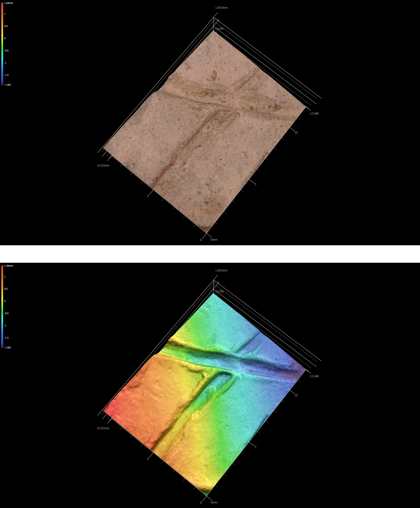
```

### 41tn91-u3-2030

```{r 41tn91-u3-2030-inc, out.width = "100%", dpi = 300, echo=TRUE, warning=FALSE, fig.cap="Incisions on sherd 41tn91-u3-2030."}
# incision image
knitr::include_graphics('images/41tn91-u3-2030-inc.png')
```

### 41tn91-u4-0-20

```{r 41tn91-u4-0-20-inc, out.width = "100%", dpi = 300, echo=TRUE, warning=FALSE, fig.cap="Incisions on sherd 41tn91-u4-0-20."}
# incision image
knitr::include_graphics('images/41tn91-u4-0-20-inc.png')
```

### 41tn91-u4-4050

```{r 41tn91-u4-4050-inc, out.width = "100%", dpi = 300, echo=TRUE, warning=FALSE, fig.cap="Incisions on sherd 41tn91-u4-4050."}
# incision image
knitr::include_graphics('images/41tn91-u4-4050-inc.png')
```

### 41tn91-u4-5060

```{r 41tn91-u4-5060-inc, out.width = "100%", dpi = 300, echo=TRUE, warning=FALSE, fig.cap="Incisions on sherd 41tn91-u4-5060."}
# incision image
knitr::include_graphics('images/41tn91-u4-5060-inc.png')
```

### 41tn91-u6-3040

```{r 41tn91-u6-3040, out.width = "100%", dpi = 300, echo=TRUE, warning=FALSE, fig.cap="Incisions on sherd 41tn91-u6-3040."}
# incision image
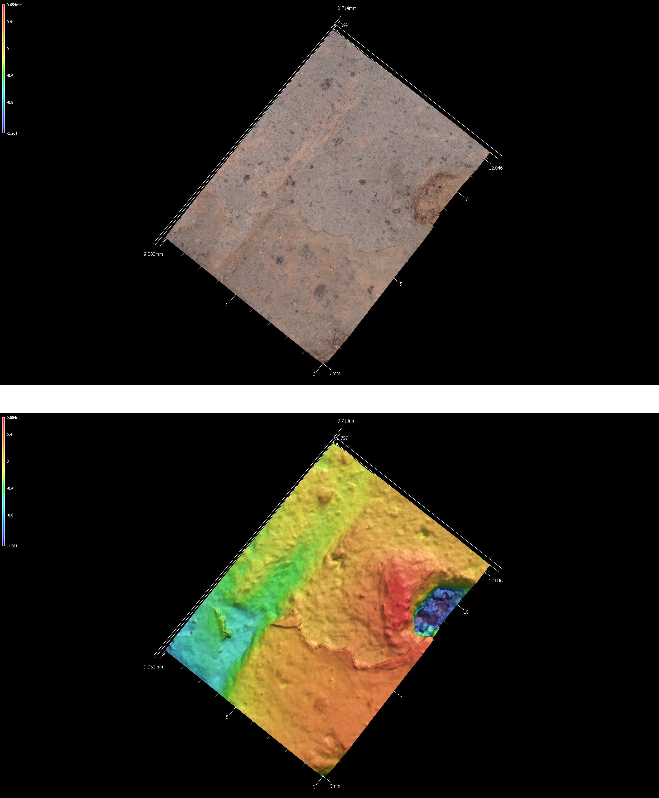
```

### 41tn91-u7-30-40

```{r 41tn91-u7-30-40-inc, out.width = "100%", dpi = 300, echo=TRUE, warning=FALSE, fig.cap="Incisions on sherd 41tn91-u7-30-40."}
# incision image
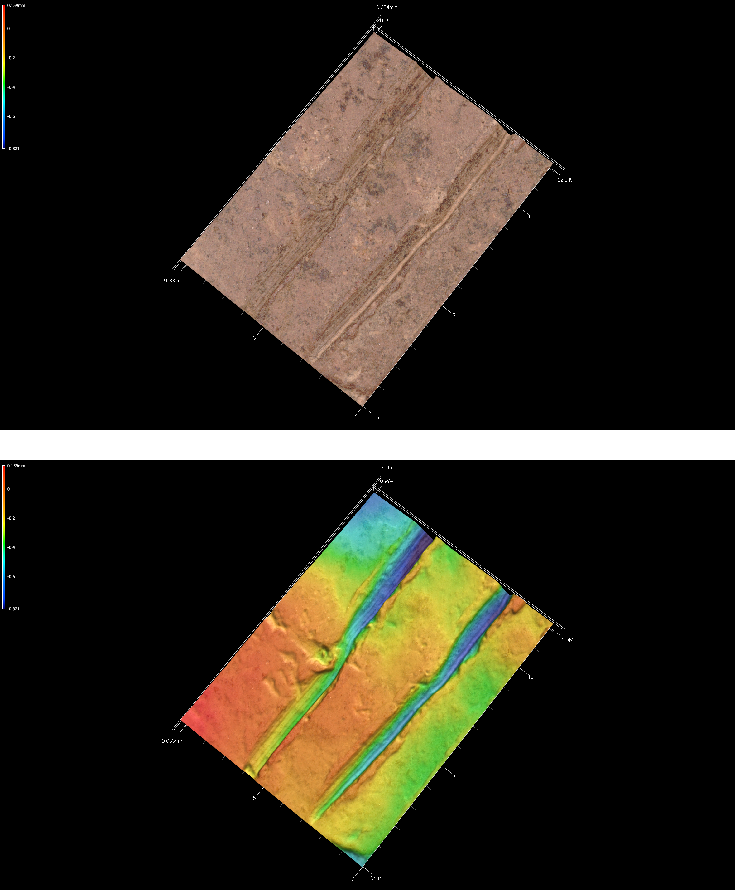
```

### 41tn91-u8-1020

```{r 41tn91-u8-1020, out.width = "100%", dpi = 300, echo=TRUE, warning=FALSE, fig.cap="Incisions on sherd 41tn91-u8-1020."}
# incision image
knitr::include_graphics('images/41tn91-u8-1020-inc.png')
```

### 41tn91-unit2-lot17

```{r 41tn91-unit2-lot17-inc, out.width = "100%", dpi = 300, echo=TRUE, warning=FALSE, fig.cap="Incisions on sherd 41tn91-unit2-lot17."}
# incision image
knitr::include_graphics('images/41tn91-unit2-lot17-inc.png')
```

<!--chapter:end:06-nfgt-sample.Rmd-->

# Archaeological sample - analysis

## Load packages + data

```{r load.arch, out.width = "100%", dpi = 300, echo=TRUE, warning=FALSE}
# devtools::install_github("geomorphR/geomorph", ref = "Stable", build_vignettes = TRUE)
library(geomorph)
library(tidyverse)
library(wesanderson)
setwd(getwd())

# read GM data
source('readmulti.csv.R')

# read .csv files
setwd("./data1")
filelist <- list.files(pattern = ".csv")
coords <- readmulti.csv(filelist)
setwd("../")

# read qualitative data
qdata <- read.csv("qdata1.csv",header=TRUE,row.names=1)
qdata <- qdata[match(dimnames(coords)[[3]],rownames(qdata)),]

# print qdata
knitr::kable(qdata, align = "ccccc", caption = "Attributes included in qdata.")
```

```{r gpa, out.width = "100%", dpi = 300, echo=TRUE, warning=FALSE,fig.cap="Results of generalized Procrustes analysis."}
# gpa
Y.gpa <- gpagen(coords, PrinAxes = TRUE, ProcD = TRUE, 
                Proj = TRUE, print.progress = FALSE)

# gpa plot
knitr::include_graphics('images/gpa3d.png')

# geomorph data frame
gdf <- geomorph.data.frame(shape = Y.gpa$coords, 
                           size = Y.gpa$Csize, 
                           site = qdata$site, 
                           unit = qdata$unit, 
                           county = qdata$county, 
                           inc = qdata$incision, 
                           inc2 = qdata$inc2) 
```

```{r categorical.arch,, out.width = "100%", dpi = 300, echo=TRUE, warning=FALSE}
# add centroid size to qdata
qdata$csz <- Y.gpa$Csize

# attributes for boxplots
csz <- Y.gpa$Csize
inc <- qdata$incision
inc2 <- qdata$inc2
cty <- qdata$county
unt <- qdata$unit

# print qdata + centroid size
knitr::kable(qdata, align = "cccccc", caption = "Attributes included in qdata.")
```

```{r box1.arch, out.width = "100%", dpi = 300, echo=TRUE, warning=FALSE,fig.cap = "Boxplot of incision profile types (inc)."}
# boxplot of incision (centroid) size by profile type (inc)
csz.inc <- ggplot(qdata, aes(x = inc, y = csz, color = inc)) +
  geom_boxplot() +
  geom_dotplot(binaxis = 'y', stackdir = 'center', dotsize = 0.3) +
  scale_color_manual(values = wes_palette("Moonrise2")) +
  theme(legend.position = "none") +
  labs(x = 'Incision', y = 'Centroid Size')

#render plot
csz.inc
```

```{r box2.arch, out.width = "100%", dpi = 300, echo=TRUE, warning=FALSE,fig.cap = "Boxplot of incision profile types (inc2)."}
# boxplot of incision (centroid) size by profile type (inc2)
csz.inc2 <- ggplot(qdata, aes(x = inc2, y = csz, color = inc2)) +
  geom_boxplot() +
  geom_dotplot(binaxis = 'y', stackdir = 'center', dotsize = 0.3) +
  scale_color_manual(values = wes_palette("Moonrise2")) +
  theme(legend.position = "none") +
  labs(x = 'Incision', y = 'Centroid Size')

#render plot
csz.inc2
```

## Principal Components Analysis

```{r pca1.arch, out.width = "100%", dpi = 300, echo=TRUE, warning=FALSE,fig.cap = "Plot of PC1 and PC2 for U- (gray square) and V-shaped (orange triangle) incisions."}
# principal components analysis
pca<-gm.prcomp(Y.gpa$coords)
summary(pca)

# set plot parameters to plot by incision type
inc <- qdata$incision
pch.gps.inc <- c(15,17)[as.factor(inc)]
col.gps.inc <- wes_palette("Moonrise2")[as.factor(inc)]
col.hull <- c("#C27D38","#798E87")

# plot pca by incision profile
pc.plot1 <- plot(pca, asp = 1,
                  pch = pch.gps.inc,
                  col = col.gps.inc)
                  shapeHulls(pc.plot1, 
                             groups = inc,
                             group.cols = col.hull)
```

```{r pca2.arch,, out.width = "100%", dpi = 300, echo=TRUE, warning=FALSE,fig.cap = "Plot of PC1 and PC2 for U-broad (gray square), U-narrow (orange triangle) and V-shaped (tan circle) incisions."}
# set plot parameters to plot by incision profile (inc2)
inc2 <- qdata$inc2
pch.gps.inc2 <- c(15,17,19)[as.factor(inc2)]
col.gps.inc2 <- wes_palette("Moonrise2")[as.factor(inc2)]
col.hull2 <- c("#CCC591","#798E87","#C27D38")

# plot pca by incision profile (inc2)
pc.plot2 <- plot(pca, asp = 1,
                  pch = pch.gps.inc2,
                  col = col.gps.inc2)
                  shapeHulls(pc.plot2, 
                             groups = inc2,
                             group.cols = col.hull2)
```

## Define models

```{r define-models, out.width = "100%", dpi = 300, echo=TRUE, warning=FALSE}
# allometry
fit.size.a <- procD.lm(shape ~ size, data = gdf, 
                       print.progress = FALSE, iter = 9999)
# allometry - common allometry, different means -> inc
fit.sz.cinc.a <- procD.lm(shape ~ size + inc, data = gdf, 
                          print.progress = FALSE, iter = 9999)
# allometry - unique allometries -> inc
fit.sz.uinc.a <- procD.lm(shape ~ size * inc, data = gdf, 
                          print.progress = FALSE, iter = 9999)
# allometry - common allometry, different means -> inc2
fit.sz.cinc2.a <- procD.lm(shape ~ size + inc2, data = gdf, 
                           print.progress = FALSE, iter = 9999)
# allometry - unique allometries -> inc2
fit.sz.uinc2.a <- procD.lm(shape ~ size * inc2, data = gdf, 
                           print.progress = FALSE, iter = 9999)

# size as a function of group
fit.sizeinc <- procD.lm(size ~ inc, data = gdf, 
                        print.progress = FALSE, iter = 9999)
fit.sizeinc2 <- procD.lm(size ~ inc2, data = gdf, 
                         print.progress = FALSE, iter = 9999)

# shape as a function of group
fit.shapeinc <- procD.lm(shape ~ inc, data = gdf, 
                         print.progress = FALSE, iter = 9999)
fit.shapeinc2 <- procD.lm(shape ~ inc2, data = gdf, 
                          print.progress = FALSE, iter = 9999)
```

## Allometry

```{r allometry.arch, out.width = "100%", dpi = 300, echo=TRUE, warning=FALSE}
# allometry - does shape change with size?
anova(fit.size.a)
```

### Common allometry

```{r common.all.arch, out.width = "100%", dpi = 300, echo=TRUE, warning=FALSE}
# inc
anova(fit.sz.cinc.a) # common allometry (inc)

# inc2
anova(fit.sz.cinc2.a) # common allometry (inc2)

```

```{r allom.plot1.arch, out.width = "100%", dpi = 300, echo=TRUE, warning=FALSE}
# allometry plots
# regscore (Drake and Klingenberg 2008)
plot(fit.size.a, type = "regression", reg.type = "RegScore", 
     predictor = log(gdf$size), pch = pch.gps.inc, col = col.gps.inc)
plot(fit.size.a, type = "regression", reg.type = "RegScore", 
     predictor = log(gdf$size), pch = pch.gps.inc2, col = col.gps.inc2)
```

```{r allom.plot2.arch, out.width = "100%", dpi = 300, echo=TRUE, warning=FALSE}
# common allometric component (Mitteroecker 2004)
plotAllometry(fit.size.a, size = gdf$size, logsz = TRUE, method = "CAC", 
              pch = pch.gps.inc, col = col.gps.inc)
plotAllometry(fit.size.a, size = gdf$size, logsz = TRUE, method = "CAC", 
              pch = pch.gps.inc2, col = col.gps.inc2)
```

```{r allom.plot3.arch, out.width = "100%", dpi = 300, echo=TRUE, warning=FALSE}
# size-shape pca (Mitteroecker 2004)
plotAllometry(fit.size.a, size = gdf$size, logsz = TRUE, method = "size.shape", 
              pch = pch.gps.inc, col = col.gps.inc)
plotAllometry(fit.size.a, size = gdf$size, logsz = TRUE, method = "size.shape", 
              pch = pch.gps.inc2, col = col.gps.inc2)
```

### Unique allometry

```{r unique.all.arch, out.width = "100%", dpi = 300, echo=TRUE, warning=FALSE}
# inc
anova(fit.sz.uinc.a) # unique allometry (inc)

# inc2
anova(fit.sz.uinc2.a) # unique allometry (inc2)
```

```{r unique.allom.plot.arch, out.width = "100%", dpi = 300, echo=TRUE, warning=FALSE}
# predline (Adams and Nistri 2010)
plotAllometry(fit.sz.uinc.a, size = gdf$size, logsz = TRUE, method = "PredLine", 
              pch = pch.gps.inc, col = col.gps.inc)
plotAllometry(fit.sz.uinc2.a, size = gdf$size, logsz = TRUE, method = "PredLine", 
              pch = pch.gps.inc2, col = col.gps.inc2)
```

## Size/Shape ~ Incision Profile?

```{r szshpinc, out.width = "100%", dpi = 300, echo=TRUE, warning=FALSE}
# ANOVA: do incision shapes differ?
anova(fit.shapeinc)

# ANOVA: do incision sizes differ?
anova(fit.sizeinc)
```

## Size/Shape ~ Incision Profile 2?

```{r szshpinc2, out.width = "100%", dpi = 300, echo=TRUE, warning=FALSE}
# ANOVA: do incision shapes differ (inc2)?
anova(fit.shapeinc2)
# pairwise comparison of LS means = which differ?
sh.inc2 <- pairwise(fit.shapeinc2, groups = qdata$inc2)
summary(sh.inc2, confidence = 0.95, test.type = "dist")
# pairwise distance between variances = standardization?
summary(sh.inc2, confidence = 0.95, test.type = "var")

# ANOVA: do incision sizes differ (inc2)?
anova(fit.sizeinc2)
# pairwise comparison of LS means = which differ?
sz.inc2 <- pairwise(fit.sizeinc2, groups = qdata$inc2)
summary(sz.inc2, confidence = 0.95, test.type = "dist")
# pairwise distance between variances = standardization?
summary(sz.inc2, confidence = 0.95, test.type = "var")
```

## Morphological disparity

```{r m-disparity}
# morphological disparity: does incision morphology display greater shape variation among individuals relative to incision profile (inc or inc2)?
# incision
morphol.disparity(fit.shapeinc, groups = qdata$incision, data = gdf, 
                  print.progress = FALSE, iter = 9999)
# inc2
morphol.disparity(fit.shapeinc2, groups = qdata$inc2, data = gdf, 
                  print.progress = FALSE, iter = 9999)

# morphological disparity: does incision morphology display greater size variation among individuals relative to incision profile (inc or inc2)?
# incision
morphol.disparity(fit.sizeinc, groups = qdata$incision, data = gdf, 
                  print.progress = FALSE, iter = 9999)
# inc2
morphol.disparity(fit.sizeinc2, groups = qdata$inc2, data = gdf, 
                  print.progress = FALSE, iter = 9999)
```

## Mean shapes

```{r m-shapes, out.width = "100%", dpi = 300, echo=TRUE, warning=FALSE, fig.cap = "Mean shapes for u-shaped broad, u-shaped narrow, v-shaped angled, and v-shaped vertical Caddo incision profiles (inc2)."}
# subset landmark coordinates to produce mean shapes by site
new.coords <- coords.subset(A = Y.gpa$coords, group = qdata$inc2)
names(new.coords)
# group shape means
mean <- lapply(new.coords, mshape)
# plot(mean$vv)

# mean shapes
#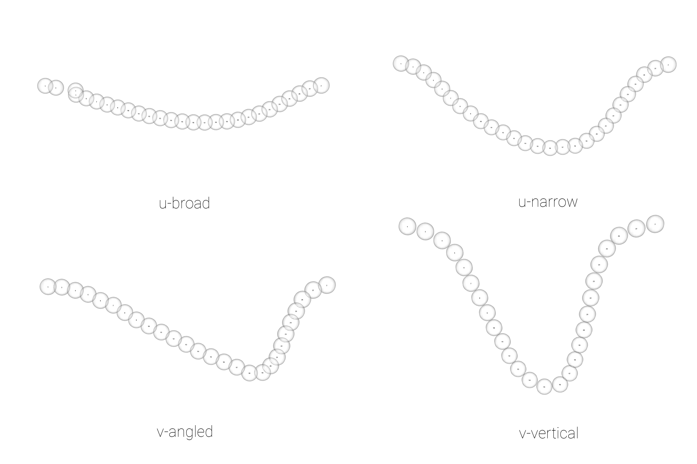
# end of code
```

<!--chapter:end:07-archanalysis.Rmd-->

# Open Review {#open}

Open Review means that you can freely read this volume and easily help to make it better. You can offer suggestions by making annotations using [hypothes.is](https://hypothes.is/), an open source annotation system. This is a simple system for interacting with this volume. If you are familiar with GitHub or Git, you can also comment using [GitHub's issue tracker](https://github.com/aksel-blaise/incision/issues) for the volume, or make a pull request. In addition to these feedback options, this website for the book will be collecting your implicit feedback by tracking the readership and abandonment rate of each section.

Open Review takes place before and during the peer review process. The feedback from Open Review and peer review will be used to create a revised manuscript. The Open Review period will end when the final manuscript is submitted to the publisher. 

The concept of Open Review, as implemented here, is taken from [Matthew Salganik's](https://twitter.com/msalganik) [Open Review Toolkit](http://www.openreviewtoolkit.org/). Much of the text on this page comes from the [Open Review Toolkit About page](http://www.bitbybitbook.com/en/open-review/) and the [Open Review Toolkit Privacy and Consent page](http://www.bitbybitbook.com/en/privacy/)

## FAQ about open review

### What kind of feedback are you looking for?

Open Review is not just about catching typos. Rather, Open Review is designed to collect all types of feedback, and I would particularly welcome feedback that relates to the substance of the volume. Are there sections that you find particularly confusing? Are their points that you find particularly important? Am I making claims that you think need to be refined? Are there parts of the book that you think should be removed? When in doubt, I ask that you follow one of the main principles at Wikipedia: [Be bold](https://en.wikipedia.org/wiki/Wikipedia:Be_bold).

### Can I see the annotations that others are making?

Yes, all annotations are public. You can view them on right side of the each page, or you can read them in [stream form](https://hypothes.is/stream?q=aksel-blaise-garylin).

### What are the benefits for readers?

You get to read the manuscript and participate in making it better.

### What are the benefits for authors and publishers?

The Open Review process will benefit both authors and publishers, even if they have no interest in increasing access to knowledge. The process will lead to higher manuscript quality through the explicit and implicit feedback. Further, the Open Review process will provide valuable data that can be used during that marketing of the book.

### Has anyone ever done something like this before?

This is based on [Matthew Salganik's](https://twitter.com/msalganik) [Open Review Toolkit](http://www.openreviewtoolkit.org/). He has written about some related efforts here: <http://www.bitbybitbook.com/en/open-review/>

### What kind of information are you collecting and how will that information be used?

Please read the privacy and consent policy, below. 

### How I can learn more about traditional peer review of academic books?

The AAUP recently published [a report](http://www.aaupnet.org/resources/for-members/handbooks-and-toolkits/peer-review-best-practices) on best practices for peer review.

### Can I do this with my book?

Absolutely. View the code for this website at <https://github.com/aksel-blaise/incision> for more about how we did it.

### I have a different question about Open Review. How can I get in touch?

Send an email to `zselden@sfasu.edu`

## Privacy and Consent Policy

### Overview

The complete text of the supplementary data is made available on this website at no cost. While you are reading the volume, reader behavior is measured in aggregate. For example, which sections of the book get read most often is measured. These data will help to improve the book.

### What information do we collect?

[Google Analytics](https://analytics.google.com/) is used to collect information about how you interact with this website. Further, like most websites, [cookies](https://en.wikipedia.org/wiki/HTTP_cookie) are used to enhance your experience, gather general visitor information, and track visits to the website. Please refer to the "do we use cookies?" section below for information about cookies and how we use them.

### How do we use your information?

Any of the information that we collect may be used for research, to improve the supplementary data.

### How do we protect your information?

A variety of security measures is used to maintain the safety of the information that you provide.

Most of the browsing information that we gather is stored in Google Analytics, and you can read more about their [security and privacy principles](https://support.google.com/analytics/answer/6004245?hl=en).

Annotations that you can add are managed by [hypothes.is](https://hypothes.is/), and you can read more about their [terms of service](https://hypothes.is/terms-of-service/).

Our website is hosted by [Github Pages](https://pages.github.com/), and you can read more about Github's [terms of service](https://help.github.com/articles/github-terms-of-service/).

### Do we use cookies?

Yes. Cookies are small files that a site or its service provider transfers to your computer's hard drive through your web browser (if you allow) that enables the sites or service providers systems to recognize your browser and capture and remember certain information.

In order to offer you a better site experience, cookies are used to understand and save your preferences for future visits, and to compile aggregate data regarding site traffic.

### Your consent

By using this site, you consent to the privacy policy.

### Questions

If you have any questions, please contact me by email at `zselden@sfasu.edu`

### Changes to our Privacy and Consent Policy

I reserve the right to this privacy policy from time to time at my discretion. Please periodically check this section to review the current version of the Privacy and Consent Policy. All previous policies are included in the associated repository, and this page will be updated if any changes are needed.

### Acknowledgments

The bulk of the (modified) text above comes directly from [Ben Marwick's](https://github.com/benmarwick/bookdown-ort) excellent bookdown example that illustrates how each of the pieces of this volume function independently, and as a whole. Many thanks to Ben for making this available, and I encourage other archaeologists to make use of these tools.

<!--chapter:end:98-open-review.Rmd-->

`r if (knitr::is_html_output()) '
# References {-}
'`

<!--chapter:end:99-references.Rmd-->

